---
format:
  revealjs:
    css: style.css
    width: 1920
    height: 1080
    footer: "Better Vaccine Demand Forecasting · Maputo · 2 September 2026"
    slide-number: c/t
    pdf-separate-fragments: false
    preview-links: auto
    html-math-method: mathjax
  pptx:
    slide-level: 2
    reference-doc: pptx-reference.pptx
---



##

 
 

[Outline]{.mimic-h2}

- [**What are we actually forecasting?**]{style="font-size: 1.2em; color: #A04B2F;"}
- [**Which method, and when**]{style="font-size: 1.2em; color: #A04B2F;"}
- [**Using what you already know**]{style="font-size: 1.2em; color: #A04B2F;"}
- [**What we found**]{style="font-size: 1.2em; color: #A04B2F;"}

---

##

 
 

[Outline]{.mimic-h2}

::: {.agenda}
- [**What are we actually forecasting?**]{.ol-on}
- [Which method, and when]{.ol-off}
- [Using what you already know]{.ol-off}
- [What we found]{.ol-off}
:::

## From the process to the methods

Stage 1The decisionWhat decision does the forecast drive, and over what time frame?

Stage 2Target variableWhat exactly are you forecasting, and in what units?

Stage 3Shape &amp; scheduleHow far ahead, how often, and a single number or a distribution?

Stage 4InputsWhat data you actually have, and what it really means

Stage 5Contextual challengesThe traps that appear once the target meets the dataWhere this session sits: a model-agnostic way to embed operational domain knowledge in the forecast distribution

Stage 6ModelThe method, chosen after everything above, not before

Stage 7EvaluationHow you know it is good enough to act on

Stage 8DeploymentWhat it takes to run it for real

## The target variable: three different numbers, often called by one name

::: {.def-row}

::: {.def-box .mc-blue}
[Doses administered]{.df-t}
[What children actually receive at the session. This is what your registers and DHIS2 record.]{.df-b}
[The number you have the most data about.]{.df-d}
:::

::: {.def-box .mc-terra}
[Consumption]{.df-t}
[Doses administered plus wastage: open vial losses, breakage, expiry, cold chain failures.]{.df-b}
[The number that leaves the store.]{.df-d}
:::

::: {.def-box .mc-amber}
[Procurement quantity]{.df-t}
[Consumption plus buffer stock, plus a margin for lead times and losses in transit.]{.df-b}
[The number you actually order.]{.df-d}
:::

:::

[Most of your data speaks about the first. Most of your decisions are about the third. Before comparing any two methods, check which of the three each one is forecasting.]{.msg-bar}

## Output type: a single number, one range, or the whole distribution?

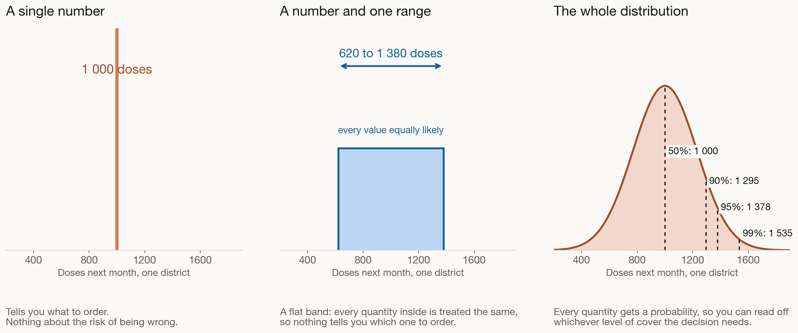{width=82% fig-align="center"}

## What good looks like

::: {.big-bullets}
- [**A number and a distribution**]{style="color:#A04B2F; font-weight:700;"}, not just one range, so buffer stock is chosen rather than guessed
- [**Compared against a simple method**]{style="color:#A04B2F; font-weight:700;"}, so you know the extra effort is buying you something
- [**Repeatable by someone else**]{style="color:#A04B2F; font-weight:700;"} next year, when a different person is in the chair
:::

---

##

 
 

[Outline]{.mimic-h2}

::: {.agenda}
- [What are we actually forecasting?]{.ol-off}
- [**Which method, and when**]{.ol-on}
- [Using what you already know]{.ol-off}
- [What we found]{.ol-off}
:::

## Where FSP4All sits in this picture

[FSP4All answers the question three ways at once, then blends the three into one annual figure. Each of the three components needs a different kind of data.]{.fsp-lead}

<i class="fa-solid fa-users"></i>
Demographic
eligible children &times; the coverage expected at each dose, added up across the schedule
<b>Needs:</b> population projections, coverage targets, the dose schedule
Available to us

<i class="fa-solid fa-chart-line"></i>
Consumption based
average the last twelve months of issues, then carry it forward
<b>Needs:</b> wastage rates, reporting rates, days out of stock
Not in our dataset

<i class="fa-solid fa-calendar-days"></i>
Session based
add up every planned session and the attendance expected at each
<b>Needs:</b> microplans and recorded attendance per session
Not in our dataset

<i class="fa-solid fa-arrow-down-long"></i>
<i class="fa-solid fa-arrow-down-long"></i>
<i class="fa-solid fa-arrow-down-long"></i>

One annual procurement figure
Whichever components are available are weighted together into a single number, with no month-to-month detail and no measure of uncertainty around it.

[The demographic component is the one we could compute, so it is the one our method builds on. Read that way, FSP is less a forecaster than a store of demographic knowledge, and that knowledge is exactly what a data-driven forecast lacks.]{.msg-soft}

## What each family actually does to your history

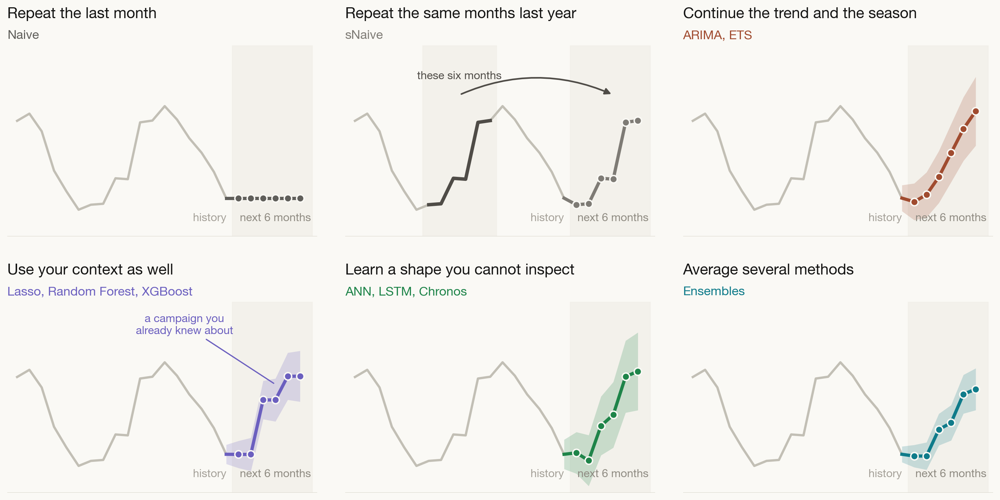{width=88% fig-align="center"}

## Model complexity and explainability: how simple can you get away with?

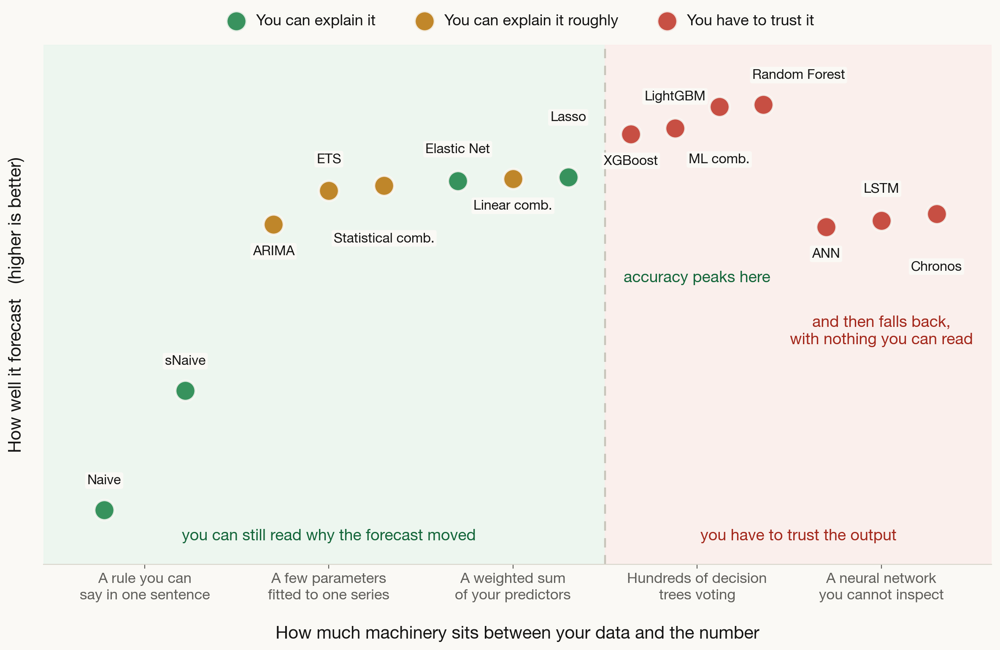{width=80% fig-align="center"}

[The accuracy against explainability trade-off is the standard framing in the explainable-AI literature (Gunning and Aha, 2019, *AI Magazine* 40(2), Figure 1). The points here are our own fifteen methods on the study's district-level data.]{.fsp-lead style="text-align:center; display:block; font-size:0.62em;"}

## Method by method (1 of 3) · simple benchmarks and statistical

<table class="modtable">
<colgroup>
<col style="width:13%"><col style="width:17%"><col style="width:22%"><col style="width:22%"><col style="width:9%"><col style="width:17%">
</colgroup>
<thead>
<tr><th>Method</th><th>What it assumes</th><th>Pros</th><th>Cons</th><th>Can you explain it</th><th>Suitable context</th></tr>
</thead>
<tbody>
<tr>
<td class="mt-model">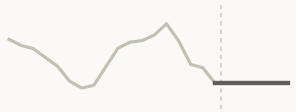NaiveSimple benchmark</td>
<td>The immediate future looks exactly like the most recent past. No trend and no seasonal cycle in the data.</td>
<td>Instant, nothing to tune, and the honest floor every other method has to beat.</td>
<td>Ignores trend, season and everything else you know about the programme.</td>
<td class="mt-ex ex-hi">&#9679;&#9679;&#9679;Easy</td>
<td>Very volatile series with no clear pattern. Always, as a starting baseline.</td>
</tr>
<tr>
<td class="mt-model">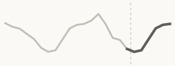sNaiveSimple benchmark</td>
<td>The seasonal pattern repeats exactly as it did last year, and no underlying trend is pushing the level up or down.</td>
<td>Carries the seasonal shape with no modelling at all. A strong seasonal baseline.</td>
<td>Copies last year's stockouts and shocks along with the pattern. Ignores growth.</td>
<td class="mt-ex ex-hi">&#9679;&#9679;&#9679;Easy</td>
<td>Stable repeating seasonality. The baseline to beat for seasonal data.</td>
</tr>
<tr>
<td class="mt-model">ARIMAStatistical</td>
<td>Statistical behaviour is stable over time, relationships are strictly linear, and the errors are uncorrelated and normally distributed.</td>
<td>Picks up both short and long term structure from few parameters. Raw data can follow any distribution.</td>
<td>Fails on non-linear patterns, is sensitive to outliers, and loses accuracy over long horizons.</td>
<td class="mt-ex ex-md">&#9679;&#9679;&#9679;Moderate</td>
<td>One series at a time, linear structure, short to medium horizons.</td>
</tr>
<tr>
<td class="mt-model">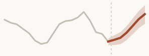ETSStatistical</td>
<td>Errors have zero mean, constant variance and a normal shape. Data stays strictly positive wherever the seasonality is multiplicative.</td>
<td>Models level, trend and season together, copes with short histories, and damps long-horizon over-forecasting.</td>
<td>One series at a time, fails when the data contains zeros, and has many parameters to optimise.</td>
<td class="mt-ex ex-md">&#9679;&#9679;&#9679;Moderate</td>
<td>Positive data with changing seasonal patterns, and small datasets.</td>
</tr>
<tr>
<td class="mt-model">Statistical averageEnsemble of Naive, sNaive, ARIMA and ETS</td>
<td>The members are equally good, their errors are uncorrelated and cancel each other out, and the weights stay stable.</td>
<td>Cuts the variance of any single member with a plain average and no weights to tune.</td>
<td>Gives weak members the same weight as strong ones, and cannot adapt when one clearly dominates.</td>
<td class="mt-ex ex-md">&#9679;&#9679;&#9679;Moderate</td>
<td>Pooling Naive, sNaive, ARIMA and ETS into one robust baseline.</td>
</tr>
</tbody>
</table>

## Method by method (2 of 3) · machine learning

<table class="modtable">
<colgroup>
<col style="width:13%"><col style="width:17%"><col style="width:22%"><col style="width:22%"><col style="width:9%"><col style="width:17%">
</colgroup>
<thead>
<tr><th>Method</th><th>What it assumes</th><th>Pros</th><th>Cons</th><th>Can you explain it</th><th>Suitable context</th></tr>
</thead>
<tbody>
<tr>
<td class="mt-model">LassoRegularised linear</td>
<td>A linear relationship between predictors and demand, errors that are independent and of constant spread, and a stable bias-variance trade-off.</td>
<td>Drops predictors that do not earn their place, so what is left is short and readable.</td>
<td>Biases the coefficients it keeps, and picks arbitrarily among predictors that move together.</td>
<td class="mt-ex ex-hi">&#9679;&#9679;&#9679;Easy</td>
<td>Many predictors where you want a sparse, interpretable model.</td>
</tr>
<tr>
<td class="mt-model">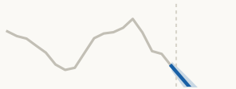Elastic NetRegularised linear</td>
<td>The same linearity, independent errors and constant error spread as Lasso, plus a feature mapping that stays stable over time.</td>
<td>Keeps groups of correlated predictors together instead of discarding all but one. Steadier than Lasso.</td>
<td>Two settings to tune instead of one, which makes cross-validation slower.</td>
<td class="mt-ex ex-hi">&#9679;&#9679;&#9679;Easy</td>
<td>Many correlated or redundant predictors, where plain regression is unstable.</td>
</tr>
<tr>
<td class="mt-model">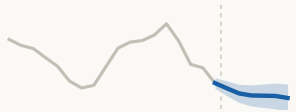Linear averageEnsemble of Lasso and Elastic Net</td>
<td>The underlying relationships are linear, the members' errors are uncorrelated, and they share the same feature space.</td>
<td>Smooths out the difference between the two penalties, with nothing to tune.</td>
<td>Inherits every limitation the linear members share, so it still cannot handle curved patterns.</td>
<td class="mt-ex ex-md">&#9679;&#9679;&#9679;Moderate</td>
<td>Stabilising forecasts built on many correlated predictors.</td>
</tr>
<tr>
<td class="mt-model">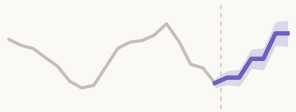Random ForestTree ensemble</td>
<td>The mapping from the inputs you feed it to demand is structurally stable, and the individual trees are independent of one another.</td>
<td>Captures non-linear patterns, copes with missing values and outliers, and takes in as much context as you have.</td>
<td>Cannot forecast above anything it saw in training, is the slowest of this family, and is a black box.</td>
<td class="mt-ex ex-lo">&#9679;&#9679;&#9679;Hard</td>
<td>Many districts at once, complex interactions, plenty of context features.</td>
</tr>
<tr>
<td class="mt-model">XGBoostTree ensemble</td>
<td>A stable input-to-demand mapping, corrections that add up across successive trees, and a genuine ordering inside any number-coded category.</td>
<td>Very high accuracy, built-in guards against overfitting, handles gaps natively, and ran in 24 seconds.</td>
<td>Cannot extrapolate beyond the training range, is sensitive to its settings, and is a black box.</td>
<td class="mt-ex ex-lo">&#9679;&#9679;&#9679;Hard</td>
<td>Large multi-district datasets where speed and accuracy both matter.</td>
</tr>
<tr>
<td class="mt-model">LightGBMTree ensemble</td>
<td>The same stable mapping and additive corrections, plus a gradient-based loss good enough to decide where each tree grows next.</td>
<td>The lightest and fastest of the family, handles categories natively, and gave the best accuracy per second here.</td>
<td>Cannot extrapolate, overfits smaller datasets easily, and has many settings that interact.</td>
<td class="mt-ex ex-lo">&#9679;&#9679;&#9679;Hard</td>
<td>High volume data, roughly ten thousand observations or more.</td>
</tr>
</tbody>
</table>

## Method by method (3 of 3) · ensembles, deep learning and foundation models

<table class="modtable">
<colgroup>
<col style="width:13%"><col style="width:17%"><col style="width:22%"><col style="width:22%"><col style="width:9%"><col style="width:17%">
</colgroup>
<thead>
<tr><th>Method</th><th>What it assumes</th><th>Pros</th><th>Cons</th><th>Can you explain it</th><th>Suitable context</th></tr>
</thead>
<tbody>
<tr>
<td class="mt-model">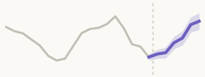Tree averageEnsemble of Random Forest, XGBoost and LightGBM</td>
<td>The tree members are structurally diverse, their split relationships stay stable, and their errors are symmetric.</td>
<td>Smooths the differences between tree models and handles interactions natively, with no weights to optimise.</td>
<td>Still cannot extrapolate beyond the training range, and offers no interpretability at all.</td>
<td class="mt-ex ex-lo">&#9679;&#9679;&#9679;Hard</td>
<td>Averaging Random Forest, XGBoost and LightGBM into one steadier forecast.</td>
</tr>
<tr>
<td class="mt-model">ANNDeep learning</td>
<td>Information flows one way through fully connected layers, neurons in the same layer do not talk to each other, and each layer uses one activation function.</td>
<td>Models very intricate non-linear relationships straight from the raw inputs.</td>
<td>Blind to chronological order, needs hours of training and large samples, and is uninterpretable.</td>
<td class="mt-ex ex-lo">&#9679;&#9679;&#9679;Hard</td>
<td>Static multi-variable problems where sequence is not what drives demand.</td>
</tr>
<tr>
<td class="mt-model">LSTMDeep learning</td>
<td>Chronological dynamics are stable, the order of the months drives the outcome, and there is enough history to train on.</td>
<td>Remembers across long stretches of history and models sequence directly, with no feature engineering.</td>
<td>Hours to train, needs large samples to avoid overfitting, and is a complete black box.</td>
<td class="mt-ex ex-lo">&#9679;&#9679;&#9679;Hard</td>
<td>Long, deep patterns over time in genuinely large datasets.</td>
</tr>
<tr>
<td class="mt-model">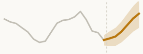ChronosFoundation model</td>
<td>Language-model architectures carry over to time series, recent history is enough context, and the pretraining data resembles yours.</td>
<td>Forecasts with no training at all, returns a range out of the box, and is quick to put in place.</td>
<td>Bounded by a fixed vocabulary, heavy every time it predicts, and risky if your data is unusual.</td>
<td class="mt-ex ex-lo">&#9679;&#9679;&#9679;Hard</td>
<td>Too little history to train your own model, or a rapid deployment.</td>
</tr>
</tbody>
</table>

---

##

 
 

[Outline]{.mimic-h2}

::: {.agenda}
- [What are we actually forecasting?]{.ol-off}
- [Which method, and when]{.ol-off}
- [**Using what you already know**]{.ol-on}
- [What we found]{.ol-off}
:::

##

::: {.big-idea}
[You need a new, better model]{.bi-strike}
[You need to use the context you already hold]{.bi-main}
[The largest gains in our study did not come from a more advanced forecasting model. They came from telling an ordinary model what a district can physically do.]{.bi-sub}
:::

## Covariables: the context is already sitting in your files

Where it already lives

What it gives the forecast

  <i class="fa-solid fa-folder-open"></i>&nbsp; Your annual planning file
  <b>Target population</b> for each district 
  <b>Coverage targets</b>, national and WHO 
  <b>The dose schedule</b> for each antigen

<i class="fa-solid fa-arrow-right-long"></i>

  The ceiling
  The most doses a district could plausibly deliver in a month. FSP4All already computes this for you.

  <i class="fa-solid fa-database"></i>&nbsp; Routine reporting
  <b>Past doses administered</b>, monthly, by district and antigen

<i class="fa-solid fa-arrow-right-long"></i>

  The forecast itself
  The level, the trend and the seasonal shape that any method learns from.

  <i class="fa-solid fa-calendar-check"></i>&nbsp; The programme calendar
  <b>Campaign and session dates</b>, known months ahead 
  <b>Floods, drought, epidemics</b> and public holidays

<i class="fa-solid fa-arrow-right-long"></i>

  Extra drivers
  Things a machine learning method can learn from, and that a pure time series method cannot see.

## A forecast range should not contain the impossible

[Any method that gives you a range gives you a range of *numbers*. It does not know which of those numbers a district could actually deliver.]{.fsp-lead}

::: {.rule-row}

::: {.rule-box .rb-floor}
[1]{.rb-num}
[A floor]{.rb-title}
[A district cannot administer a negative number of doses. Every value below zero in the range is wasted probability.]{.rb-body}
:::

::: {.rule-box .rb-ceiling}
[2]{.rb-num}
[A ceiling]{.rb-title}
[A district cannot vaccinate more children than live there. Beyond that ceiling, the range is describing something that cannot happen.]{.rb-body}
:::

:::

 

[We take the probability that the model put on impossible quantities, and we move it back into the range that is possible. Nothing else about the model changes.]{.msg-soft}

## A simple example

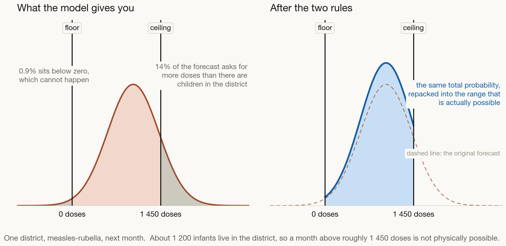{width=88% fig-align="center"}

## A fair question: does this only work if you assume a bell curve?

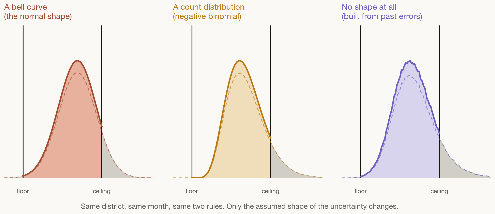{width=88% fig-align="center"}

[We ran the whole study three times: assuming a bell curve, assuming a count distribution, and assuming no shape at all, building the range purely from past forecast errors.]{.fsp-lead style="text-align:center; display:block;"}

## Where the ceiling comes from

[The ceiling is built from the numbers your programme already produces, in two steps.]{.fsp-lead}

:::: {.fsp-two}

::: {.fsp-step-blue}
**Step 1 · The plan**

The demographic estimate you already compute:

$$E = \tfrac{1}{12} \times \text{target population} \times \!\!\!\sum_{\text{each dose}}\!\!\! \text{coverage at that dose}$$

Coverage falls across the schedule, so the per-dose coverages are added up rather than one coverage multiplied by the number of doses.
:::

::: {.fsp-step-orange}
**Step 2 · A reality factor**

Real districts sometimes exceed the plan: catch-up, outreach, children crossing from a neighbouring district.

$$U = k \times E$$

$k$ is learned from your own history, set high enough that only the top 2.5% of past months sit above it.
:::

::::

 

[The ceiling deliberately sits above the plan, so that a genuine surge is never cut off. It only removes quantities no district has ever come close to delivering.]{.msg-soft}

## Two rules, and they sit on top of any method

::::::::: {.fw-wrap}

[Whatever you already use]{.flow-label}

:::::: {.flow-steps}
::: {.fw-box .fw-fsp}
[The demographic method]{.fw-t}
[what FSP4All already gives you]{.fw-s}
:::
::: {.fw-box .fw-stat}
[Trend and season models]{.fw-t}
[ARIMA, ETS, same month last year]{.fw-s}
:::
::: {.fw-box .fw-ml}
[Machine learning]{.fw-t}
[random forest, boosting]{.fw-s}
:::
::: {.fw-box .fw-dl}
[Deep learning and AI models]{.fw-t}
[neural networks, pre-trained models]{.fw-s}
:::
::::::

[▼]{.fw-arrow}

::: {.fw-bar}
Each one produces a forecast with a range around it
:::

[▼]{.fw-arrow}

:::::: {.flow-steps}
::: {.fw-box .fw-data}
[Apply the floor]{.fw-t}
[nothing below zero doses]{.fw-s}
:::
::: {.fw-box .fw-data}
[Apply the ceiling]{.fw-t}
[nothing above what the district's children allow]{.fw-s}
:::
::: {.fw-box .fw-data}
[Repack the probability]{.fw-t}
[the impossible share moves into the possible range]{.fw-s}
:::
::::::

[▼]{.fw-arrow}

::: {.fw-final}
The same method, now producing a forecast a district could actually deliver
:::

:::::::::

---

##

 
 

[Outline]{.mimic-h2}

::: {.agenda}
- [What are we actually forecasting?]{.ol-off}
- [Which method, and when]{.ol-off}
- [Using what you already know]{.ol-off}
- [**What we found**]{.ol-on}
:::

## What we tested it on

::: {.stat-grid}

::: {.stat-card}
[]{.si}
[5 vaccines]{.st}
[BCG · Pentavalent · Measles-Rubella · OPV birth · OPV routine]{.ss}
:::

::: {.stat-card}
[]{.si}
[306 districts]{.st}
[1 530 series, the level where the stock decisions are made]{.ss}
:::

::: {.stat-card}
[]{.si}
[Tested on 2020 and 2021]{.st}
[trained on history the model never saw the test years in]{.ss}
:::

::: {.stat-card}
[]{.si}
[15 methods, 5 families]{.st}
[statistical · machine learning · deep learning · foundation · ensembles]{.ss}
:::

::: {.stat-card}
[]{.si}
[3 ways of expressing uncertainty]{.st}
[no shape assumed · a bell curve · a count distribution]{.ss}
:::

::: {.stat-card}
[]{.si}
[220 320 forecasts]{.st}
[per method and per uncertainty shape, up to 6 months ahead]{.ss}
:::

:::

[The point of the study is not to crown a winning method. It is to ask whether adding the feasibility bound helps, whatever method and whatever uncertainty shape you started from.]{.msg-bar}

## What this looks like in one real district

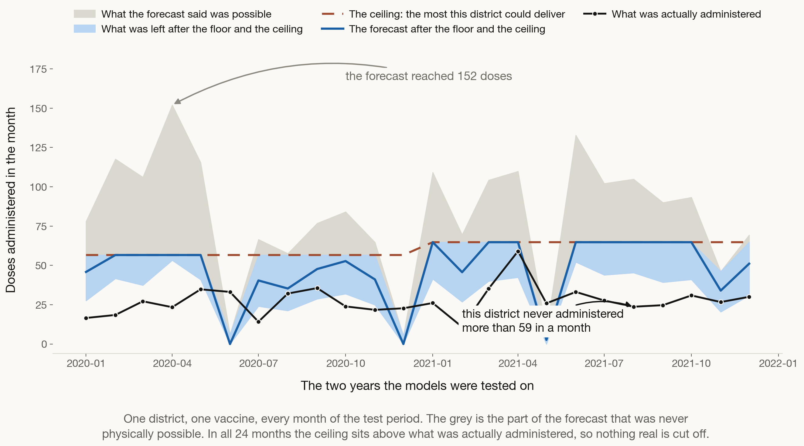{width=84% fig-align="center"}

## Scaled CRPS, before and after

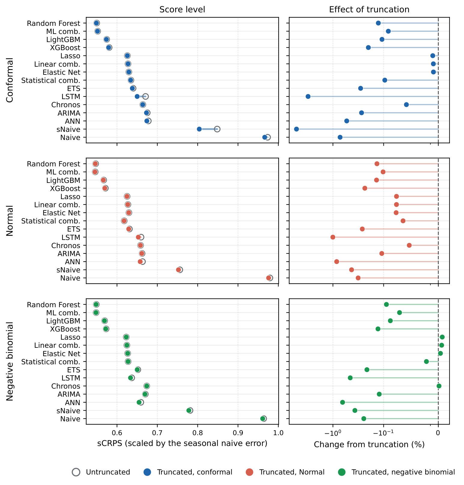{width=53% fig-align="center"}

## RMSSE and MASE, before and after

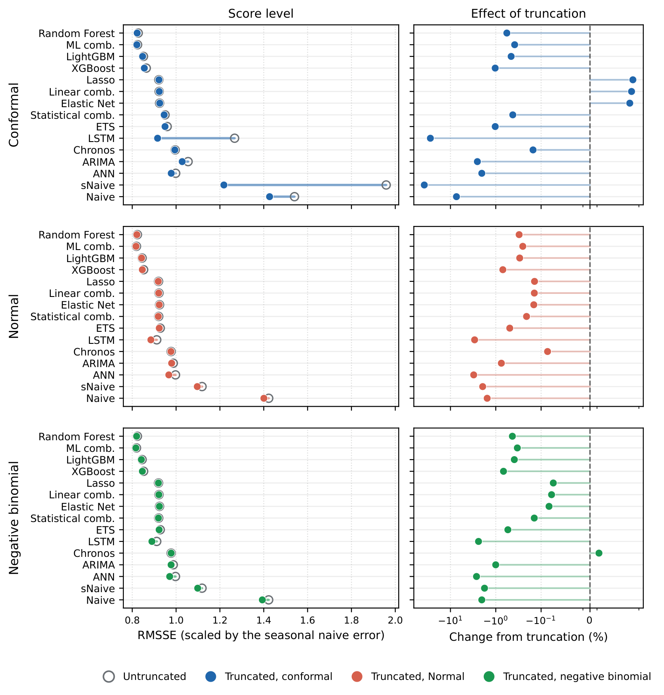{width=53% fig-align="center"}

## What contextual truncation did

::: {.stat-grid}

::: {.stat-card}
[]{.si}
[15 of 15]{.st}
[methods forecast better once the floor and the ceiling were applied]{.ss}
:::

::: {.stat-card}
[]{.si}
[14.7% cheaper]{.st}
[stocking decisions at a 99% service level, and 78% cheaper for the weakest method]{.ss}
:::

::: {.stat-card}
[]{.si}
[0.24%]{.st}
[of months where real demand ever went above the ceiling, so almost nothing genuine is cut]{.ss}
:::

:::

 

::: {.big-bullets}
- It worked under **all three** ways of expressing uncertainty, and at **every** horizon from one to six months
- The gain is largest where forecasts were most spread out, near zero where they were already tight, and no method was worse off
:::

## Decision metrics: scoring what the decision cares about

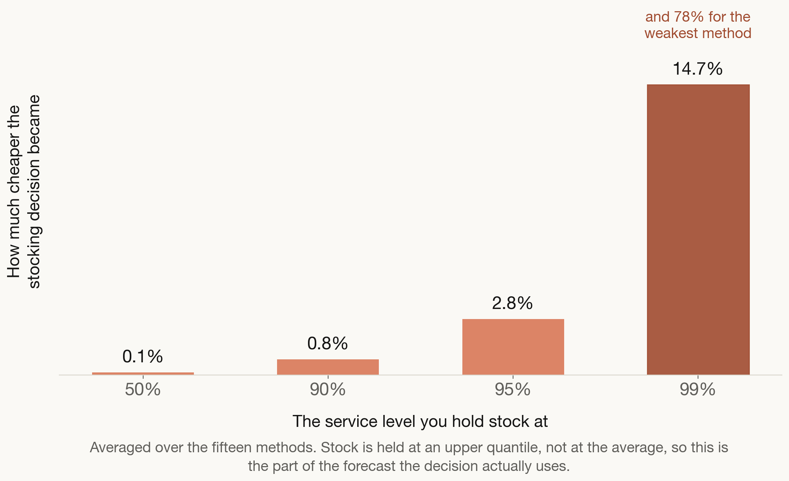{width=58% fig-align="center"}

[You do not order the average. You order enough to cover demand most of the time, and that decision lives in the upper tail, which is exactly where the impossible forecast was sitting.]{.msg-soft}

[The bound buys **sharpness without losing calibration**: the ranges get narrower, and realised demand still falls inside them in 99.76% of months.]{.msg-bar}

## Where the gain lands across the methods

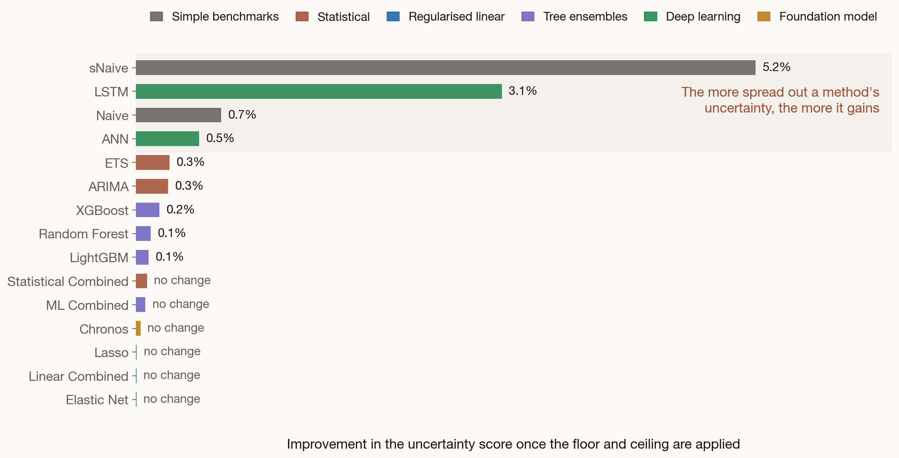{width=68% fig-align="center"}

## The simplest method is the one that gains the most

:::: {.fsp-two}

::: {.fsp-step-blue}
**sNaive, on its own**

- Repeats what happened in the same months a year ago
- Needs **only its own history**: no population file, no context features, no extra reporting
- Runs in about **two minutes** on any laptop
- Anyone in this room can explain exactly how it got its number
:::

::: {.fsp-step-orange}
**sNaive, with contextual truncation**

- Point error down **38%** (RMSSE) and **41%** (MASE)
- Stocking decision at a 95% service level: **23% cheaper**
- At a 99% service level: **78% cheaper**, the largest gain of any method
- Still costs two minutes, still needs no new data, still fully explainable
:::

::::

 

[Being honest about the limit: even after truncation sNaive does not overtake the machine learning methods on the full distributional score. What it does is close a large part of the operational gap using nothing you do not already have.]{.msg-soft}

## What to take home

::: {.takeaways}
- There is no single best method. Match the method to the data you actually have, and to the decision it has to support.
- **Always keep a simple benchmark.** "Same month last year" costs nothing and tells you whether a sophisticated method is earning its keep.
- **Ask every method for a range, not just a number.** Buffer stock is a decision about uncertainty, so the forecast has to describe uncertainty.
- **The context you already hold is worth more than a more advanced model.** Population, coverage and the dose schedule are already in your planning files, and no new data collection is needed.
- **The simplest method gains the most.** "Same month last year" plus the two rules costs two minutes, needs no data you do not already have, stays fully explainable, and its stocking decision at a 99% service level became 78% cheaper.
:::

# Any questions or thoughts? 💬

{fig-align="center"}

::: {.qr-corner}
{width="150"}

[Visit my website for these slides]{.qr-cap}
:::

# Appendix

## Every method improved, whatever shape was assumed

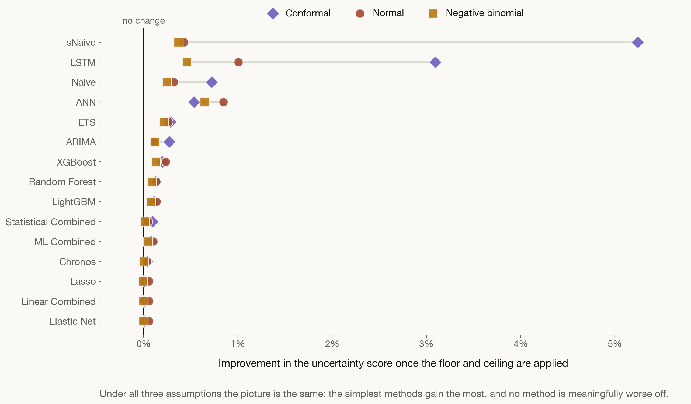{width=70% fig-align="center"}

[Better for all 15 methods under two of the three shapes, and 11 of 15 under the third, where the other four move by less than 0.005%. No method is significantly worse anywhere.]{.fsp-lead style="text-align:center; display:block;"}

## Why the service level matters

::: {.rule-row}

::: {.rule-box .rb-floor}
[]{.rb-num}
[You do not stock to the average]{.rb-title}
[You hold enough to cover demand most of the time, at a 90%, 95% or 99% service level. That decision lives in the upper tail of the forecast, not at its centre.]{.rb-body}
:::

::: {.rule-box .rb-ceiling}
[]{.rb-num}
[The upper tail is where the impossible sits]{.rb-title}
[The higher the service level, the further into implausible territory the forecast reaches, and the more the ceiling has to remove. At the 99% level the cost of the stocking decision fell by 15% on average, and by 78% for the weakest method.]{.rb-body}
:::

:::

 

## Point accuracy, and every horizon

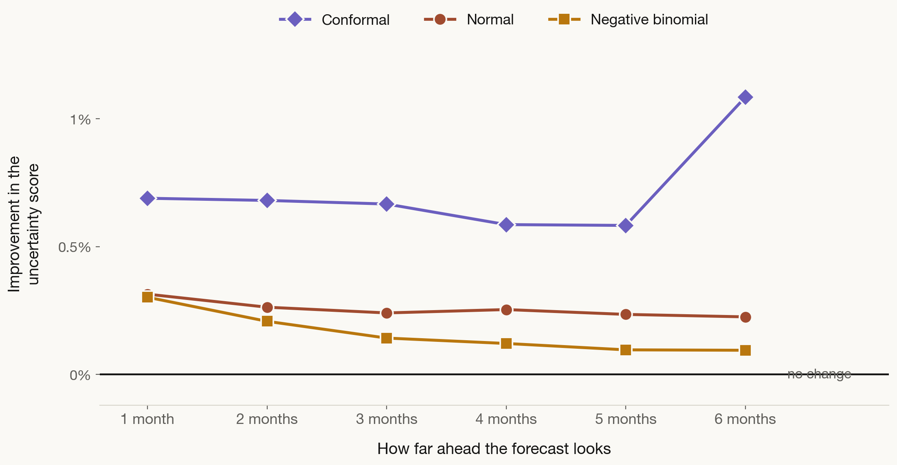{width=62% fig-align="center"}

[Point accuracy improves for all 15 methods under the bell curve, 14 under the count distribution, and 12 under no assumed shape. The benefit neither fades nor spikes with lead time.]{.fsp-lead style="text-align:center; display:block;"}

## Why it works

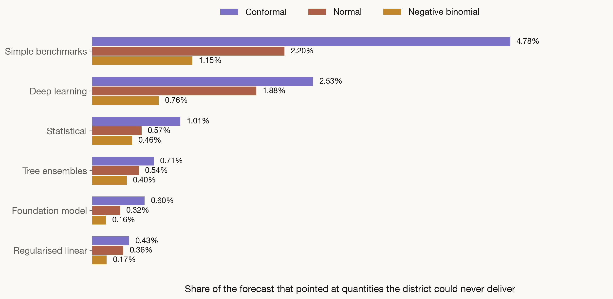{width=64% fig-align="center"}

## The bound binds where the forecast is wrong

:::: {.fsp-two}

::: {.fsp-step-blue}
**What decides the size of the gain**

- Not how often the ceiling is touched, but how much misplaced probability it removes when it is
- The ceiling is touched on 12% of forecasts for the sharpest methods and 96% for the weakest
- None of the forecasting methods is given population data, so the spread alone explains the difference
:::

::: {.fsp-step-orange}
**And it does not cut real demand**

- Across the whole test panel, actual demand went above the ceiling on only [0.24%]{style="font-weight:700;"} of occasions
- The bound is deliberately set above the plan, at the 97.5th percentile of what districts have really delivered
- So it removes the implausible without excluding the demand that genuinely occurs
:::

::::

 

[This is why the rule can be applied across a whole portfolio of methods rather than picked and chosen: it repairs the over-spread forecasts and leaves the well-behaved ones almost untouched.]{.msg-soft}

## What a monthly series actually looks like

{width=62% fig-align="center"}

[Trend, seasonality and noise, separated out. At district level the noise is large relative to the pattern, which is exactly why a range matters more than a single number.]{.fsp-lead style="text-align:center; display:block;"}
