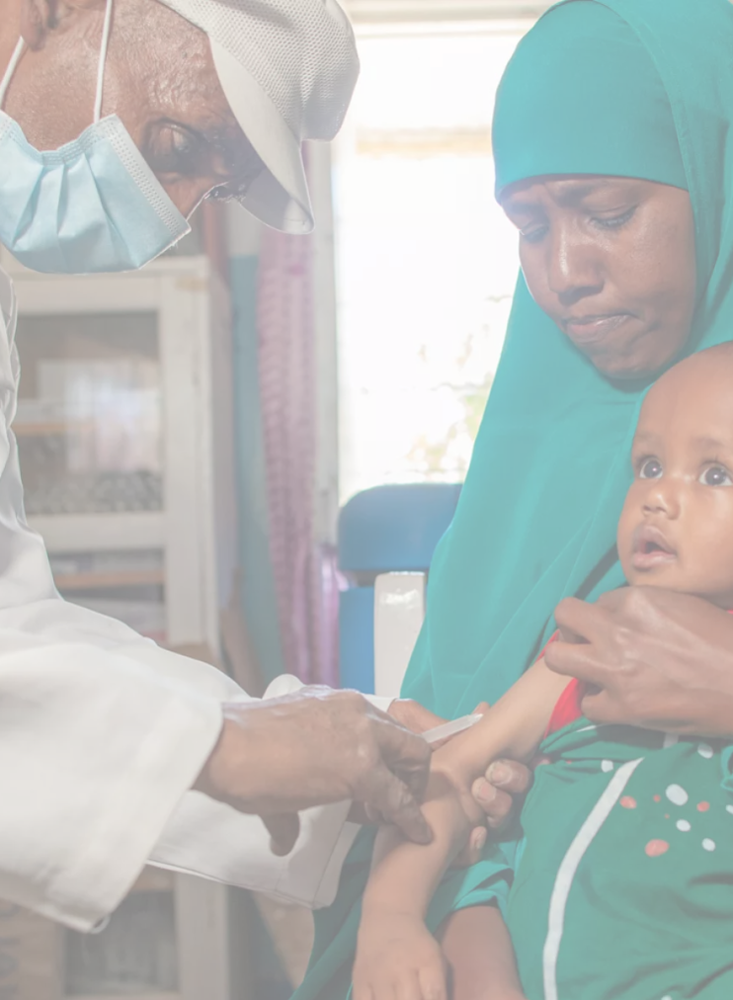
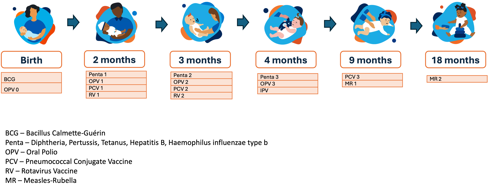
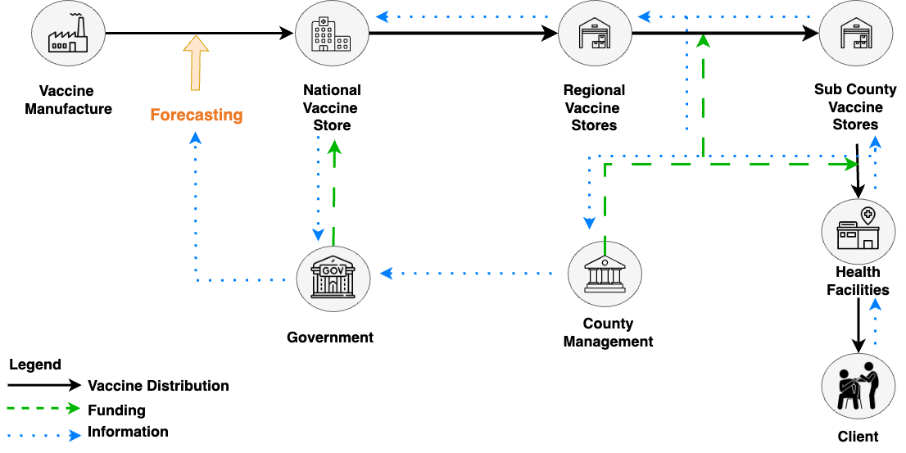
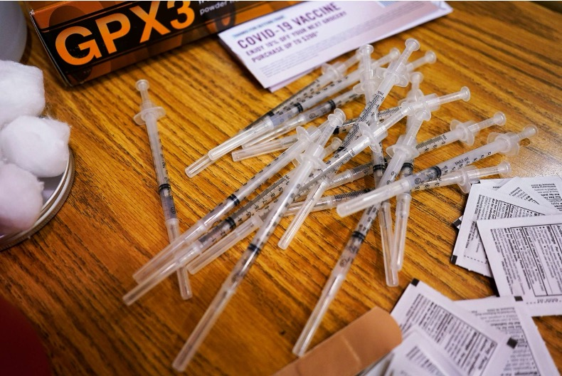
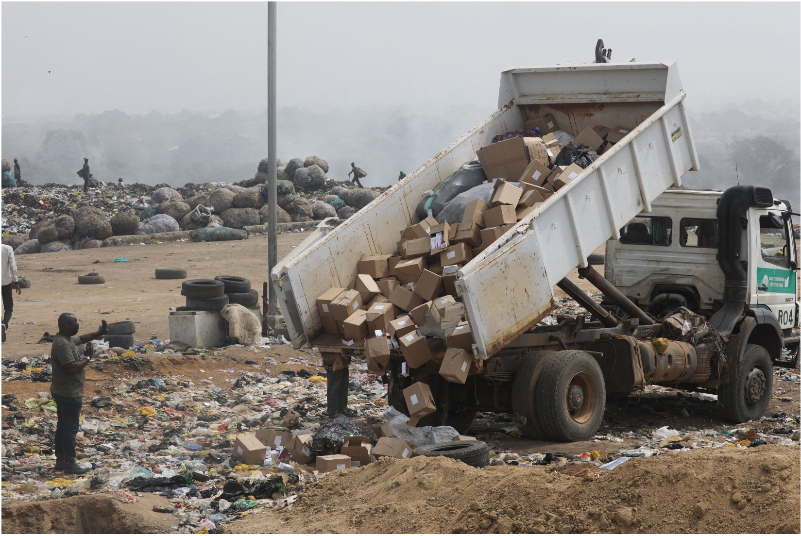
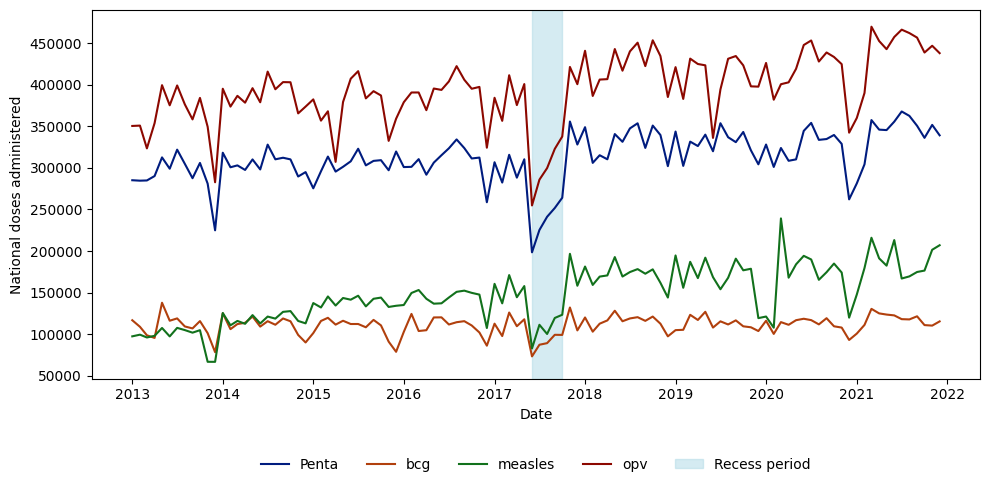

---
format: 
    revealjs:
        toc: false
        slideNumber: "c/t"
        width: 1280
        height: 720
        controls: true
        progress: true
        transition: slide
        plugins: [notes, print-pdf]
        title-slide-attributes:
            data-background-image: none
            data-background-size: cover
        theme: [default, custom.scss]
        logo: images/cardiff_dl4sg_logo.png
        footer: "© 2025 Udeshi Salgado – EURO, Leeds"
---

:::{.slide .title-slide data-background-image="images/background.png" data-background-size="cover"}


## Missed in the Numbers:
### Quantifying Demand Gaps in Routine Immunisation
<br><br><br>

**Udeshi Salgado**  
_Data Lab for Social Good Research Group_ <br>
_Cardiff Business School, Cardiff University, UK_  

<div style="font-size: 50%; line-height: 0.1;">
<strong>Lead Supervisor:</strong> Professor Bahman Rostami-Tabar<br>
<strong>Co-supervisors:</strong> Dr Thanos E Goltsos, Dr Geraint Palmer, Dr Xun Wang
</div>

<br>

2025-06-24

:::


---

::: {.columns}

::: {.column width="40%"}
{width=100%}
:::

::: {.column width="60%"}
<br>

### <span style="color: black;">Outline</span>

1. <span style="color: blue;">Immunisation Supply Chain</span>   
2. (Forecasting) Problem 
3. Methodology  
4. Model Performance Evaluation 
5. Way Forward  

:::

:::

## 

::: {.columns}

::: {.column width="40%"}
{width=100%}
:::

::: {.column width="60%"}

### Background

- <span style="color: blue;">1 in 5 children</span>  worldwide lack access to lifesaving vaccines.
- Globally, in 2023, <span style="color: blue;">14.5 million children were zero-dose.</span> 
- An additional <span style="color: blue;">6.5 million children are partially vaccinated.</span> 
- Annually, <span style="color: blue;">1.5 million children under five die</span>  from vaccine-preventable diseases.

*source: [WHO](https://www.who.int/news-room/fact-sheets/detail/immunization-coverage)*

:::

:::

## 

::: {.columns}

::: {.column width="40%"}
{width=100%}
:::

::: {.column width="60%"}


### What is Routine Immunisation?

- <span style="color: blue;">Regular administration of vaccines</span>  for infants, children, and adults  
- Builds population immunity and prevents disease  
- <span style="color: blue;">Immunisation at birth is critical</span> 
  - Newborns are highly vulnerable to severe infections  
  - Delays can lead to serious illness or death


:::

:::

## Most Countries Recommended Vaccine Schedule

{width=100% fig-align="center"}

*source: [CDC](https://www.cdc.gov/vaccines/hcp/imz-schedules/child-adolescent-age.html)*


## 

::: {.columns}

::: {.column width="40%"}
{height=100%}
:::

::: {.column width="60%"}

### Why Routine Immunisation

- Solving the problem at the start: 
    - Fewer vaccine-preventable deaths.
    - Lower immediate and long-term costs from illness and complications.
    - Reduces future social and economic burden.
- <span style="color: blue;">Each dollar spent on immunization saves $52</span> in low- and middle-income countries (source: [CDC](https://www.cdc.gov/global-immunization/fast-facts/index.html))

:::

:::

## Potential Causes 

- Vaccine hesitancy and misinformation
- Geographic inaccessibility and conflict zones
- Weak health infrastructure and limited cold-chain capacity
- <span style="color: blue;">Supply chain inefficiencies</span>


## The Routine Immunisation Supply Chain

{width=120% fig-align="right"}


## Routine Supply Chain Inefficiencies

- Inadequate infrastructure
- Weak distribution systems
- Poor data management
- Insufficient funding
- Lack of trained personnel
- <span style="color: blue;">Inaccurate/outdated forecasting</span> 


---

::: {.columns}

::: {.column width="40%"}
{width=100%}
:::

::: {.column width="60%"}
<br>

### <span style="color: black;">Outline</span>

1. Immunisation Supply Chain  
2. <span style="color: blue;">(Forecasting) Problem</span>  
3. Methodology  
4. Model Performance Evaluation 
5. Way Forward  

:::

:::


## Vaccines

::: {.columns}

::: {.column width="33%" }
{width=100%}  
<div style="text-align: center;"><strong>Vial</strong></div>
:::

::: {.column width="33%" .fragment}
{width=100%}  
<div style="text-align: center;"><strong>Dose</strong></div>
:::

::: {.column width="33%" .fragment}
{width=100%}  
<div style="text-align: center;"><strong>Administered</strong></div>
:::

:::

## Wastage

::: {.columns}

::: {.column width="50%" }
{width=100%}  
<div style="text-align: center;"><strong>Open Vial</strong></div>
:::

::: {.column width="50%"}
{width=100%}  
<div style="text-align: center;"><strong>Closed Vial</strong></div>
:::

:::


##  What we want to forecast? {auto-animate=true}


::: {style="margin-top: 10px;font-size: 0.1em;"}


:::


##  What we want to forecast? {auto-animate=true}


::: {style="margin-top: 200px; font-size: 1.2em; color: blue;"}


$$
\text{Doses Need} \quad = \quad \text{Doses administered} \quad + \quad \text{Wastage}
$$

:::


## Current Approaches in Practice

- Countries use a range of forecasting tools to <span style="color: blue;">support national immunisation planning and funding requests.</span> 
- These tools are developed by global partners including <span style="color: blue;">UNICEF, Gavi, the Vaccine Alliance, and John Snow, Inc. (JSI).</span> 
- The most common tools include:
    1. Expanded Programme on Immunisation (EPI) Log Tool (Incorporated in the FSP Tool)
    2. Forecasting and Supply Planning (FSP) Tool
    3. Gavi Vaccine Renewal Allocation Tool

---

### FSP Tool: Forecasting and Supply Planning 

- Developed by <span style="color: blue;">UNICEF</span> to enhance national capacity in vaccine forecasting and supply planning
- Designed for <span style="color: blue;">use by national immunisation programme managers</span>  to support multi-year vaccine planning, particularly in <span style="color: blue;">low- and middle-income countries</span> 
- <span style="color: blue;">Incorporates the older EPI Log Tool,</span>  which relied solely on demographic methods
- Used during <span style="color: blue;">annual forecasting exercises and for multi-year planning to align supply with projected needs</span> 

---

## Forecasting Methods in the FSP Tool

The FSP Tool combines three estimation methods for each vaccine $i$:

**1. Demographic Method**  
$$
\hat{D}_{\text{demographic},i,t} = \frac{P_t \cdot \text{Coverage}_{i,t} \cdot \text{DosesPerChild}_i}{1 - \text{WastageRate}_{i,t}}
$$  

<div style="font-size: 70%; line-height: 1.2;">

where:

- $\hat{D}_{\text{demographic},i,t}$: Forecasted annual vaccine doses used demand for vaccine $i$ in year $t$ using demographic approach  
- $P_t$: Target population (e.g., surviving infants) in year $t$  
- $\text{Coverage}_{i,t}$: Coverage rate for vaccine $i$ in year $t$  
- $\text{DosesPerChild}_i$: Number of doses required per child for vaccine $i$  
- $\text{WastageRate}_{i,t}$: Expected wastage rate for vaccine $i$ in year $t$

</div>

---

**2. Consumption-Based Method**  
$$
\hat{D}_{\text{consumption},i,t} = \text{AvgYearlyIssues}_{i,t} \cdot \frac{1}{\text{StockAvailability}_{i,t}}
$$  

<div style="font-size: 80%; line-height: 1.2;">

where

- $\hat{D}_{\text{consumption},i,t}$: Forecasted annual vaccine doses used demand for vaccine $i$ in year $t$ based on consumption  
- $\text{AvgYearlyIssues}_{i,t}$: Historical average monthly vaccine issues for vaccine $i$ at year $t$  
- $\text{StockAvailability}_{i,t}$: Proportion of the year $t$ vaccine $i$ was available (i.e., no stockout)

</div>


---

**3. Session-Based Method**  
$$
\hat{D}_{\text{session},i,t} = \frac{\text{Sessions}_{i,t} \cdot \text{ChildrenPerSession}_{i,t} \cdot \text{DosesPerChild}_i}{1 - \text{WastageRate}_{i,t}}
$$ 


<div style="font-size: 80%; line-height: 1.2;">

where:

- $\hat{D}_{\text{session},i,t}$: Forecasted annual vaccine doses used demand for vaccine $i$ in year $t$ using session planning  
- $\text{Sessions}_{i,t}$: Number of planned vaccination sessions for vaccine $i$ at year $t$ 
- $\text{ChildrenPerSession}_{i,t}$: Children vaccinated per session for vaccine $i$ at year $t$ 
- $\text{DosesPerChild}_i$: Number of doses per child for vaccine $i$  
- $\text{WastageRate}_{i,t}$: Expected wastage rate for vaccine $i$ at year $t$ 

</div>

---

### Final Forecast Combination (Hybrid Approach)

The FSP Tool combines all three forecast methods using weighted averaging:

$$
\hat{D}_{\text{final},i,t} = w_1 \cdot \hat{D}_{\text{demographic},i,t} + w_2 \cdot \hat{D}_{\text{consumption},i,t} + w_3 \cdot \hat{D}_{\text{session},i,t}
$$

<div style="font-size: 80%; line-height: 1.2;">

where

- $\hat{D}_{\text{final},i,t}$: Final forecasted annual vaccine doses used demand for vaccine $i$ in year $t$  
- $w_1, w_2, w_3$: Assigned weights for the demographic, consumption-based, and session-based

</div>

---

## Gavi Vaccine Allocation and Renewal Tool

- Developed by <span style="color: blue;">Gavi, the Vaccine Alliance</span> to guide financial support for country immunisation programmes
- Used by <span style="color: blue;">national governments and Gavi</span> to estimate routine vaccine needs and determine <span style="color: blue;">multi-year funding allocations</span>
- Applied during <span style="color: blue;">multi-year approval (MYA) and annual renewal processes</span> for Gavi-supported vaccines
- Focused on <span style="color: blue;">routine immunisation only</span>, using demographic forecasting to inform co-financing responsibilities and procurement planning

## Forecasting Equation Used in the Tool

For multi-dose vaccine $i$:

$$
\hat{D}_{i,t} = \lceil \hat{SI}_t \times (d_i - 1) \times c_{i,t,1} \times (1 + w_i) + \hat{SI}_t \times c_{i,t,2} \times (1 + w_{i,t}) \times \left(1 + \frac{b_{i,t}}{12}\right) \rceil
$$


<div style="font-size: 70%; line-height: 1.2;">

Where:

- $\hat{D}_{i,t}$: Forecasted annual vaccine doses used demand for vaccine $i$ in year $t$
- $\hat{SI}_t$: Estimated surviving infants in year $t$
- $d_i$: Total doses required per child for vaccine $i$
- $c_{i,t,1}$: Coverage of the first dose of vaccine $i$ at year $t$
- $c_{i,t,2}$: Coverage of the last dose of vaccine $i$ at year $t$
- $w_{i,t}$: Vaccine wastage rate of vaccine $i$ at year $t$
- $b_{i,t}$: Buffer stock duration in months for vaccine $i$ at year $t$

</div>


## Comparison of Forecasting Tools

<div style="max-height: 500px; overflow-y: auto; font-size: 48%;">

```{r, results='asis', echo=FALSE}
library(knitr)
library(kableExtra)

forecast_comparison <- data.frame(
  Tool = c(
    "FSP Tool – Demographic Method",
    "FSP Tool – Consumption-Based Method",
    "FSP Tool – Session-Based Method",
    "Gavi Allocation and Renewal Tool"
  ),
  
  `Output Variables` = c(
    "Forecasted vaccine doses based on population targets",
    "Forecasted vaccine doses based on historical usage adjusted for stockouts",
    "Forecasted vaccine doses based on planned session activity",
    "Annual forecasted vaccine doses used for funding allocation"
  ),
  
  `Input Variables` = c(
    "Population growth, birth cohort, surviving infants, wastage rate, doses per schedule",
    "Average yearly consumption, stockout days, wastage",
    "Session frequency, population per session, attendance rate",
    "Surviving infants, coverage (1st/last dose), wastage, buffer stock"
  ),
  
  `Forecast Horizon` = rep("3–5 years", 3) %>%
    append("5 years", after = 3),
  `Time Granularity` = rep("Yearly", 4),
  `Forecasting Method` = c(
    "Demographic",
    "Consumption-based",
    "Session-based",
    "Demographic"
  ),
  `Vaccines Targeted` = rep("BCG, Penta, OPV, Measles, PCV, Rotavirus", 3) %>%
    append("Penta, Measles, PCV, Rotavirus", after = 3)
)

kable(forecast_comparison, format = "html", escape = FALSE,
      table.attr = "style='width:100%; text-align:center;'") %>%
  kable_styling(full_width = TRUE, bootstrap_options = c("striped", "hover")) %>%
  row_spec(0, background = "#003366", color = "white") %>%
  group_rows("FSP (Forecasting and Supply Planning) Tool", 1, 3)
```

</div>

## Strengths of Current Forecasting Tools

- <span style="color: blue;">Fit for national planning</span>: supports budgeting and procurement.
- <span style="color: blue;">Simple and transparent</span>: easy to use, low technical barrier.
- <span style="color: blue;">Globally backed</span>: aligned with funders and reporting.
- <span style="color: blue;">Standardised assumptions</span>: enables cross-country comparison.
- <span style="color: blue;">Evolving tools</span>: FSP integration improves accuracy.


## Limitations of Current Forecasting Tools

- <span style="color: blue;">Assume perfect data</span>: not realistic in low-resource settings.
- <span style="color: blue;">Ignore uncertainty</span> in demand and supply.
- <span style="color: blue;">National focus</span>: misses facility-level variation.
- <span style="color: blue;">Slow updates</span>: not responsive to rapid changes.
- <span style="color: blue;">Fixed weights</span>: not adaptive to data quality.


## Literature Review

<div style="max-height: 500px; overflow-y: auto; font-size: 47%;">

```{r}
library(knitr)
library(kableExtra)

forecast_table <- data.frame(
  Reference = c("Chiu et al. (2008)", "Kotagiri et al. (2011)", "Mueller et al. (2016)", "Azadi et al. (2018)", 
                "Cernuschi et al. (2018)", "Alegado & Tumibay (2020)", "Colrain et al. (2020)", "Hariharan et al. (2020)", 
                "Sahisnu et al. (2020)", "Vinitha et al. (2024)"),
  Method = c("ARIMA, BPNN, ARIMAT", "Birth pop.-based model", "Pop.-based model", "Regression models", 
             "Pop.-based model", "ARIMA, MLPNN", "Stat./Probabilistic (Binomial)", "RFR", 
             "ARIMA", "LR, RF, GBM, SVR, LSTM, ANN"),
  Variable = c("Total annual vaccine demand", "Births", "Quantity of vaccines needed", "Childhood immunization demand",
               "BCG vaccine demand", "BCG vaccine demand", "Expected doses used/wastage", "Vaccine utilization",
               "Vaccine stock levels", "Infant vaccination demand"),
  Inputs = c("Historical births, doses, wastage, CDC rules", "Early birth info", "Scaled census cohort data",
             "Population size, poverty, literacy, clinics", 
             "UNPD forecast, EPI schedule, WHO coverage/wastage", 
             "Monthly vaccination data", 
             "Birth cohort, sessions, vials, discard time", 
             "Health facility data, date parts, rolling avg.", 
             "Stock history data", 
             "Vaccine name, district, intake date"),
  Time = c("Annual", "NA", "Monthly", "Monthly", "Annual", "Monthly", "Annual", "Biweekly", "Monthly", "Monthly"),
  Horizon = c("1 year", "NA", "12 months", "NA", "14 years", "12 months", "1 year", "NA", "10 months", "NA"),
  Hierarchical = c("Yes", "No", "Yes", "No", "No", "No", "Yes", "No", "No", "No"),
  Level = c("Regional", "Local", "Local", "Regional", "National", "Local", "Local", "Local", "Local", "Local"),
  Probabilistic = c("No", "No", "No", "No", "No", "No", "Yes", "No", "No", "No"),
  Metric = c("Average error rate", 
             "Impact on vaccine inventory levels", 
             "Vaccine availability, Missed Vaccination Opportunities (MVO)", 
             "Not available", 
             "Comparison with historical procurement", 
             "RMSE, MAE", 
             "Wastage rate comparison, sensitivity analysis", 
             "Forecasting error (FE), RMSE", 
             "MAPE", 
             "RMSE, R-Square")
)

kable(forecast_table, format = "html", escape = FALSE) %>%
  kable_styling(full_width = TRUE, bootstrap_options = c("striped", "hover", "condensed")) %>%
  row_spec(0, background = "#003366", color = "white") 


```

</div>


## Literature Review Cont.

<div style="max-height: 500px; overflow-y: auto; font-size: 48%;">

```{r}
library(knitr)
library(kableExtra)

forecast_table <- data.frame(
  Reference = c("Alegado & Tumibay (2020)", "Colrain et al. (2020)", "Hariharan et al. (2020)", 
                "Sahisnu et al. (2020)", "Vinitha et al. (2024)"),
  Method = c("ARIMA, MLPNN", "Stat./Probabilistic (Binomial)", "RFR", 
             "ARIMA", "LR, RF, GBM, SVR, LSTM, ANN"),
  Variable = c("BCG vaccine demand", "Expected doses used/wastage", "Vaccine utilization",
               "Vaccine stock levels", "Infant vaccination demand"),
  Inputs = c("Monthly vaccination data", 
             "Birth cohort, sessions, vials, discard time", 
             "Health facility data, date parts, rolling avg.", 
             "Stock history data", 
             "Vaccine name, district, intake date"),
  Time = c("Monthly", "Annual", "Biweekly", "Monthly", "Monthly"),
  Horizon = c("12 months", "1 year", "NA", "10 months", "NA"),
  Hierarchical = c("No", "Yes", "No", "No", "No"),
  Level = c("Local", "Local", "Local", "Local", "Local"),
  Probabilistic = c( "No", "Yes", "No", "No", "No"),
  Metric = c("RMSE, MAE", 
             "Wastage rate comparison, sensitivity analysis", 
             "Forecasting error (FE), RMSE", 
             "MAPE", 
             "RMSE, R-Square")
)

kable(forecast_table, format = "html", escape = FALSE) %>%
  kable_styling(full_width = TRUE, bootstrap_options = c("striped", "hover", "condensed")) %>%
  row_spec(0, background = "#003366", color = "white") 


```

</div>

## What is Missing?

- Tools in practice mainly use <span style="color: blue;">population-based</span> forecasting.
- FSP tool combines methods, but <span style="color: blue;">weighting is subjective</span>.
- Academic models: mostly population or consumption-based, <span style="color: blue;">rarely both</span>.
- <span style="color: blue;">No unified model</span> combining population and consumption data.
- <span style="color: blue;">Forecasts rarely inform inventory decisions</span> in practice.


## What we want to achieve?

::: {.columns}

::: {.column width="40%"}

{width=80%}


:::

::: {.column width="60%"}

<br>

### **High Coverage of the Doses Administrated**


✅ Reduce missed opportunities

✅ Accounting for accurate wastage rate

✅ Data-driven buffer stock

✅ Forecasting + inventory integration

:::

:::


## Research Questions

::: {.fragment .highlight-blue}
1. What is the most suitable consumption-based forecasting model for routine vaccine demand forecasting?
:::

::: {.fragment .highlight-blue}
2. How can population-based features be effectively combined with consumption-based models to improve forecast accuracy and quantify uncertainty?
:::

::: {.fragment .highlight-blue}
3. How can improved probabilistic forecasts be integrated into inventory decision-making for better vaccine supply chain management?
:::

---

::: {.columns}

::: {.column width="40%"}
{width=100%}
:::

::: {.column width="60%"}
<br>

### <span style="color: black;">Outline</span>

1. Immunisation Supply Chain  
2. (Forecasting) Problem
3. <span style="color: blue;">Methodology</span>    
4. Model Performance Evaluation 
5. Way Forward  
:::

:::

## Data

- Vaccine consumption data from an African country (Jan 2013 – Dec 2021)
- Four vaccines:
  - **Measles~rubella**
  - **BCG** – for tuberculosis
  - **Penta** – combination vaccine for diphtheria, tetanus, pertussis, hepatitis B, and Hib
  - **OPV** – oral polio vaccine


## Doses administrated: National
{width=150% fig-align="center"}

## Forecasting Setup

- Forecasting methods:  <span style="color: blue;">Naive, Seasonal Naive, ARIMA, ETS, Linear Regression, Gradient Boosting (GBM, quantile regression) </span>
- Forecast horizon:  <span style="color: blue;">12 months</span>
- Target: Doses Administered
- Cross-sectional training across vaccines with monthly data


## Performance Evaluation Metrics

::: columns
::: {.column width="50%"}

**Root Mean Squared Scaled Error (RMSSE):**

$$
\text{RMSSE} = \sqrt{ \text{mean}(q_j^2) }
$$

where

$$
q_j^2 = \frac{e_j^2}{\frac{1}{T-m} \sum_{t=m+1}^{T} (y_t - y_{t-m})^2}
$$


:::

::: {.column width="50%"}

**Mean Absolute Scaled Error (MASE):**

$$
\text{MASE} = \text{mean}(|q_j|)
$$

where

$$
q_j = \frac{e_j}{\frac{1}{T-m} \sum_{t=m+1}^{T} |y_t - y_{t-m}|}
$$
:::

:::


---

::: {.columns}

::: {.column width="40%"}
{width=100%}
:::

::: {.column width="60%"}
<br>

### <span style="color: black;">Outline</span>

1. Immunisation Supply Chain  
2. (Forecasting) Problem
3. Methodology    
4. <span style="color: blue;">Model Performance Evaluation</span> 
5. Way Forward  
:::

:::

## Performance Metrics

::: {.columns}

::: {.column width="50%"}
#### BCG
<div style="max-height: 500px; overflow-y: auto; font-size: 50%;">
```{r}
library(knitr)
library(kableExtra)
bcg_table <- data.frame(
  Model = c("AutoARIMA", "LinearRegression", "SeasonalNaive", "GBM", "AutoETS", "Naive"),
  MASE = c(0.796465, 0.852819, 0.856192, 0.866310, 0.906216, 2.506803),
  RMSSE = c(0.689527, 0.774822, 0.792913, 0.751394, 0.809989, 1.964830)
)
kable(bcg_table, format = "html", digits = 6) %>%
  kable_styling(full_width = FALSE, bootstrap_options = c("striped", "hover")) %>%
  row_spec(0, background = "#00274D", color = "white")
```

</div>

#### Penta

<div style="max-height: 500px; overflow-y: auto; font-size: 50%;">
```{r}
penta_table <- data.frame(
  Model = c("GBM", "SeasonalNaive", "AutoARIMA", "AutoETS", "Naive", "LinearRegression"),
  MASE = c(0.671291, 1.212922, 1.565548, 1.894074, 3.602789, 3.890683),
  RMSSE = c(0.603837, 0.957851, 1.120036, 1.351566, 2.473502, 2.718183)
)
kable(penta_table, format = "html", digits = 6) %>%
  kable_styling(full_width = FALSE, bootstrap_options = c("striped", "hover")) %>%
  row_spec(0, background = "#00274D", color = "white")
```

</div>

:::


::: {.column width="50%"}
#### Measles~Rubella

<div style="max-height: 500px; overflow-y: auto; font-size: 50%;">

```{r}
mr_table <- data.frame(
  Model = c("AutoARIMA", "AutoETS", "GBM", "SeasonalNaive", "LinearRegression", "Naive"),
  MASE = c(0.676176, 0.743397, 0.777096, 1.127701, 2.799991, 2.852494),
  RMSSE = c(0.630862, 0.742965, 0.532561, 1.204783, 2.391404, 2.303965)
)
kable(mr_table, format = "html", digits = 6) %>%
  kable_styling(full_width = FALSE, bootstrap_options = c("striped", "hover")) %>%
  row_spec(0, background = "#00274D", color = "white")
```

</div>

#### OPV

<div style="max-height: 500px; overflow-y: auto; font-size: 50%;">

```{r}
opv_table <- data.frame(
  Model = c("GBM", "LinearRegression", "SeasonalNaive", "AutoARIMA", "AutoETS", "Naive"),
  MASE = c(0.744075, 0.858765, 0.926087, 1.350139, 1.533141, 2.691505),
  RMSSE = c(0.670003, 0.721325, 0.841312, 1.047141, 1.199226, 2.047815)
)
kable(opv_table, format = "html", digits = 6) %>%
  kable_styling(full_width = FALSE, bootstrap_options = c("striped", "hover")) %>%
  row_spec(0, background = "#00274D", color = "white")
```

</div>
:::

:::

---

::: {.columns}

::: {.column width="40%"}
{width=100%}
:::

::: {.column width="60%"}
<br>

### <span style="color: black;">Outline</span>

1. Immunisation Supply Chain  
2. (Forecasting) Problem
3. Methodology  
4. Model Performance Evaluation 
5. <span style="color: blue;">Way Forward</span>    
:::

:::

## Next Steps

- Check and address data quality issues for doses used.

- Combine consumption-based probabilistic forecasting with demographic features to improve vaccine demand forecasts and report evaluation results.

- Incorporate forecasting outputs into actionable inventory decisions.

---

::: {.columns}

::: {.column width="40%"}
{width=100%}
:::

::: {.column width="60%"}
<br>

### <span style="color: black;">Acknowledgement</span>

-  John and Snow Inc (JSI) team
    - Dr. Laila Akhlaghi
    - Wendy Prosser


:::

:::


---

::: {.columns}

::: {.column width="50%"}
### About me

<br>

Udeshi Salgado

1st year PhD Student

DL4SG, Cardiff University, UK

<br>

LinkedIn: [udeshi-salgado](https://www.linkedin.com/in/udeshi-salgado/)  

Slides: [udeshisalgado.github.io/talks](https://udeshisalgado.github.io/talks.html)


:::

::: {.column width="50%"}


### Outline of my talk
<br>

1. Immunisation Supply Chain  
2. (Forecasting) Problem
3. Methodology  
4. Model Performance Evaluation 
5. Way Forward  

:::

:::

