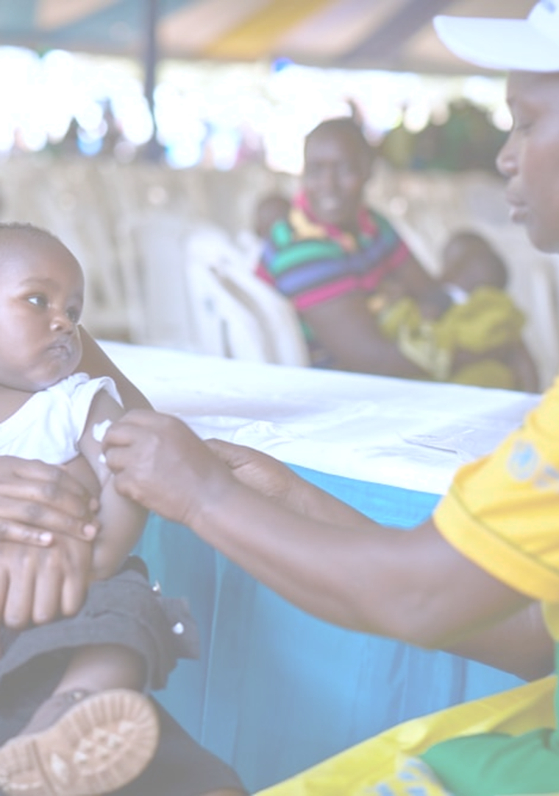
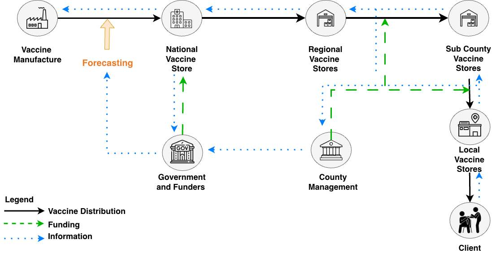
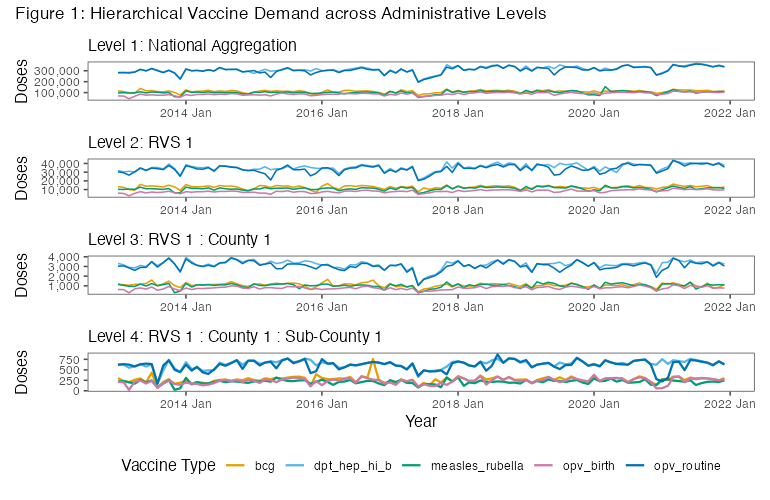
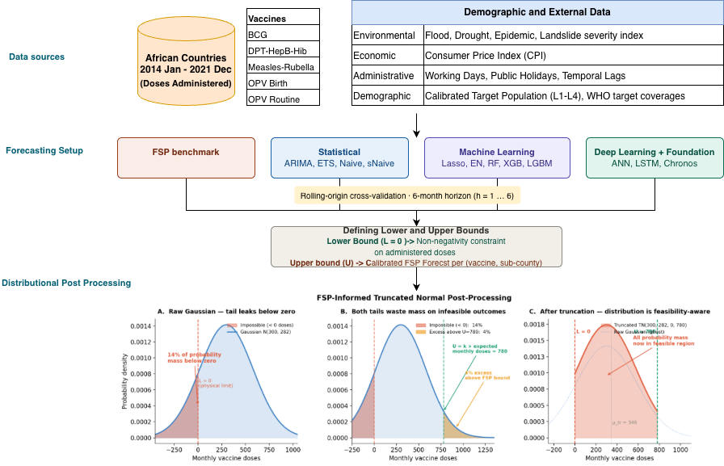
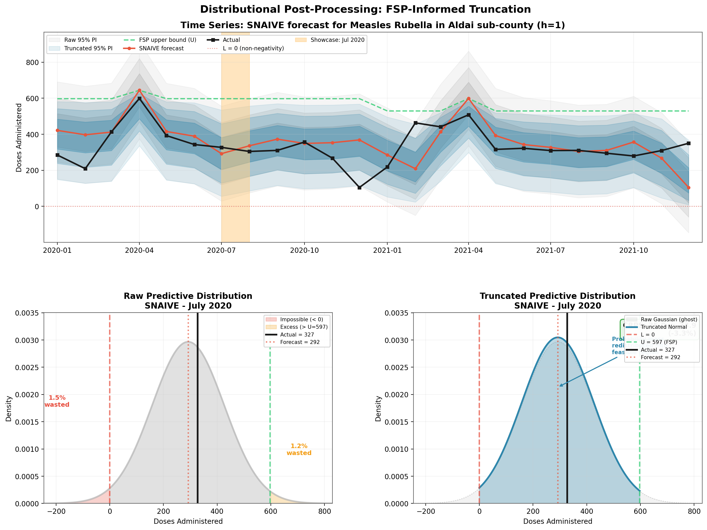
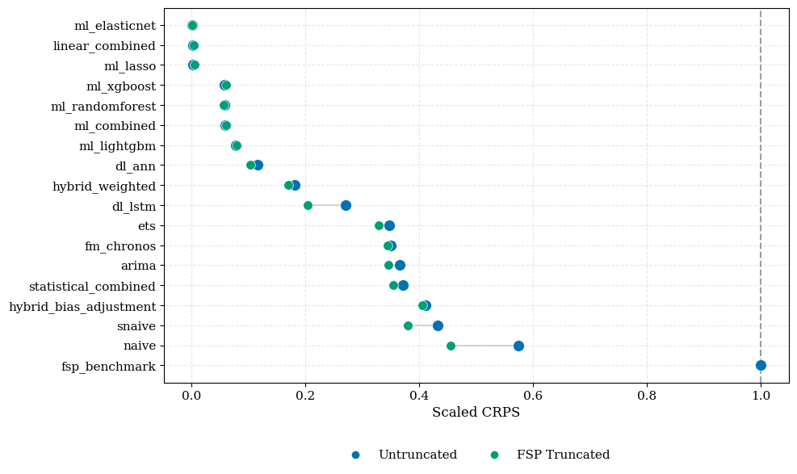
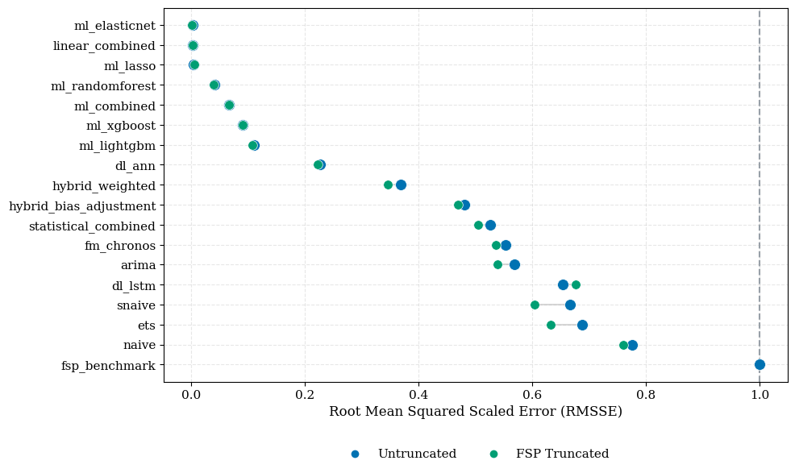

{width=20% fig-align="left"}

  

### Distributional Post-Processing for Vaccine Demand Forecasting at the Operational Level in Low- and Middle-Income Countries

 
    
 
   

**Udeshi Salgado**, _DL4SG, Cardiff University, UK_  
<strong>Lead Supervisor:</strong> Professor Bahman Rostami-Tabar 
<strong>Co-supervisors:</strong> Dr Thanos E Goltsos, Dr Geraint Palmer, Dr Xun Wang

11 June 2026

## Background

::: {.columns}

::: {.column width="40%"}
{width=80%}
:::

::: {.column width="60%"}

::: {.incremental}

- 1 in 5 children worldwide still lack access to essential vaccines.
- A key operational contributor is inefficiency in vaccine supply chains.
- In low- and middle-income countries, these inefficiencies often involve:

  - inaccurate demand forecasts
  - inventory decisions made under limited uncertainty information
  - wastage and stockouts

:::

:::

:::

## Vaccines

::: {.columns}

::: {.column width="33%" }
{width=100%}  

<strong>Vial</strong>

:::

::: {.column width="33%" .fragment}
{width=100%}  

<strong>Dose</strong>

:::

::: {.column width="33%" .fragment}
{width=100%}  

<strong>Administered</strong>

:::

:::

## The Immunisation Supply Chain

{width=120% fig-align="right"}

## Why Operational Administrative Level? 

{width=100% fig-align="center"}  

## The Gap & The Question

::: {.fragment fragment-index=1 }

- In practice, the **Forecasting, Supply Planning and Procurement (FSP) Tool** relies on static demographic targets and produces point forecasts only, with no representation of uncertainty.

:::

::: {.fragment fragment-index=2 }

- In academia, existing studies focus on aggregate planning levels and point forecast accuracy, with little attention to probabilistic forecasting at the operational level in LMICs.

:::

::: {.fragment fragment-index=3 }

- Forecast distributions are not constrained to feasible values: negative doses and quantities exceeding the eligible population.

:::

::: {.fragment fragment-index=4 .callout-tip}

### Research Question

How well do statistical, ML, DL, and foundation time-series methods forecast routine childhood vaccine doses probabilistically at the operational level in LMICs, and can FSP-informed distributional post-processing improve the feasibility and quality of forecast distributions?

:::

---

## Methodology

{width=120% fig-align="center"}

## Distributional Post Processing 

{width=120% fig-align="center"}

## Key Results

:::: {.columns}

::: {.column width="50%"}

### Scaled CRPS

{width=100% fig-align="center"}
:::

::: {.column width="50%"}

### RMSSE

{width=100% fig-align="center"}
:::

::::

# Thank you!
{width=100% fig-align="center"}