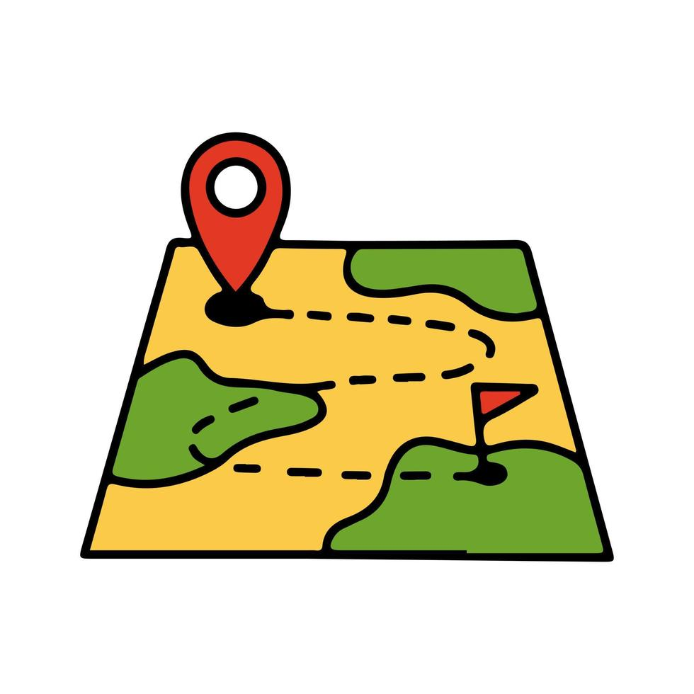
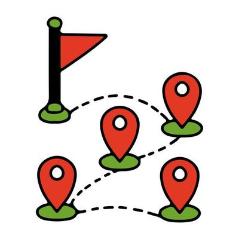
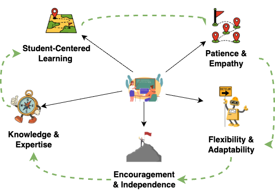

---
format: 
    revealjs:
        toc: false
        slideNumber: "c/t"
        width: 1280
        height: 720
        controls: true
        progress: true
        transition: slide
        plugins: [notes, print-pdf]
        title-slide-attributes:
            data-background-image: none
            data-background-size: cover
        theme: [default, custom.scss]
        logo: images/cardiff_dl4sg_logo.png
        footer: "© 2025 Udeshi Salgado – PGR Interview"
---

:::{.slide .title-slide data-background-image="images/background.png" data-background-size="cover"}

## What Qualities Make a Good Tutor? 
### Guiding students on their learning journey
   

**Udeshi Salgado**  
_Data Lab for Social Good Research Group_  
_Cardiff Business School, Cardiff University, UK_  

 

2025-09-18

:::

## Knowledge & Growth

::: {.columns}

::: {.column width="40%"}
{width=100%}
:::

::: {.column width="60%"}
 

#### Direction & expertise

- Strong subject knowledge builds trust
- Continuous learning keeps skills sharp
- Reflection ensures personal growth

:::

:::

## Student-Centered Learning 

::: {.columns}

::: {.column width="40%"}
{width=100%}
:::

::: {.column width="60%"}
 

####  Personalized routes for each student

- Every learner has different starting points
- Learning is tailored to individual pace & goals
- Student needs define the journey

:::

:::

## Patience & Empathy

::: {.columns}

::: {.column width="40%"}
{width=100%}
:::

::: {.column width="60%"}
 

####  Walking alongside the learner

- Supports students at their own pace
- Encourages without judgment
- Builds confidence through trust

:::

:::

## Flexibility & Adaptability

::: {.columns}

::: {.column width="40%"}
{width=100%}
:::

::: {.column width="60%"}
 

####  Changing direction when needed

- Adjusts explanations and methods
- Uses creativity to overcome barriers
- Flexible in response to challenges

:::

:::

## Encouragement & Independence

::: {.columns}

::: {.column width="40%"}
{width=100%}
:::

::: {.column width="60%"}
 

####  Students reach their goals confidently

- Builds resilience and confidence
- Motivates students to keep learning
- Goal: independent, self-reliant learners

:::

:::

## Summary

{width=100% fig-align="center"}

---

::: {.columns}

::: {.column width="50%"}

     

### Thank You!

:::

::: {.column width="50%"}

### About me
 

Udeshi Salgado

2nd year PhD Student

DL4SG, Cardiff University, UK

 

LinkedIn: [udeshi-salgado](https://www.linkedin.com/in/udeshi-salgado/)  

Slides: [udeshisalgado.github.io/talks](https://udeshisalgado.github.io/talks.html)

:::

:::

