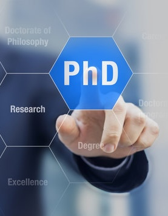
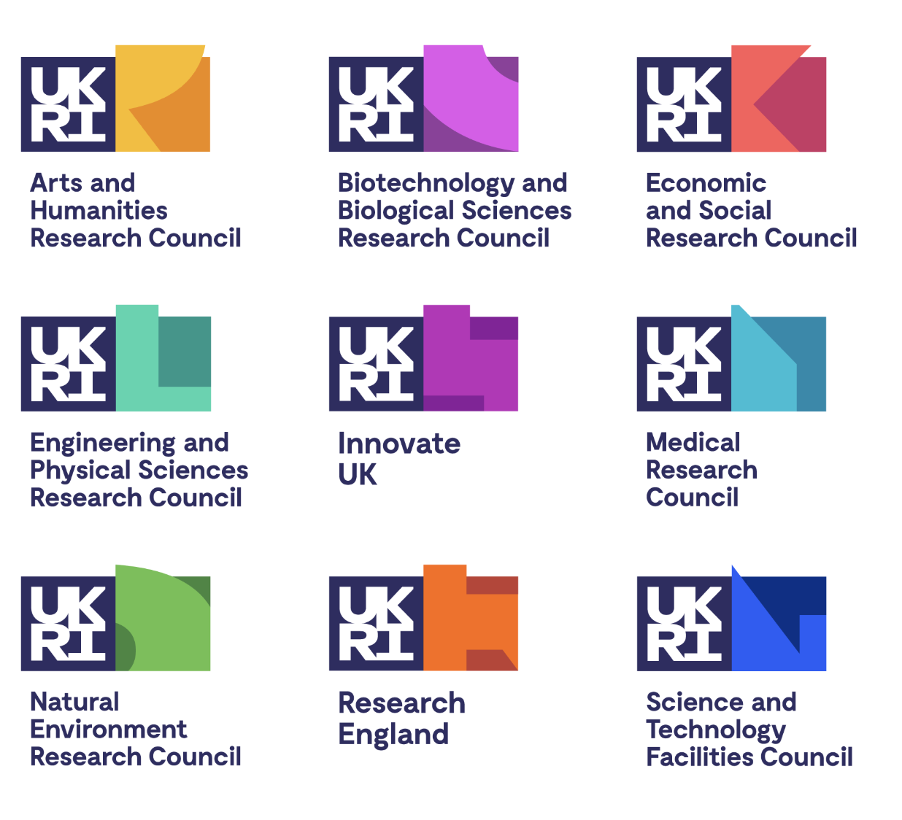
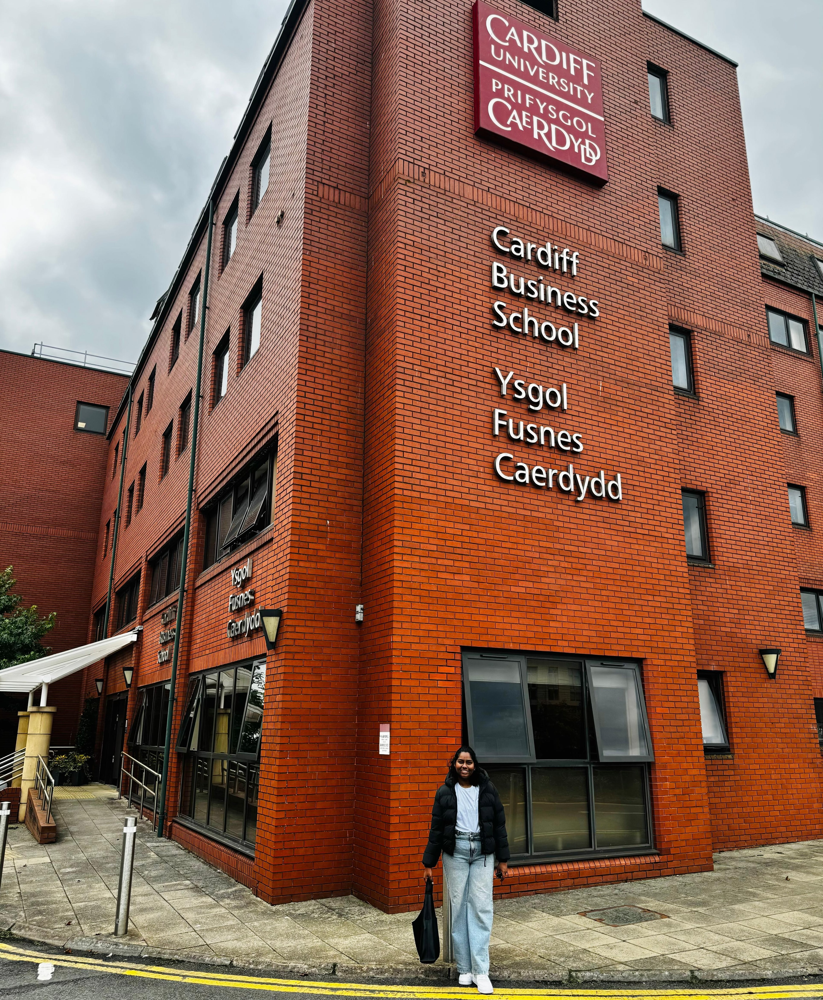
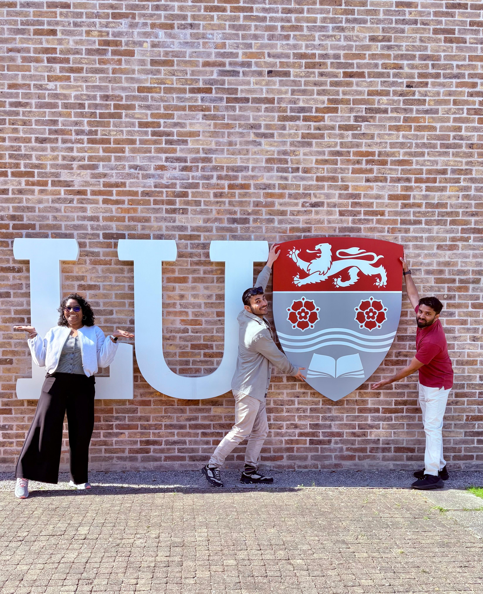
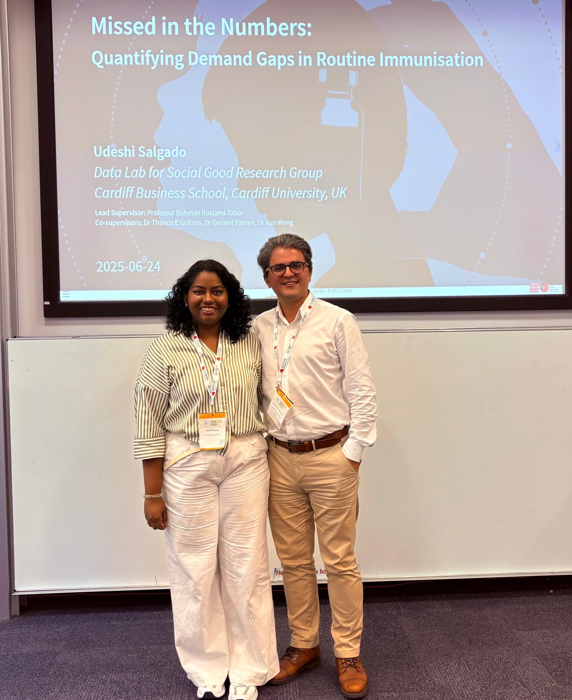
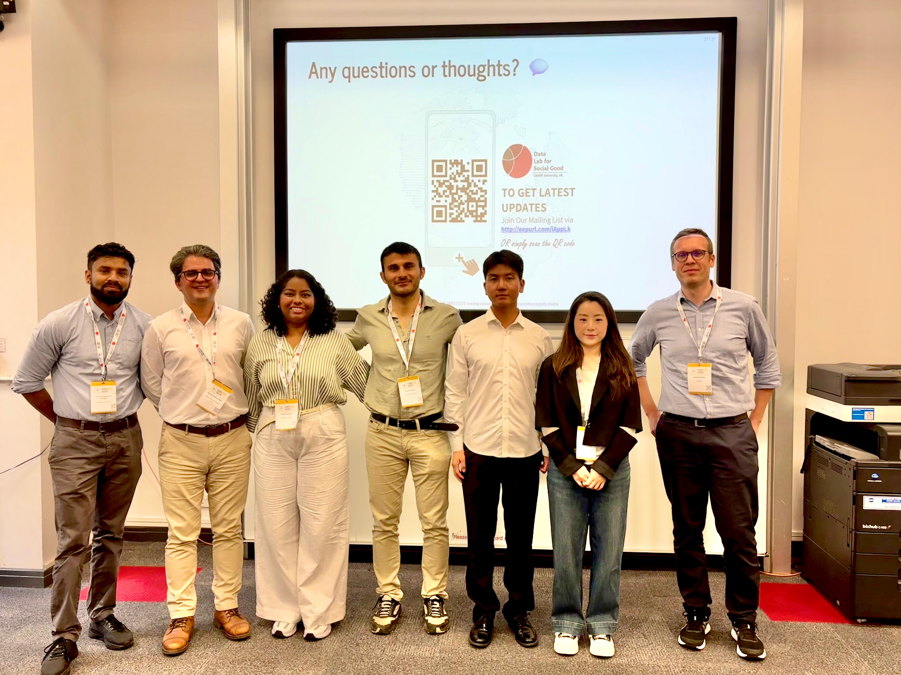
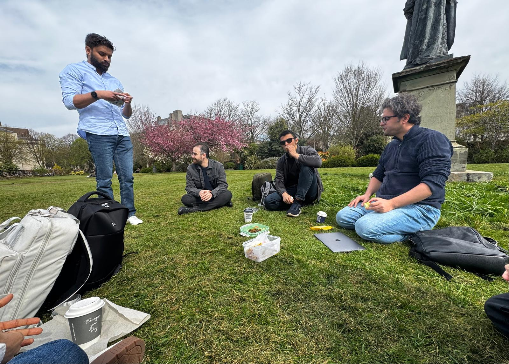
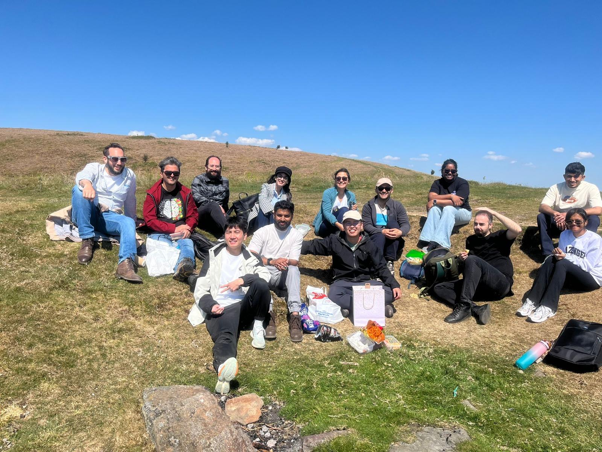
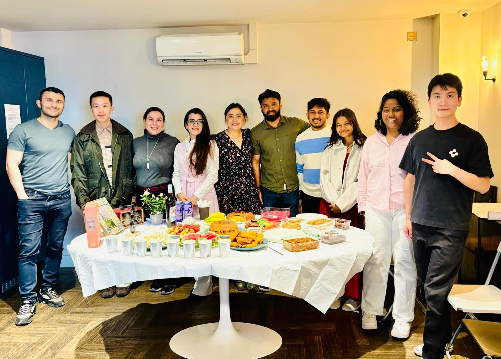
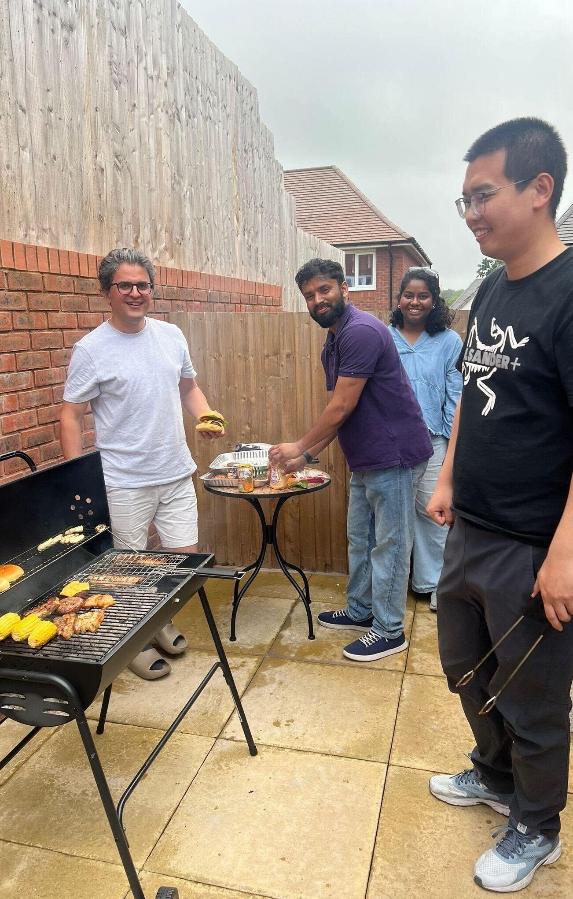

---
format: 
    revealjs:
        toc: false
        slideNumber: "c/t"
        width: 1280
        height: 720
        controls: true
        progress: true
        transition: slide
        plugins: [notes, print-pdf]
        title-slide-attributes:
            data-background-image: none
            data-background-size: cover
        theme: [default, custom.scss]
        logo: images/cardiff_dl4sg_logo.png
        footer: "© 2025 Udeshi Salgado – Higher Studies Webinar, USJ"
---

:::{.slide .title-slide data-background-image="images/background.png" data-background-size="cover"}


## Pursuing a Fully Funded PhD in the UK: 
### A Roadmap to Academic Success
<br><br><br>

**Udeshi Salgado**  
_Data Lab for Social Good Research Group_ <br>
_Cardiff Business School, Cardiff University, UK_  


<br>

2025-07-30

:::


---

::: {.columns}

::: {.column width="40%"}
{width=100%}
:::

::: {.column width="60%"}

<br>

### Outline

<br>

1. <span style="color: #FF4500;"> Getting into the Statistics Special Degree Program</span>   
2. Life as a Statistics Honours Student
3. Securing Scholarships and Adapting to PhD Life
4. Life as an Overseas Student


:::

:::


## Getting into the Statistics Special Degree

::: {.columns}

::: {.column width="40%"}
{width=100%}
:::

::: {.column width="60%"}
<br>

### Why I Chose Statistics
- <span style="color: #FF4500;">Unique value</span> of the Statistics Special Degree at <span style="color: #FF4500;">USJ</span>  
- <span style="color: #FF4500;">Broad applicability across diverse fields</span>  
- Equips you for pursuing a <span style="color: #FF4500;">PhD without a Master’s</span>
 

:::

:::


---


### What Helped Me Get Selected
- Maintained consistent performance in assignments 
- Took mid-semester exams seriously   
- Maintained high lecture attendance
- Achieved a <span style="color: #FF4500;">high GPA (above 3.4)</span> in Statistics  

---

### Recommendations 

- Focus on mastering <span style="color: #FF4500;">basic statistics</span> which forms the foundation for later coursework  
- Maintain a <span style="color: #FF4500;">strong GPA in all three subjects</span>, not just statistics  
- Don’t hesitate to <span style="color: #FF4500;">ask questions</span> and actively engage in class  
- Build <span style="color: #FF4500;">good relationships with lecturers</span>; they can guide and support your progress  
- If possible, <span style="color: #FF4500;">join ongoing departmental projects</span> for early research exposure  
- Learn programming languages such as <span style="color: #FF4500;">Python</span> and <span style="color: #FF4500;">R</span>, and explore cloud tools like <span style="color: #FF4500;">AWS</span> as well as query languages like <span style="color: #FF4500;">SQL</span>.

---
 

::: {.columns}

::: {.column width="40%"}
{width=100%}
:::

::: {.column width="60%"}

<br>

### Outline

<br>

1. Getting into the Statistics Special Degree Program</span>   
2. <span style="color: #FF4500;">Life as a Statistics Honours Student</span> 
3. Securing Scholarships and Adapting to PhD Life
4. Life as an Overseas Student


:::

:::

## Life as a Statistics Honours Student

::: {.columns}

::: {.column width="40%"}
{width=100%}
:::

::: {.column width="60%"}


### Academic Journey
- Built a <span style="color: #FF4500;">strong statistical foundation</span>  
- Improved soft skills through <span style="color: #FF4500;">Statistical Seminar</span>  
- Real-world exposure via <span style="color: #FF4500;">Statistical Consultancy</span>  
- Industry field visits and cross-domain experience  
- Developed strong bonds with lecturers

:::

:::


---

### Research & Internship Highlights  

- My impactful <span style="color: #FF4500;">BSc thesis</span>  in data science applied to dentistry, featuring the <span style="color: #FF4500;">AIdentist</span>  app and a novel data augmentation method, played a key role in securing direct fully funded PhD program  
- Gained practical experience as a <span style="color: #FF4500;">Data Analyst Intern</span> at Vizumatix  


### Leadership & Societies
- Editor of <span style="color: #FF4500;">Statistics Society USJ</span> and <span style="color: #FF4500;">CSM</span>  and chaired two impactful <span style="color: #FF4500;">Rotaract</span> projects  
- Gained  <span style="color: #FF4500;">event management, teaching, and training experience</span> 
- Currently Social Media Head at <span style="color: #FF4500;">DL4SG Research Group</span> 


---


::: {.columns}

::: {.column width="40%"}
{width=100%}
:::

::: {.column width="60%"}

<br>

### Outline

<br>

1. Getting into the Statistics Special Degree Program</span>   
2. Life as a Statistics Honours Student
3. <span style="color: #FF4500;"> Securing Scholarships and Adapting to PhD Life</span> 
4. Life as an Overseas Student


:::

:::


## 

::: {.columns}

::: {.column width="40%"}
{width=100%}
:::

::: {.column width="60%"}

### Why Choose to Do a PhD?

- <span style="color: #FF4500;">Self Growth</span>  
- Opportunity to Explore a Topic in Depth
- Read, Learn, and Discover Continuously
- Develop Critical Thinking and Problem-Solving Skills
- Build a Global Academic and Professional Network
- Open Doors to Academic, Industry, and Research Careers


:::

:::


## Why Choose the UK?

::: {.fragment .semi-fade-out fragment-index=7}
::: {.fragment fragment-index=1}
- Shorter Duration <span style="color: #FF4500;">(Typically 3–4 Years)</span> 
:::
:::


::: {.fragment fragment-index=2}
- Access to <span style="color: #FF4500;">Funding and Scholarships</span>
:::

::: {.fragment .semi-fade-out fragment-index=7}
::: {.fragment fragment-index=3}
- <span style="color: #FF4500;">Additional funding</span> to attend seminars, conferences, and other events
:::
:::

::: {.fragment .semi-fade-out fragment-index=7}
::: {.fragment fragment-index=4}
- Possibility to teach as <span style="color: #FF4500;">an extra income (Graduate Tutor/ RA Opportunities)</span>
:::
:::

::: {.fragment .semi-fade-out fragment-index=7}
::: {.fragment fragment-index=5}
- Post-Study Options: PhD graduates can stay in the UK for up to 3 years via the Graduate Route or apply for the <span style="color: #FF4500;">Global Talent visa</span> for a flexible path to settlement in academia or research
:::
:::

::: {.fragment .semi-fade-out fragment-index=7}
::: {.fragment fragment-index=6}
- Gateway to <span style="color: #FF4500;">Europe and Beyond</span>
:::
:::


## Scholarships and Funding Options  

::: {.fragment .semi-fade-out fragment-index=6}
::: {.fragment fragment-index=1}
- <span style="color: #FF4500;">Commonwealth Scholarship</span> – Fully funded; includes on-campus, distance learning and split-site pathways (for PhD students in eligible Commonwealth countries to spend up to 12 months in the UK).
:::
:::

::: {.fragment .semi-fade-out fragment-index=6}
::: {.fragment fragment-index=2}
- <span style="color: #FF4500;">Chevening Scholarship</span> – Primarily for Master’s; limited PhD opportunities
:::
:::

::: {.fragment fragment-index=3}
- <span style="color: #FF4500;">UK Research and Innovation (UKRI) Studentships</span> – Offered via DTPs/CDTs
:::

::: {.fragment .semi-fade-out fragment-index=6}
::: {.fragment fragment-index=4}
- <span style="color: #FF4500;">University Scholarships</span> – e.g., Gates Cambridge, Clarendon (Oxford), CRABS (Cardiff)
:::
:::

::: {.fragment .semi-fade-out fragment-index=6}
::: {.fragment fragment-index=5}
- <span style="color: #FF4500;">Industrial Funding</span> – Supervisor may fund you via industry-sponsored projects
:::
:::

---


### UKRI Studentships

::: {.columns}

::: {.column width="40%"}
{width=100%}
:::

::: {.column width="60%"}

- Fully funded: **Tuition + £19,000+ annual stipend**
- Offered via **DTPs (Doctoral Training Partnerships)** and **CDTs (Centres for Doctoral Training)**
- Available across **9 research councils** (EPSRC, ESRC, AHRC, etc.)
- More info: [ukri.org](https://www.ukri.org/)


:::

:::

---

### UKRI PhD Funding Paths

<br>

```{mermaid}
flowchart LR
  classDef bigNode fill:#2780e3,stroke:#333,stroke-width:2px,font-size:16px,color:#fff

  PhD["   PhD<br/>Application   "]:::bigNode --> SupervisorLed["   Supervisor-led<br/>Path   "]:::bigNode
  PhD --> StudentLed["   Student-led<br/>Path   "]:::bigNode

  SupervisorLed --> GrantApply["   Supervisor Applies<br/>Directly   "]:::bigNode
  GrantApply --> GrantReceived["   Grant<br/>Received   "]:::bigNode
  GrantReceived --> PublishPHD["   Supervisor Publishes<br/>the PhD   "]:::bigNode
  PublishPHD --> Interview["   Interview    "]:::bigNode
  Interview --> SelectCandidate["   Candidate Selection   "]:::bigNode

  StudentLed --> StudentApply["   Student Applies<br/>Directly   "]:::bigNode
  StudentApply --> Decision{"   Supervisor<br/>Selection   "}:::bigNode

  Decision -->|By Student| Offer1["   Student Finds a<br/>Supervisor   "]:::bigNode
  Decision -->|By University| Offer2["   University Assigns<br/>Supervisor   "]:::bigNode

  Offer1 --> PublishPHD1["   Interview   "]:::bigNode
  Offer2 --> PublishPHD1
  PublishPHD1 --> SelectCandidate1["   Grant<br/>Received   "]:::bigNode


```


## How to Find PhD Opportunities?

- [FindAPhD.com](https://www.findaphd.com) – Main platform for funded and self-funded PhD listings in the UK and globally  
- [University Websites](https://www.findaphd.com/phds/phd-study-guides/university-funding.aspx) – Check departmental pages, scholarship sections, and project listings  
- Contact potential supervisors – Read recent publications and email with a tailored proposal  
- [UKRI Studentships](https://www.ukri.org) – Doctoral Training Partnerships (DTPs) and Centres for Doctoral Training (CDTs)  
- [LinkedIn](https://www.linkedin.com) – Follow researchers, research groups/centers (eg: [DL4SG](https://www.linkedin.com/company/dlsg2023/)) and institutions for live PhD postings  


## What You Need to Prepare Before Applying

### Academic & Documentation Requirements

- <span style="color: #FF4500;">Minimum Qualifications</span>: UK first/upper-second class honours degree or equivalent, or a Master’s degree (could be change on the studentship) 
- <span style="color: #FF4500;">Proof of English Language Competency</span>: IELTS score of **6.5 overall** (minimum **5.5 per subskill**)  
- <span style="color: #FF4500;">2 academic or professional references</span>:  candidates must approach referees themselves and include references with their application. The reference must detail the applicant’s research strengths
- <span style="color: #FF4500;">Degree certificates and transcripts</span> (including translations if applicable)
- <span style="color: #FF4500;">Research Proposal</span>


---


- <span style="color: #FF4500;">Academic CV</span>: Include education, research, publications, skills, and achievements  
- <span style="color: #FF4500;">Cover Letter</span>:
  - Summarize academic background, key achievements, research interests  
  - Describe proposed research idea and how it aligns with the supervisor’s work  
  - Mention relevant skills, publications (if any), and enthusiasm for the field  
  - Show awareness of supervisor’s work by referencing recent papers  
  - Add extracurricular interests to show a well-rounded profile

---

### Financial Requirements (Estimates for 2025)
<br>

```{r}
library(knitr)
library(kableExtra)

# Create the data frame
financial_data <- data.frame(
  Item = c("IELTS Test", "Student Visa Fee", "NHS Health Surcharge (1 year)", "Air Ticket (SL to UK)", "Accommodation Prepayment", "TB Test"),
  `Cost (GBP)` = c("£200", "£490", "£776", "£600", "£250", "£45"),
  `Approx. Cost (LKR)` = c("LKR 80,000", "LKR 196,000", "LKR 310,400", "LKR 240,000", "LKR 100,000", "LKR 18,300")
)

# Render the styled table
kbl(financial_data, align = "lcc", escape = FALSE) %>%
  kable_styling(bootstrap_options = c("striped", "hover", "condensed"), full_width = F) %>%
  row_spec(0, background = "#003366", color = "white")

```


## How to Prepare for the Interview?

- Know your research topic and related literature thoroughly  
- Clearly explain your motivation and what the committee gains by selecting you  
- Understand the theoretical background relevant to your project  
- Reflect on your practical experience and have a draft research methodology  
- Be honest about your knowledge and show eagerness to learn  
- Be specific about your post-PhD plans and maintain a humble, growth mindset   


## Post-Offer Process for PhD Students

- Submit all requested documentation to the university  
- Wait to receive your Confirmation of Acceptance for Studies (CAS)  
- Check that all scholarship details are included in the CAS  
- Take the Tuberculosis (TB) test at an approved centre (if required)  
- Apply for your UK Student Visa once you have the CAS  
- Book your visa appointment and prepare necessary documents  
- Plan your travel and accommodation after visa approval  


## Top Tips 

- Start searching early (at least 1 year in advance)  
- Be flexible with your topic to align with funded projects  
- Regularly check [FindAPhD.com](https://www.findaphd.com), [UKRI](https://www.ukri.org), and university scholarship pages  
- Always connect with a potential supervisor first; many scholarships require their support  
- Avoid emailing multiple supervisors in the same area simultaneously; if needed, ask for recommendations
- Create a portfolio website to showcase your work, and maintain Git repositories for your completed projects  


---

::: {.columns}

::: {.column width="40%"}
{width=100%}
:::

::: {.column width="60%"}

<br>

### Outline

<br>

1. Getting into the Statistics Special Degree Program  
2. Life as a Statistics Honours Student
3. Securing Scholarships and Adapting to PhD Life
4. <span style="color: #FF4500;">Life as an Overseas Student</span> 


:::

:::

## Life as an Overseas Student

::: {.columns}

::: {.column width="33%" }
{height=100%}  

:::

::: {.column width="33%"}
{height=100%}  

:::

::: {.column width="33%"}
{height=100%}  

:::

:::


## Life as an Overseas Student

::: {.columns}

::: {.column width="33%" }
{width=100%}  
{width=100%}  

:::

::: {.column width="33%"}
{width=100%}  
{width=100%}  

:::

::: {.column width="33%"}
{width=100%}  

:::

:::

---

::: {.columns}

::: {.column width="50%"}
### About me
<br>

Udeshi Salgado

1st year PhD Student

DL4SG, Cardiff University, UK

<br>

LinkedIn: [udeshi-salgado](https://www.linkedin.com/in/udeshi-salgado/)  

Slides: [udeshisalgado.github.io/talks](https://udeshisalgado.github.io/talks.html)


:::

::: {.column width="50%"}


### Outline of my talk
<br>

1. Getting into the Statistics Special Degree Program  
2. Life as a Statistics Honours Student
3. Securing Scholarships and Adapting to PhD Life
4. Life as an Overseas Student

:::

:::

