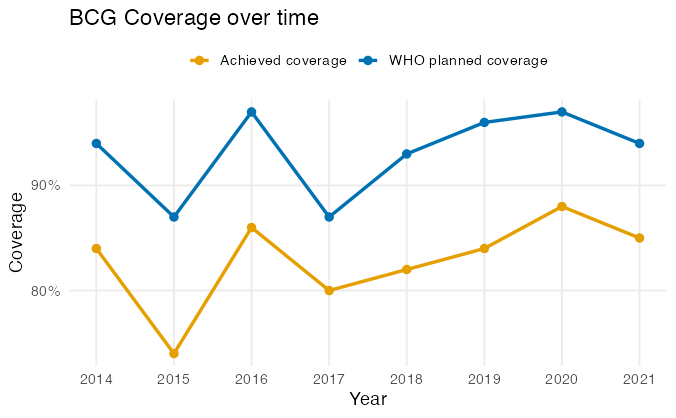
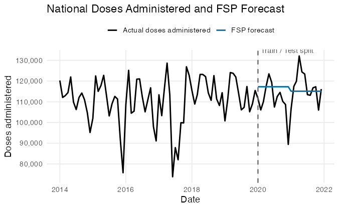
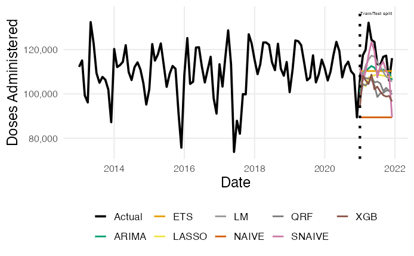
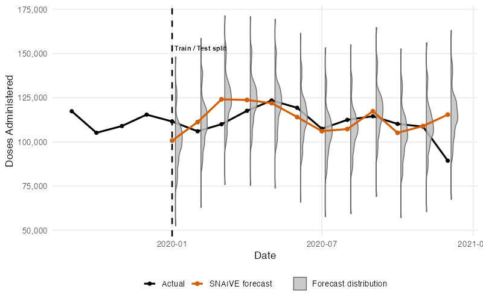
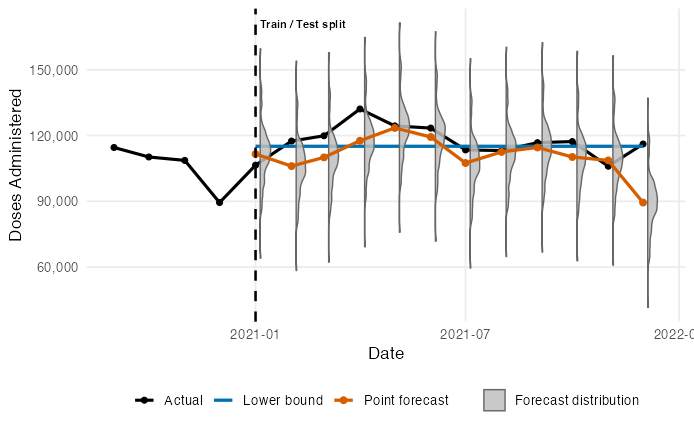
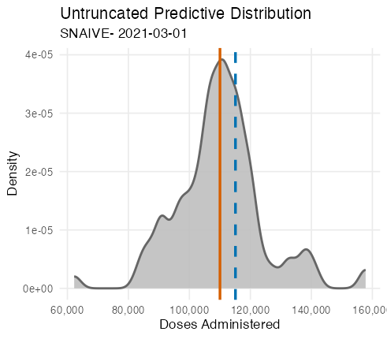
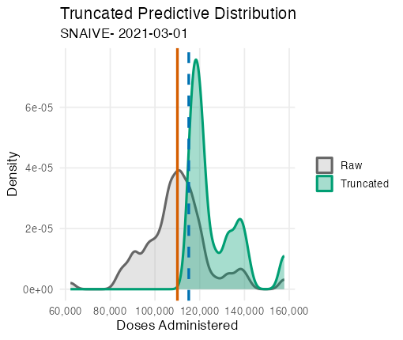
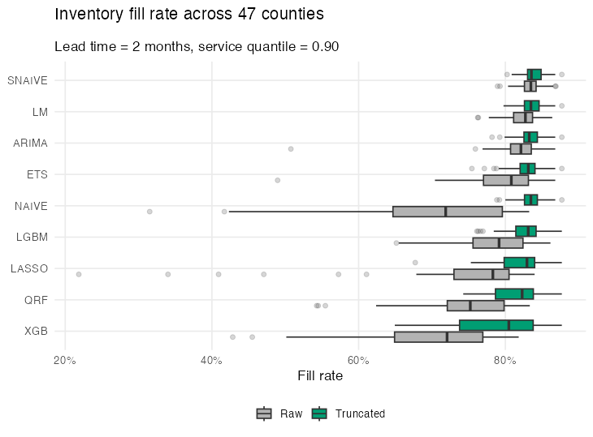
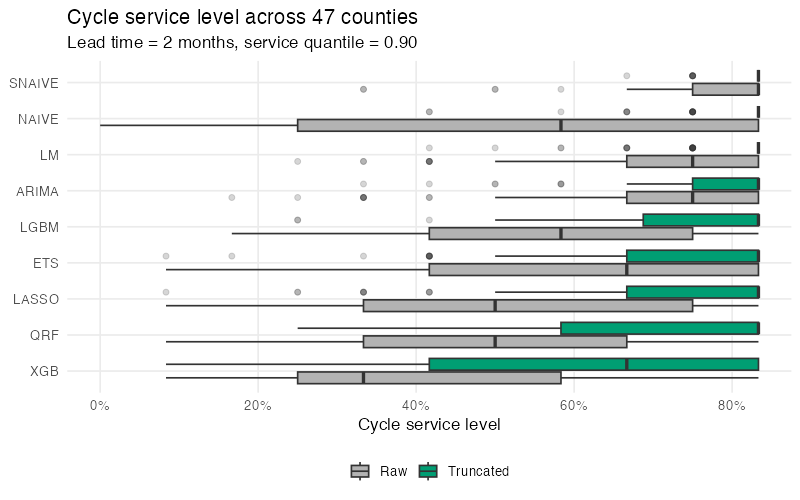

---
format: 
    revealjs:
        toc: false
        slideNumber: "c/t"
        width: 1280
        height: 720
        controls: true
        progress: true
        transition: slide
        plugins: [notes, print-pdf]
        title-slide-attributes:
            data-background-image: none
            data-background-size: cover
        theme: [default, custom.scss]
        footer: "© 2025 Udeshi Salgado – IIF UK Chapter, Cardiff"
        html-math-method:
          method: mathjax
          url: "https://cdn.jsdelivr.net/npm/mathjax@3/es5/tex-mml-chtml.js"
---


{width=20% fig-align="left"}

<br> 


<div style="text-align:center; font-size: 120%">

### Distributional Post-Processing for Vaccine Demand Inventory Forecasting

</div>


<br>
<br> <br> 
<br>
<br> <br>

<div style="text-align:left; font-size: 90%">
**Udeshi Salgado**, _DL4SG, Cardiff University, UK_ <br>
<strong>Lead Supervisor:</strong> Professor Bahman Rostami-Tabar<br>
<strong>Co-supervisors:</strong> Dr Thanos E Goltsos, Dr Geraint Palmer, Dr Xun Wang

13 March 2026
</div>


## Background

::: {.columns}

::: {.column width="40%"}
{width=80%}
:::

::: {.column width="60%"}

::: {.incremental}

- <span style="color:#FF4500;">1 in 5 children</span> worldwide still lack access to essential vaccines.
- A key operational contributor is <span style="color:#FF4500;">inefficiency in vaccine supply chains</span>.
- In low- and middle-income countries, these inefficiencies often involve:

  - inaccurate demand forecasts
  - inventory decisions made under limited uncertainty information
  - wastage and stockouts

:::

:::

:::

## The Immunisation Supply Chain

{width=120% fig-align="right"}


## BCG (Bacille Calmette-Guérin) Vaccines

::: {.columns}

::: {.column width="33%" }
{width=100%}  
<div style="text-align: center;"><strong>Vial</strong></div>
:::

::: {.column width="33%" .fragment}
{width=100%}  
<div style="text-align: center;"><strong>Dose</strong></div>
:::

::: {.column width="33%" .fragment}
{width=100%}  
<div style="text-align: center;"><strong>Administered</strong></div>
:::

:::


## Outline

1. <span style="color: #FF4500;"> Problem Statement and Motivation</span> 
2. Decision-Relevant Forecasting under Uncertainty
3. Forecasting Framework
4. Distributional Post-Processing and Inventory Decision Model
5. Results


## The Problem: Evidence from the Study Setting

::: {.columns}

::: {.column width="65%"}

{width=100% fig-align="left"}

:::

::: {.column width="35%"}

::: {.fragment}
<div style="font-size: 65%;">
- Coverage shown here refers to **BCG vaccination coverage among newborns**
- BCG is a **single-dose vaccine administered at birth**
- Coverage is defined as:

$$
\text{Coverage}
=
\frac{\text{No of Clients Administered}}{\text{Target Population}}
$$

</div>

:::

::: {.fragment}
<div style="font-size: 80%;">
- <span style="color:#FF4500;"><strong>Forecasting limitations may contribute to persistent coverage gaps.</strong></span>
</div>
:::

:::

:::


## Current Forecasting Practice

::: {.incremental}

- In practice, vaccine planning often relies on the **Forecasting, Supply planning, and Procurement (FSP) Tool**.
- The FSP workflow combines three point-based planning components:

  - <span style="color:#009E73;">Demographic-based</span>: based on demographic estimates and who static wastage and coverage rates
  - <span style="color:#999999;">Consumption / issue-based</span>: previous year doses administred adjusted for stockout and reporting rate
  - <span style="color:#999999;">Session-based</span>: 100% expert-driven planning for upcoming vaccination sessions  

- These approaches typically produce **point estimates**, with limited representation of uncertainty.

:::
## The FSP Forecasting

::: {.column width="70%"}

{width=100% fig-align="center"}


:::

::: {.column width="30%"}

- Forecast equation for doses administered:

    $$
    \hat{D_t} = \frac{P_y \cdot C_y}{12}
    $$


<div style="font-size: 57%; line-height: 0.1;">

Where:

- $\hat{D_t}$: Forecasted doses administered at month $t$
- $P_t$: Target population at year $y$
- $C_t$: WHO target coverage at year $y$

</div>


:::


## Methodological Limitations

::: {.fragment}
- In practice, vaccine planning often relies on **point-based demographic planning models**, limiting responsiveness to observed consumption patterns.
:::

::: {.fragment}
- Forecasting workflows still emphasise **point predictions**, which do not capture uncertainty needed for operational decision-making.
:::

::: {.fragment}
- Models trained on historical administered doses may understate true need when past delivery is supply-constrained.
:::


## Outline

1. Problem Statement and Motivation
2. <span style="color: #FF4500;">Decision-Relevant Forecasting under Uncertainty</span> 
3. Forecasting Framework
4. Distributional Post-Processing and Inventory Decision Model
5. Results

## The Risk of Point Forecasting

{width=100% fig-align="center"}


## Addressing the Uncertainty

{width=100% fig-align="center"}


## Distributional Post-Processing: Defining Lower Bound

::: {.column width="70%"}

{width=100% fig-align="left"}


:::

::: {.column width="30%"}

<div style="font-size: 80%;">

- We define lower bound as the FSP forecast: 

    $$
    \text{Lower Bound} =  \frac{P_y \cdot C_y}{12}
    $$

</div>


<div style="font-size: 57%; line-height: 0.1;">

Where:

- $P_t$: Target population at year $y$
- $C_t$: WHO target coverage at year $y$

</div>


:::


## Distributional Post-Processing: Truncation

::: {.column width="50%"}

{width=120% fig-align="center"}


:::

::: {.column width="50%" .fragment}

{width=120% fig-align="center"}


:::

## Outline

1. Problem Statement and Motivation
2. Decision-Relevant Forecasting under Uncertainty 
3. <span style="color: #FF4500;">Forecasting Framework</span>
4. Distributional Post-Processing and Inventory Decision Model
5. Results


## Forecasting Framework

::: {.columns}

::: {.column width="45%"}

::: {.fragment}

### Data Setting
- BCG doses administered from a LMIC country
- Monthly data from Jan 2013 - Dec 2021
- Hierachical Level: County Level (47 counties)
- **48 time series** in total (47 counties + national)

:::

:::

::: {.column width="55%"}


::: {.fragment}
### Forecasting Setup

- Target variable: monthly BCG doses administsered

- Let $y_{i,t}$ denote administered doses  
in county $i$ at month $t$.

For forecast origin $T$, predict:

$$
\{y_{i,T+1}, \dots, y_{i,T+H}\}, \quad H = 12
$$

:::


:::

:::


## Forecasting Models

::: {.columns}

::: {.column width="55%"}

::: {.fragment}


```{r}
#| echo: false
#| warning: false

library(gt)
library(dplyr)

model_table <- tibble::tibble(
  `Model class` = c(
    "Classical statistical",
    "Regression-based",
    "Machine learning"
  ),
  Models = c(
    "ETS, ARIMA, Naïve, Seasonal Naïve",
    "Linear regression, LASSO",
    "Quantile Random Forest, XGBoost, LightGBM"
  )
)

model_table %>%
  gt() %>%
  cols_align(align = "left") %>%
  tab_options(
    table.font.size = "large",
    data_row.padding = gt::px(30)
  )

```

:::

:::

::: {.column width="45%"}


::: {.fragment}

- Each model produces multi-step point forecasts $\hat{y}_{i,T+h|T}$.
- Predictive distributions are obtained via blocked bootstrap residual simulation.

:::

:::

:::


## Outline

1. Problem Statement and Motivation
2. Decision-Relevant Forecasting under Uncertainty 
3. Forecasting Framework
4. <span style="color: #FF4500;">Distributional Post-Processing and Inventory Decision Model</span>
5. Results


## Distributional Post-Processing

::: {.columns}

::: {.column width="55%"}


### Raw predictive distribution

<div style="font-size:82%;">

Let the predictive distribution at horizon $h$ be

$$
p_h(y) = \Pr(Y_{T+h} = y).
$$

In practice, this is approximated using blocked bootstrap residual simulation:

$$
\{y^{(1)}_{T+h},\dots,y^{(R)}_{T+h}\}.
$$

</div>

::: 

::: {.column width="45%" .fragment}

### Target coverage lower bound

<div style="font-size:82%;">

We impose a planning-based (FSP benchmark target) lower bound:

$$
L_{T+h} = \frac{P_y \cdot C_y}{12},
$$

where $P_y$ is the target population and $C_y$ is WHO target coverage for year $y$.

</div>

:::

:::

----

::: {.columns}

::: {.column width="55%"}

### Conceptual truncation

<div style="font-size:82%;">

The predictive distribution is truncated as:

$$
p_h^{\text{tr}}(y)=
\begin{cases}
p_h(y), & y \ge L_{T+h},\\
0, & y < L_{T+h}.
\end{cases}
$$

and renormalized:

$$
\tilde{p}_h(y)
=
\frac{p_h^{\text{tr}}(y)}
{\sum_{z \ge L_{T+h}} p_h(z)}.
$$

<div style="font-size:72%; line-height:1.2; margin-top:8px;">

- $p_h(y)$: raw predictive distribution at horizon $h$  
- $L_{T+h}$: lower bound from target population and coverage  
- $\tilde{p}_h(y)$: adjusted predictive distribution  

</div>

</div>

::: 

::: {.column width="45%" .fragment}

### Implementation (simulation)

<div style="font-size:82%;">

In practice, truncation is applied to simulated draws:

<div style="font-size:72%;">

$$
y^{(r),\text{tr}}_{T+h}
=
\begin{cases}
y^{(r)}_{T+h}, & y^{(r)}_{T+h} \ge L_{T+h},\\
\text{resample from feasible draws}, & \text{otherwise}.
\end{cases}
$$

</div>

<div style="font-size:72%; line-height:1.2; margin-top:8px;">

- $r=1,\dots,R$: simulation draw  
-  Renormalization occurs implicitly through resampling.

</div>

</div>

:::

:::

## Inventory Decision Model 

::: {.columns}

::: {.column width="50%" }


::: {.fragment}

### Policy


<div style="font-size:70%;">

- **Periodic-review order-up-to policy**
- Inventory reviewed **monthly**
- At each review, inventory position is raised to target level \(S_t\)

$$
S_t = Q_{\alpha}(D_t^L)
$$

- $Q_{\alpha}(\cdot)$: $\alpha$-quantile of predictive lead-time demand  
- Operationally, forecasts determine the replenishment target  

</div>

:::


:::

::: {.column width="50%"}


::: {.fragment}

### Assumptions

<div style="font-size:70%;">

- **Missed vaccination opportunities** (no backlog)  
- Fixed lead time \(L\)  
- Decisions based on predictive simulations  

</div>

:::

::: {.fragment}

### Lead-time demand

<div style="font-size:70%;">

Demand occurring while orders are in transit:

$$
D_t^{L,(r)} = \sum_{j=t}^{t+L-1} y_j^{(r)}
$$

</div>

<div style="font-size:50%;">

where

::: {.column width="50%"}

- $t$ = review period  
- $L$ = lead time (months)  

:::

::: {.column width="50%"}
- $r = 1,\dots,R$ = simulation draw  
- $y_j^{(r)}$ = simulated demand  

:::

</div>

:::

:::

:::


## Performance evaluation

::: {.columns}

::: {.column width="50%"}


### Service measures

<div style="font-size:90%;">

$$
\text{Fill Rate}
=
\frac{\sum_{t=1}^{T} FD_t}
{\sum_{t=1}^{T} D_t}
$$

$$
\text{CSL}
=
1 - \frac{N_{\text{stockout}}}{T}
$$

</div>


:::

::: {.column width="50%" }


### Inventory Measures


<div style="font-size:90%;">

$$
\text{Average on-hand}
=
\frac{1}{T}\sum_{t=1}^{T} I_t
$$

$$
\text{Total unmet demand}
=
\sum_{t=1}^{T} (D_t - FD_t)
$$

</div>


:::

<div style="font-size:60%; line-height:1.2;">

where

::: {.column width="50%"}

  - $D_t$ = demand in period $t$ 
  - $FD_t$ = fulfilled demand in period $t$ 
  - $T$ = total number of periods (in months)  

:::

::: {.column width="50%"}

  - $N_{\text{stockout}}$ = number of stockout periods (in months)  
  - $I_t$ = on-hand inventory at end of period $t$

:::


</div>

:::


## Outline

1. Problem Statement and Motivation
2. Decision-Relevant Forecasting under Uncertainty 
3. Forecasting Framework
4. Distributional Post-Processing and Inventory Decision Model
5. <span style="color: #FF4500;">Results</span>

## Mean Inventory Performance Across Counties

```{r}
#| echo: false
#| warning: false


library(gt)
library(tibble)

# ------------------------------------------------------------
# MEAN table (UPDATED VALUES)
# ------------------------------------------------------------
slide_table_mean <- tibble::tribble(
  ~Model, ~FR_Raw, ~FR_Trunc, ~CSL_Raw, ~CSL_Trunc, ~OH_Raw, ~OH_Trunc, ~Unmet_Raw, ~Unmet_Trunc,

  "ARIMA", 0.821, 0.834, 0.689, 0.785, 567, 1036, 5142, 4855,
  "ETS",   0.808, 0.829, 0.598, 0.732, 453, 838, 5552, 5033,
  "LASSO", 0.761, 0.825, 0.514, 0.718, 428, 840, 6774, 5212,
  "LGBM",  0.799, 0.829, 0.564, 0.752, 434, 909, 5740, 5027,
  "LM",    0.827, 0.835, 0.710, 0.801, 611, 1075, 5000, 4814,
  "NAIVE", 0.761, 0.836, 0.542, 0.806, 571, 1542, 6685, 4802,
  "QRF",   0.778, 0.820, 0.497, 0.696, 366, 748, 6241, 5269,
  "SNAIVE",0.834, 0.838, 0.786, 0.825, 972, 1542, 4838, 4730,
  "XGB",   0.745, 0.800, 0.420, 0.594, 291, 596, 7080, 5906
)

# ------------------------------------------------------------
# Highlight logic (same as median)
# ------------------------------------------------------------
fr_raw_rows    <- which(slide_table_mean$FR_Raw    >= slide_table_mean$FR_Trunc)
fr_trunc_rows  <- which(slide_table_mean$FR_Trunc  >= slide_table_mean$FR_Raw)

csl_raw_rows   <- which(slide_table_mean$CSL_Raw   >= slide_table_mean$CSL_Trunc)
csl_trunc_rows <- which(slide_table_mean$CSL_Trunc >= slide_table_mean$CSL_Raw)

oh_raw_rows   <- which(slide_table_mean$OH_Raw   <= slide_table_mean$OH_Trunc)
oh_trunc_rows <- which(slide_table_mean$OH_Trunc <= slide_table_mean$OH_Raw)

unmet_raw_rows   <- which(slide_table_mean$Unmet_Raw   <= slide_table_mean$Unmet_Trunc)
unmet_trunc_rows <- which(slide_table_mean$Unmet_Trunc <= slide_table_mean$Unmet_Raw)

# ------------------------------------------------------------
# FINAL TABLE (MEAN)
# ------------------------------------------------------------
slide_table_mean %>%
  gt(rowname_col = "Model") %>%

  tab_spanner("Fill rate", c(FR_Raw, FR_Trunc)) %>%
  tab_spanner("CSL", c(CSL_Raw, CSL_Trunc)) %>%
  tab_spanner("Avg on-hand", c(OH_Raw, OH_Trunc)) %>%
  tab_spanner("Unmet demand", c(Unmet_Raw, Unmet_Trunc)) %>%

  cols_label(
    FR_Raw = "Raw", FR_Trunc = "Trunc",
    CSL_Raw = "Raw", CSL_Trunc = "Trunc",
    OH_Raw = "Raw", OH_Trunc = "Trunc",
    Unmet_Raw = "Raw", Unmet_Trunc = "Trunc"
  ) %>%

  fmt_percent(
    columns = c(FR_Raw, FR_Trunc, CSL_Raw, CSL_Trunc),
    decimals = 1
  ) %>%
  fmt_number(
    columns = c(OH_Raw, OH_Trunc, Unmet_Raw, Unmet_Trunc),
    decimals = 0
  ) %>%

  tab_options(
    table.font.size = px(24),
    heading.title.font.size = px(28),
    heading.subtitle.font.size = px(20),
    column_labels.font.size = px(20),
    table_body.hlines.width = px(1.5),
    column_labels.padding = px(8),
    data_row.padding = px(8)
  ) %>%

  # Highlight best values
  tab_style(
    style = list(cell_fill(color = "#D9F2D9"), cell_text(weight = "bold")),
    locations = cells_body(columns = FR_Raw, rows = fr_raw_rows)
  ) %>%
  tab_style(
    style = list(cell_fill(color = "#D9F2D9"), cell_text(weight = "bold")),
    locations = cells_body(columns = FR_Trunc, rows = fr_trunc_rows)
  ) %>%

  tab_style(
    style = list(cell_fill(color = "#D9F2D9"), cell_text(weight = "bold")),
    locations = cells_body(columns = CSL_Raw, rows = csl_raw_rows)
  ) %>%
  tab_style(
    style = list(cell_fill(color = "#D9F2D9"), cell_text(weight = "bold")),
    locations = cells_body(columns = CSL_Trunc, rows = csl_trunc_rows)
  ) %>%

  tab_style(
    style = list(cell_fill(color = "#D9F2D9"), cell_text(weight = "bold")),
    locations = cells_body(columns = OH_Raw, rows = oh_raw_rows)
  ) %>%
  tab_style(
    style = list(cell_fill(color = "#D9F2D9"), cell_text(weight = "bold")),
    locations = cells_body(columns = OH_Trunc, rows = oh_trunc_rows)
  ) %>%

  tab_style(
    style = list(cell_fill(color = "#D9F2D9"), cell_text(weight = "bold")),
    locations = cells_body(columns = Unmet_Raw, rows = unmet_raw_rows)
  ) %>%
  tab_style(
    style = list(cell_fill(color = "#D9F2D9"), cell_text(weight = "bold")),
    locations = cells_body(columns = Unmet_Trunc, rows = unmet_trunc_rows)
  ) %>%

  tab_header(
    title = "Inventory Performance Across Counties",
    subtitle = "Mean across 47 counties, lead time = 2 months, service quantile = 0.90"
  ) %>%
  cols_align(align = "center")

```


## Median Inventory Performance Across Counties {.smaller}

```{r}
#| echo: false
#| warning: false

library(gt)
library(tibble)

# ------------------------------------------------------------
# UPDATED manual table (NEW VALUES)
# ------------------------------------------------------------
slide_table <- tibble::tribble(
  ~Model, ~FR_Raw, ~FR_Trunc, ~CSL_Raw, ~CSL_Trunc, ~OH_Raw, ~OH_Trunc, ~Unmet_Raw, ~Unmet_Trunc,

  "ARIMA", 0.829, 0.835, 0.750, 0.833, 428, 977, 4409, 4074,
  "ETS",   0.824, 0.834, 0.667, 0.833, 341, 762, 4824, 4068,
  "LASSO", 0.808, 0.832, 0.500, 0.833, 298, 732, 5363, 4198,
  "LGBM",  0.817, 0.833, 0.583, 0.833, 315, 798, 4988, 3990,
  "LM",    0.831, 0.835, 0.750, 0.833, 463, 932, 4225, 3985,
  "NAIVE", 0.814, 0.835, 0.583, 0.833, 303, 1152, 5322, 3985,
  "QRF",   0.805, 0.828, 0.500, 0.833, 267, 636, 5178, 4447,
  "SNAIVE",0.834, 0.836, 0.833, 0.833, 835, 1369, 3985, 3985,
  "XGB",   0.777, 0.824, 0.333, 0.667, 199, 409, 6075, 4481
)

# ------------------------------------------------------------
# Helper row indices for highlighting
# ------------------------------------------------------------
fr_raw_rows    <- which(slide_table$FR_Raw    >= slide_table$FR_Trunc)
fr_trunc_rows  <- which(slide_table$FR_Trunc  >= slide_table$FR_Raw)

csl_raw_rows   <- which(slide_table$CSL_Raw   >= slide_table$CSL_Trunc)
csl_trunc_rows <- which(slide_table$CSL_Trunc >= slide_table$CSL_Raw)

oh_raw_rows   <- which(slide_table$OH_Raw   <= slide_table$OH_Trunc)
oh_trunc_rows <- which(slide_table$OH_Trunc <= slide_table$OH_Raw)

unmet_raw_rows   <- which(slide_table$Unmet_Raw   <= slide_table$Unmet_Trunc)
unmet_trunc_rows <- which(slide_table$Unmet_Trunc <= slide_table$Unmet_Raw)

# ------------------------------------------------------------
# FINAL SLIDE TABLE
# ------------------------------------------------------------
slide_table %>%
  gt(rowname_col = "Model") %>%

  tab_spanner("Fill rate", c(FR_Raw, FR_Trunc)) %>%
  tab_spanner("CSL", c(CSL_Raw, CSL_Trunc)) %>%
  tab_spanner("Avg on-hand", c(OH_Raw, OH_Trunc)) %>%
  tab_spanner("Unmet demand", c(Unmet_Raw, Unmet_Trunc)) %>%

  cols_label(
    FR_Raw = "Raw", FR_Trunc = "Trunc",
    CSL_Raw = "Raw", CSL_Trunc = "Trunc",
    OH_Raw = "Raw", OH_Trunc = "Trunc",
    Unmet_Raw = "Raw", Unmet_Trunc = "Trunc"
  ) %>%

  fmt_percent(
    columns = c(FR_Raw, FR_Trunc, CSL_Raw, CSL_Trunc),
    decimals = 1
  ) %>%
  fmt_number(
    columns = c(OH_Raw, OH_Trunc, Unmet_Raw, Unmet_Trunc),
    decimals = 0
  ) %>%

  tab_options(
    table.font.size = px(24),
    heading.title.font.size = px(28),
    heading.subtitle.font.size = px(20),
    column_labels.font.size = px(20),
    table_body.hlines.width = px(1.5),
    column_labels.padding = px(8),
    data_row.padding = px(8)
  ) %>%

  # Highlight best values
  tab_style(
    style = list(cell_fill(color = "#D9F2D9"), cell_text(weight = "bold")),
    locations = cells_body(columns = FR_Raw, rows = fr_raw_rows)
  ) %>%
  tab_style(
    style = list(cell_fill(color = "#D9F2D9"), cell_text(weight = "bold")),
    locations = cells_body(columns = FR_Trunc, rows = fr_trunc_rows)
  ) %>%

  tab_style(
    style = list(cell_fill(color = "#D9F2D9"), cell_text(weight = "bold")),
    locations = cells_body(columns = CSL_Raw, rows = csl_raw_rows)
  ) %>%
  tab_style(
    style = list(cell_fill(color = "#D9F2D9"), cell_text(weight = "bold")),
    locations = cells_body(columns = CSL_Trunc, rows = csl_trunc_rows)
  ) %>%

  tab_style(
    style = list(cell_fill(color = "#D9F2D9"), cell_text(weight = "bold")),
    locations = cells_body(columns = OH_Raw, rows = oh_raw_rows)
  ) %>%
  tab_style(
    style = list(cell_fill(color = "#D9F2D9"), cell_text(weight = "bold")),
    locations = cells_body(columns = OH_Trunc, rows = oh_trunc_rows)
  ) %>%

  tab_style(
    style = list(cell_fill(color = "#D9F2D9"), cell_text(weight = "bold")),
    locations = cells_body(columns = Unmet_Raw, rows = unmet_raw_rows)
  ) %>%
  tab_style(
    style = list(cell_fill(color = "#D9F2D9"), cell_text(weight = "bold")),
    locations = cells_body(columns = Unmet_Trunc, rows = unmet_trunc_rows)
  ) %>%

  tab_header(
    title = "Inventory Performance Across Counties",
    subtitle = "Median across 47 counties, lead time = 2 months, service quantile = 0.90"
  ) %>%
  cols_align(align = "center")

```


---

{width=120% fig-align="center"}

---


{width=120% fig-align="center"}

---

::: {.columns}

::: {.column width="50%"}
### Connect


Udeshi Salgado

2nd year PhD Student

DL4SG, Cardiff University, UK


LinkedIn: [udeshi-salgado](https://www.linkedin.com/in/udeshi-salgado/)  

Slides: <br>
{width=50% fig-align="center"}


:::

::: {.column width="50%"}


### Outline of my talk


1. Problem Statement and Motivation
2. Decision-Relevant Forecasting under Uncertainty 
3. Forecasting Framework
4. Distributional Post-Processing and Inventory Decision Model
5. Results


:::

:::

