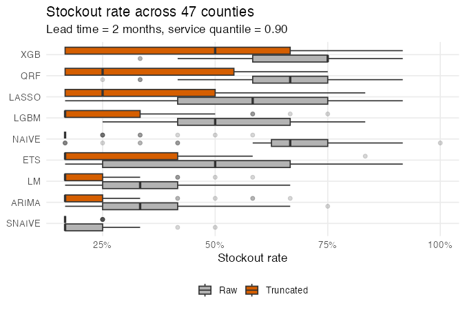

---
format: 
    revealjs:
        toc: false
        slideNumber: "c/t"
        width: 1280
        height: 720
        controls: true
        progress: true
        transition: slide
        plugins: [notes, print-pdf]
        title-slide-attributes:
            data-background-image: none
            data-background-size: cover
        theme: [default, custom.scss]
        footer: "© 2025 Udeshi Salgado – IIF UK Chapter, Cardiff"
---


{width=20% fig-align="left"}

<br> 


<div style="text-align:center; font-size: 110%">

### Distributional Post-Processing with Feasibility Truncation for Vaccine Demand Forecasting

</div>


<br>
<br> <br> 
<br>
<br> <br>


**Udeshi Salgado**, _Cardiff University, UK_ <br>
<strong>Lead Supervisor:</strong> Professor Bahman Rostami-Tabar<br>
<strong>Co-supervisors:</strong> Dr Thanos E Goltsos, Dr Geraint Palmer, Dr Xun Wang

13 March 2026


## Outline

1. <span style="color: #FF4500;"> Problem Statement and Motivation</span> 
2. Decision-Relevant Forecasting under Uncertainty
3. Forecasting Framework
4. Feasibility Truncation and Inventory Decision Model
5. Results

## Background

::: {.incremental}

- <span style="color: #FF4500;">1 in 5 children</span>  worldwide lack access to lifesaving vaccines. *(source: [WHO](https://www.who.int/news-room/fact-sheets/detail/immunization-coverage))*
- Potential Cause: <span style="color: #FF4500;">Supply chain inefficiencies</span>
- Vaccine supply chains in low- and middle-income countries (LMICs) often face:

    - Inaccurate forecasts of vaccine demand
    - Inefficient inventory decisions driven mainly by cost minimisation
    - Wastage and stockouts

:::

## Coverage gap in the study setting

{width=100% fig-align="center"}

::: {.smaller}
- Achieved coverage remains below WHO planned coverage across years, motivating improved operational forecasting and planning.
:::


## Current Forecasting Practice

::: {.incremental}
- In practice, vaccine planning often relies on the **Forecasting, Supply Planning, and Procurement (FSP) Tool** and related planning workflows.
- It combines outputs from several deterministic models:

    - <span style="color:#009E73;">Demographic-based (Stratified if available)</span>
    - <span style="color:#999999;">Facility consumption-based / Issue-based (not useful if we lack stockouts data, reporting rates, as it adjusts the previous year's consumption and is considered a forecast)</span>
    - <span style="color:#999999;">Session-based (100% based on expert knowledge)</span>

:::

## The FSP Forecasting

::: {.column width="70%"}

{width=100% fig-align="center"}


:::

::: {.column width="30%"}

- Forecast equation for doses administered:

    $$
    \hat{D_t} = P_t * C_t
    $$


<div style="font-size: 57%; line-height: 0.1;">

Where:

- $\hat{D_t}$: Forecasted doses administered at time $t$
- $P_t$: Target population at time $t$
- $C_t$: Planned WHO coverage at time $t$

</div>


:::


## Methodological Limitations

::: {.fragment}
- In practice, vaccine planning relies largely on **deterministic demographic-based models**, limiting responsiveness to real consumption patterns.
:::

::: {.fragment}
- Forecasting workflows still emphasise **point predictions**, which fail to capture uncertainty relevant for operational planning.
:::

::: {.fragment}
- Models trained on historical administered doses tend to **systematically underforecast**, reflecting constrained past delivery rather than true demand.
:::


## Outline

1. Problem Statement and Motivation
2. <span style="color: #FF4500;">Decision-Relevant Forecasting under Uncertainty</span> 
3. Forecasting Framework
4. Feasibility Truncation and Inventory Decision Model
5. Results

## The Risk of Point Forecasting

{width=100% fig-align="center"}


## Addressing the Uncertainty

{width=100% fig-align="center"}


## Distributional Post-Processing: Defining Lower Bound

::: {.column width="70%"}

{width=100% fig-align="left"}


:::

::: {.column width="30%"}

- We define lower bound as the FSP forecast: 

    $$
    \text{Lower Bound} =  P_t * C_t
    $$


<div style="font-size: 57%; line-height: 0.1;">

Where:

- $P_t$: Target population at time $t$
- $C_t$: Planned WHO coverage at time $t$

</div>


:::


## Distributional Post-Processing: Truncation

::: {.column width="50%"}

{width=100% fig-align="left"}


:::

::: {.column width="50%" .fragment}

{width=120% fig-align="left"}


:::

## Outline

1. Problem Statement and Motivation
2. Decision-Relevant Forecasting under Uncertainty 
3. <span style="color: #FF4500;">Forecasting Framework</span>
4. Feasibility Truncation and Inventory Decision Model
5. Results


## Study Design

::: columns

:::: {.column width="40%"}

::: {.fragment}
### Data setting
- One LMIC country  
- One vaccine: **BCG**
- Monthly time series
:::

::::

:::: {.column width="60%"}

::: {.fragment}
### Hierarchical level
- Sub-national level: **47 counties**
- National aggregation used for evaluation
- **48 time series** (47 counties + national)
:::
::::

::: {.fragment}
### Forecast target

Let $y_{i,t}$ denote administered doses in county $i$ at month $t$.

The forecasting for 12 month horizon $H$ is given by

$$
\{y_{i,T+1},\dots,y_{i,T+H}\}, \qquad H = 12.
$$

:::

:::


## Forecasting Models

```{r}
library(gt)
library(dplyr)

model_table <- tibble::tibble(
  `Model class` = c(
    "Classical statistical",
    "Regression-based",
    "Machine learning"
  ),
  Models = c(
    "ETS, ARIMA, Naïve, Seasonal Naïve",
    "Linear regression, LASSO",
    "Quantile Random Forest, XGBoost, LightGBM"
  )
)

model_table %>%
  gt() %>%
  cols_align(align = "left") %>%
  tab_options(
    table.font.size = "large",
    data_row.padding = gt::px(30)
  )

```

- Each model produces multi-step point forecasts $\hat{y}_{i,T+h|T}$.
- Predictive distributions are obtained via blocked bootstrap residual simulation.


## Outline

1. Problem Statement and Motivation
2. Decision-Relevant Forecasting under Uncertainty 
3. Forecasting Framework
4. <span style="color: #FF4500;">Feasibility Truncation and Inventory Decision Model</span>
5. Results


## Feasibility Truncation

::: {.fragment}

### Predictive distribution

Let the raw predictive distribution at horizon \(h\) be

$$
p_h(y) = \Pr(Y_{T+h} = y).
$$

In practice, this is approximated using training residuals via blocked bootstrap.

$$
\{y^{(1)}_{T+h},\dots,y^{(R)}_{T+h}\}.
$$

:::

----


### Lower-bound truncation


The monthly feasibility lower bound is defined as

$$
L_{T+h} = \frac{P_t C_t}{12},
$$

where $T$ = forecast origin (time index), $h$ = forecast horizon step $(h = 1,\dots,H)$, $P_t$ = target population in year $t$, $C_t$ = planned WHO coverage in year $t$


The truncated mass function becomes

$$
p_h^{\text{tr}}(y)
=
\begin{cases}
p_h(y), & y \ge L_{T+h}, \\\\
0, & y < L_{T+h}.
\end{cases}
$$

---

### Renormalization

To ensure a valid distribution,

$$
\tilde{p}_h(y)
=
\frac{p_h^{\text{tr}}(y)}
{\sum_{z \ge L_{T+h}} p_h(z)}.
$$


::: {.fragment}

### Simulation implementation

$$
y^{(r),\text{tr}}_{T+h}
=
\begin{cases}
y^{(r)}_{T+h}, & y^{(r)}_{T+h} \ge L_{T+h}, \\\\
\text{resample from feasible draws}, & \text{otherwise.}
\end{cases}
$$

:::

## Inventory Decision Model

**Policy**

- Periodic review $(T,S)$ policy  
- Order-up-to level based on predictive distribution  

$$
S_t = Q_{\alpha}(D^L_t)
$$

---

**Assumptions**

- Lost-sales setting (no backorders)  
- Fixed lead time $L$  
- Monthly review cycle  
- Lead-time demand from predictive simulations  

$$
D^{L,(r)}_t = \sum_{j=t}^{t+L-1} y^{(r)}_j
$$

<div style="font-size: 60%; margin-top: -10px;">

where $t$ = review period (month), $L$ = lead time (months), $r$ = simulation draw $(r=1,\dots,R)$, $y^{(r)}_j$ = simulated demand in month $j$, $D^{L,(r)}_t$ = simulated lead-time demand

</div>

## Inventory Performance Evaluation

**Service measures**

- Fill rate  
- Cycle service level (CSL)  
- Stockout rate  

**Stock measures**

- Average on-hand inventory  
- Total unmet demand


## Outline

1. Problem Statement and Motivation
2. Decision-Relevant Forecasting under Uncertainty 
3. Forecasting Framework
4. Feasibility Truncation and Inventory Decision Model
5. <span style="color: #FF4500;">Results</span>


## Inventory Performance Across Counties

```{r}
library(gt)
library(tibble)

# ------------------------------------------------------------
# Manual table (from your results)
# ------------------------------------------------------------
slide_table <- tibble::tribble(
  ~Model, ~FR_Raw, ~FR_Trunc, ~CSL_Raw, ~CSL_Trunc, ~Stock_Raw, ~Stock_Trunc, ~OH_Raw, ~OH_Trunc, ~Unmet_Raw, ~Unmet_Trunc,

  "ARIMA", 0.821, 0.833, 0.667, 0.833, 0.333, 0.167, 373, 811, 4850, 4410,
  "ETS",   0.808, 0.831, 0.500, 0.833, 0.500, 0.167, 276, 684, 5534, 4413,
  "LASSO", 0.783, 0.829, 0.417, 0.750, 0.583, 0.250, 223, 543, 5886, 4442,
  "LGBM",  0.791, 0.831, 0.500, 0.833, 0.500, 0.167, 221, 694, 5447, 4410,
  "LM",    0.827, 0.835, 0.667, 0.833, 0.333, 0.167, 406, 749, 4879, 4410,
  "NAIVE", 0.719, 0.835, 0.333, 0.833, 0.667, 0.167, 191, 984, 6959, 4410,
  "QRF",   0.752, 0.823, 0.333, 0.750, 0.667, 0.250, 192, 440, 6826, 4482,
  "SNAIVE",0.835, 0.836, 0.833, 0.833, 0.167, 0.167, 613, 1297, 4434, 4410,
  "XGB",   0.721, 0.805, 0.250, 0.500, 0.750, 0.500, 177, 298, 7639, 4482
)

# ------------------------------------------------------------
# Helper row indices for highlighting
# ------------------------------------------------------------
fr_raw_rows    <- which(slide_table$FR_Raw    >= slide_table$FR_Trunc)
fr_trunc_rows  <- which(slide_table$FR_Trunc  >= slide_table$FR_Raw)

csl_raw_rows   <- which(slide_table$CSL_Raw   >= slide_table$CSL_Trunc)
csl_trunc_rows <- which(slide_table$CSL_Trunc >= slide_table$CSL_Raw)

stock_raw_rows   <- which(slide_table$Stock_Raw   <= slide_table$Stock_Trunc)
stock_trunc_rows <- which(slide_table$Stock_Trunc <= slide_table$Stock_Raw)

oh_raw_rows   <- which(slide_table$OH_Raw   <= slide_table$OH_Trunc)
oh_trunc_rows <- which(slide_table$OH_Trunc <= slide_table$OH_Raw)

unmet_raw_rows   <- which(slide_table$Unmet_Raw   <= slide_table$Unmet_Trunc)
unmet_trunc_rows <- which(slide_table$Unmet_Trunc <= slide_table$Unmet_Raw)

# ------------------------------------------------------------
# Slide table
# ------------------------------------------------------------
slide_table %>%
  gt(rowname_col = "Model") %>%

  tab_spanner("Fill rate", c(FR_Raw, FR_Trunc)) %>%
  tab_spanner("CSL", c(CSL_Raw, CSL_Trunc)) %>%
  tab_spanner("Stockout", c(Stock_Raw, Stock_Trunc)) %>%
  tab_spanner("Avg on-hand", c(OH_Raw, OH_Trunc)) %>%
  tab_spanner("Unmet demand", c(Unmet_Raw, Unmet_Trunc)) %>%

  cols_label(
    FR_Raw = "Raw", FR_Trunc = "Trunc",
    CSL_Raw = "Raw", CSL_Trunc = "Trunc",
    Stock_Raw = "Raw", Stock_Trunc = "Trunc",
    OH_Raw = "Raw", OH_Trunc = "Trunc",
    Unmet_Raw = "Raw", Unmet_Trunc = "Trunc"
  ) %>%

  fmt_percent(
    columns = c(FR_Raw, FR_Trunc, CSL_Raw, CSL_Trunc, Stock_Raw, Stock_Trunc),
    decimals = 1
  ) %>%
  fmt_number(
    columns = c(OH_Raw, OH_Trunc, Unmet_Raw, Unmet_Trunc),
    decimals = 0
  ) %>%

  # Increase overall size
  tab_options(
    table.font.size = px(24),
    heading.title.font.size = px(28),
    heading.subtitle.font.size = px(20),
    column_labels.font.size = px(20),
    table_body.hlines.width = px(1.5),
    column_labels.padding = px(8),
    data_row.padding = px(8)
  ) %>%

  # Highlight best values in light green
  tab_style(
    style = list(
      cell_fill(color = "#D9F2D9"),
      cell_text(weight = "bold")
    ),
    locations = cells_body(columns = FR_Raw, rows = fr_raw_rows)
  ) %>%
  tab_style(
    style = list(
      cell_fill(color = "#D9F2D9"),
      cell_text(weight = "bold")
    ),
    locations = cells_body(columns = FR_Trunc, rows = fr_trunc_rows)
  ) %>%

  tab_style(
    style = list(
      cell_fill(color = "#D9F2D9"),
      cell_text(weight = "bold")
    ),
    locations = cells_body(columns = CSL_Raw, rows = csl_raw_rows)
  ) %>%
  tab_style(
    style = list(
      cell_fill(color = "#D9F2D9"),
      cell_text(weight = "bold")
    ),
    locations = cells_body(columns = CSL_Trunc, rows = csl_trunc_rows)
  ) %>%

  tab_style(
    style = list(
      cell_fill(color = "#D9F2D9"),
      cell_text(weight = "bold")
    ),
    locations = cells_body(columns = Stock_Raw, rows = stock_raw_rows)
  ) %>%
  tab_style(
    style = list(
      cell_fill(color = "#D9F2D9"),
      cell_text(weight = "bold")
    ),
    locations = cells_body(columns = Stock_Trunc, rows = stock_trunc_rows)
  ) %>%

  tab_style(
    style = list(
      cell_fill(color = "#D9F2D9"),
      cell_text(weight = "bold")
    ),
    locations = cells_body(columns = OH_Raw, rows = oh_raw_rows)
  ) %>%
  tab_style(
    style = list(
      cell_fill(color = "#D9F2D9"),
      cell_text(weight = "bold")
    ),
    locations = cells_body(columns = OH_Trunc, rows = oh_trunc_rows)
  ) %>%

  tab_style(
    style = list(
      cell_fill(color = "#D9F2D9"),
      cell_text(weight = "bold")
    ),
    locations = cells_body(columns = Unmet_Raw, rows = unmet_raw_rows)
  ) %>%
  tab_style(
    style = list(
      cell_fill(color = "#D9F2D9"),
      cell_text(weight = "bold")
    ),
    locations = cells_body(columns = Unmet_Trunc, rows = unmet_trunc_rows)
  ) %>%

  tab_header(
    title = "Inventory Performance Across Counties",
    subtitle = "Median across 47 counties, lead time = 2 months, service quantile = 0.90"
  ) %>%
  cols_align(align = "center")

```


---

{width=120% fig-align="center"}

---


{width=120% fig-align="center"}

---

::: {.columns}

::: {.column width="50%"}
### Connect


Udeshi Salgado

2nd year PhD Student

DL4SG, Cardiff University, UK


LinkedIn: [udeshi-salgado](https://www.linkedin.com/in/udeshi-salgado/)  

Slides: <br>
{width=50% fig-align="center"}


:::

::: {.column width="50%"}


### Outline of my talk


1. Problem Statement and Motivation
2. Decision-Relevant Forecasting under Uncertainty 
3. Forecasting Framework
4. Feasibility Truncation and Inventory Decision Model
5. Results


:::

:::

