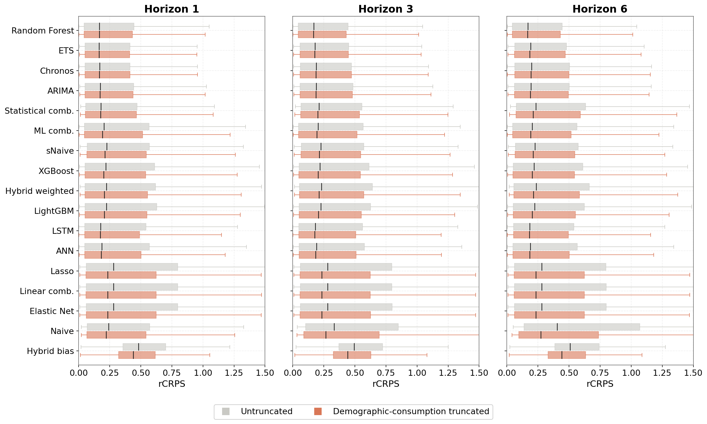
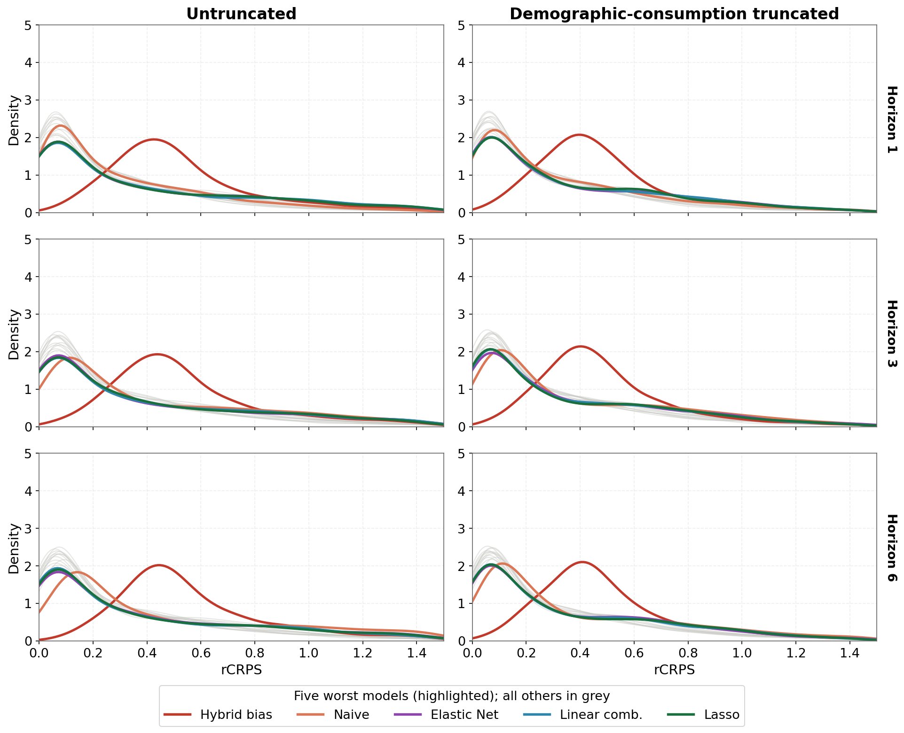
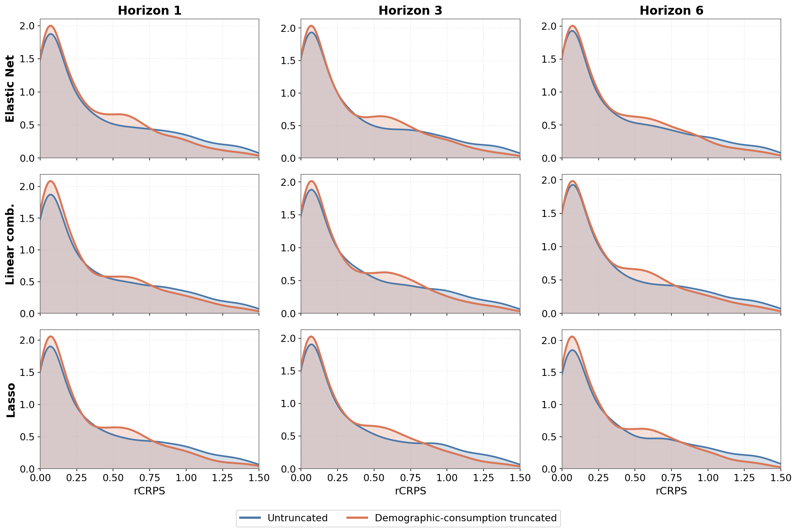

---
format:
  revealjs:
    css: style.css
    width: 1920
    height: 1080
    footer: "[ISF Montreal, Canada 2026](https://udeshisalgado.github.io/talks.html)"
    slide-number: c/t
    pdf-separate-fragments: false
    preview-links: auto
    # chalkboard: true
    html-math-method: mathjax
    # margin: 0.1
    # min-scale: 0.2
    # max-scale: 2.0
---



##

 
 

[Outline]{.mimic-h2}

- [**Background and motivation**]{style="font-size: 1.2em; color: #A04B2F;"}
- [**Current practice and literature**]{style="font-size: 1.2em; color: #A04B2F;"}
- [**Data and Methodology**]{style="font-size: 1.2em; color: #A04B2F;"}
- [**Results**]{style="font-size: 1.2em; color: #A04B2F;"}

---

##

 
 

[Outline]{.mimic-h2}

::: {.agenda}
- [**Background and motivation**]{.ol-on}
- [Current practice and literature]{.ol-off}
- [Data and Methodology]{.ol-off}
- [Results]{.ol-off}
:::

## Background

::: {.columns}
::: {.column width="40%"}
{width=72%}
:::
::: {.column width="60%" style="font-size: 1.4em;"}
- [1 in 5 children]{style="color:#D97757; font-weight:bold;"} worldwide still lack access to essential vaccines.
- A key operational driver is [inefficiency in vaccine supply chains]{style="color:#D97757; font-weight:bold;"}.
- In low and middle-income countries this shows up as:
  - inaccurate demand forecasts
  - inventory decisions made with no measure of uncertainty
  - wastage and stockouts
:::
:::

## Vaccines {.vaccines}

[A vial holds several doses; each dose is what reaches a child. We forecast the doses actually *administered*.]{.fsp-lead style="display:block; text-align:center;"}

::: {.columns}
::: {.column width="33%"}
{width=100%}
[**Vial**]{style="display:block; text-align:center; font-size:1.3em; color:#A04B2F;"}
:::
::: {.column width="33%" .fragment}
{width=100%}
[**Dose**]{style="display:block; text-align:center; font-size:1.3em; color:#A04B2F;"}
:::
::: {.column width="33%" .fragment}
{width=100%}
[**Administered**]{style="display:block; text-align:center; font-size:1.3em; color:#A04B2F;"}
:::
:::

## The immunisation supply chain

{width=88% fig-align="center"}

##

 
 

[Outline]{.mimic-h2}

::: {.agenda}
- [Background and motivation]{.ol-off}
- [**Current practice and literature**]{.ol-on}
- [Data and Methodology]{.ol-off}
- [Results]{.ol-off}
:::

## FSP4All: the standard planning tool

::: {style="font-size:1.05em; line-height:1.5;"}
- [**What it is**]{style="color:#A04B2F; font-weight:700;"}: FSP4All, UNICEF's *Forecasting and Supply Planning* tool for vaccine quantification
- [**Who built it**]{style="color:#A04B2F; font-weight:700;"}: developed by UNICEF, in collaboration with WHO
- [**For what**]{style="color:#A04B2F; font-weight:700;"}: to support national forecasting and supply planning, mitigating stockouts, overstocking and zero-dose children
- [**Who uses it**]{style="color:#A04B2F; font-weight:700;"}: adopted by national immunisation programmes across 25+ countries
- [**What it forecasts**]{style="color:#A04B2F; font-weight:700;"}: *consumption*, the annual quantity a country must procure
:::

 

::: {style="border:2px solid #D97757; border-radius:14px; padding:0.85em 1.2em; background:#FBF3EE; width:86%; margin:0 auto;"}
[Consumption&nbsp; = &nbsp;Doses administered&nbsp; + &nbsp;Wastage]{style="display:block; text-align:center; font-size:1.25em; font-weight:700; color:#7A3A1E; margin:0.1em 0;"}
:::

## Projecting consumption demand, three ways

[FSP4All projects *consumption* three ways, then blends them into one annual figure.]{.fsp-lead}

::::: {.fsp-main}
:::: {.fsp-stack}

::: {.fsp-box .fsp-dem .fragment}
 **Demographic**

- Multiplies the eligible child population by a coverage target and the dose schedule
- Converted to a procurement quantity with an assumed wastage rate
- $Q_{\mathrm{dem}} = P \cdot \frac{c}{100} \cdot d \cdot \frac{100}{100 - w}$
:::

::: {.fsp-box .fsp-orange .fragment}
 **Consumption**

- Averages the last 12 months of issues into one flat mean
- Adjusts for stockout days, then projects forward with an assumed growth rate
- $Q_{\mathrm{cons}} = \bar{C} \cdot \frac{D}{D - D_{\mathrm{so}}} \cdot 12 \cdot (1+g)^{t} \cdot \frac{100-w_{\mathrm{old}}}{100-w_{\mathrm{new}}} \cdot (1+r)$
:::

::: {.fsp-box .fsp-sess .fragment}
 **Session**

- Adds up every planned session's expected attendance
- Built bottom-up from the session plan and attendance
- $Q_{\mathrm{sess}} = \sum_{s} n_{s} \cdot \bar{a}_{s} \cdot d$
:::

::: {.fsp-combine .fragment}
 **Then combine**

- $Q_{\mathrm{FSP}} = \sum_{m} \omega_{m}\, Q_{m}$
- Weights are decided by the experts in the immunisation supply chain. Default weights are equal
:::

::::
:::: {.fsp-notation}
[Notation]{.fsp-note-title}
$P$: target population 
$c$: coverage (%) 
$d$: doses per child 
$\bar{C}$: avg. monthly consumption 
$D,\ D_{\mathrm{so}}$: days in period, stockout days 
$g$: population growth 
$t$: years from data to plan year 
$r$: planner's manual % adjustment, e.g. for a campaign 
$w$: wastage (%) 
$n_s$: sessions 
$\bar{a}_s$: attendance 
$\omega_m$: method weights
::::
:::::

## Vaccine demand forecasting in the literature

<table class="littable-full">
<colgroup>
<col style="width:10%"><col style="width:16%"><col style="width:12%"><col style="width:9%"><col style="width:7%"><col style="width:10%"><col style="width:5.5%"><col style="width:5.5%"><col style="width:6%"><col style="width:8%"><col style="width:5.5%">
</colgroup>
<thead>
<tr>
<th>Reference</th><th>Approach / method</th><th>Target variable</th><th>Level</th><th>Horizon</th><th>Evaluation focus</th><th class="flag">Inventory integration</th><th class="flag">Benchmark</th><th class="flag">Probabilistic forecasting</th><th class="flag">Distributional post-processing</th><th class="flag">Reproducibility</th>
</tr>
</thead>
<tbody>
<tr>
<td class="ref">Chiu et al. (2008)</td><td>ARIMA, BPNN</td><td>Annual demand</td><td>Regional</td><td>1 year</td><td>Average error</td><td class="flag no">No</td><td class="flag no">No</td><td class="flag no">No</td><td class="flag no">No</td><td class="flag no">No</td>
</tr>
<tr>
<td class="ref">Kotagiri et al. (2011)</td><td>Birth-cohort model</td><td>Inventory requirements</td><td>Local inventory</td><td>1 year</td><td>Inventory impact</td><td class="flag yes">Yes</td><td class="flag no">No</td><td class="flag no">No</td><td class="flag no">No</td><td class="flag no">No</td>
</tr>
<tr>
<td class="ref">Mueller et al. (2016)</td><td>Simulation</td><td>Vaccine quantity</td><td>Multi-level</td><td>12 months</td><td>Availability, cost</td><td class="flag yes">Yes</td><td class="flag no">No</td><td class="flag no">No</td><td class="flag no">No</td><td class="flag no">No</td>
</tr>
<tr>
<td class="ref">Azadi et al. (2018)</td><td>Regression</td><td>Childhood demand</td><td>Regional</td><td>n.s.</td><td>Not reported</td><td class="flag no">No</td><td class="flag no">No</td><td class="flag no">No</td><td class="flag no">No</td><td class="flag no">No</td>
</tr>
<tr>
<td class="ref">Cernuschi et al. (2018)</td><td>Demand-supply assessment</td><td>BCG demand, supply</td><td>National, global</td><td>14 years</td><td>Procurement</td><td class="flag no">No</td><td class="flag no">No</td><td class="flag no">No</td><td class="flag no">No</td><td class="flag no">No</td>
</tr>
<tr>
<td class="ref">Alegado &amp; Tumibay (2020)</td><td>ARIMA, MLP</td><td>Monthly demand</td><td>Local</td><td>12 months</td><td>RMSE, MAE</td><td class="flag no">No</td><td class="flag no">No</td><td class="flag no">No</td><td class="flag no">No</td><td class="flag no">No</td>
</tr>
<tr>
<td class="ref">Hariharan et al. (2020)</td><td>Random forest</td><td>Utilisation</td><td>Facility</td><td>Biweekly</td><td>RMSE</td><td class="flag no">No</td><td class="flag yes">Yes</td><td class="flag no">No</td><td class="flag no">No</td><td class="flag no">No</td>
</tr>
<tr>
<td class="ref">Sahisnu et al. (2020)</td><td>ARIMA</td><td>Stock levels</td><td>Local</td><td>10 months</td><td>MAPE</td><td class="flag yes">Yes</td><td class="flag no">No</td><td class="flag no">No</td><td class="flag no">No</td><td class="flag no">No</td>
</tr>
<tr>
<td class="ref">Vinitha et al. (2024)</td><td>Regression, trees, LSTM, ANN</td><td>Infant demand</td><td>Local</td><td>n.s.</td><td>RMSE, R²</td><td class="flag no">No</td><td class="flag no">No</td><td class="flag no">No</td><td class="flag no">No</td><td class="flag no">No</td>
</tr>
<tr class="ours">
<td class="ref">Current study</td><td>FSP-informed administered benchmark, statistical, ML, DL, foundation, ensemble</td><td>Administered doses, monthly</td><td>Sub-county</td><td>6 months</td><td>CRPS, rMAE, rRMSE</td><td class="flag no">No</td><td class="flag yes">Yes</td><td class="flag yes">Yes</td><td class="flag yes">Yes</td><td class="flag yes">Yes</td>
</tr>
</tbody>
</table>

## From practice and literature to our contribution

[We combine the domain knowledge built into FSP4All with the open gaps in the forecasting literature, and use the data we do have, doses administered, to build a feasibility-aware probabilistic forecast.]{.fsp-lead}

:::: {.fsp-two}

::: {.fsp-step-orange .fragment}
**From the tools** · domain knowledge

- FSP4All's demographic feasibility logic
- Population, coverage and capacity structure
- A principled ceiling for plausible demand
:::

::: {.fsp-step-blue .fragment}
**From the literature** · the open gaps

- Forecasts are rarely probabilistic
- Reproducible benchmarks are scarce
- Distributions ignore physical feasibility
:::

::::

 

[Our contribution: model the administered history *probabilistically*, then make the distribution feasibility-aware with FSP-informed bounds.]{.fsp-lead .fragment}

::: {.fsp-rq .fragment}
[Research Question]{.fsp-rq-label}
How can data-driven probabilistic forecasting, combined with FSP-informed demographic-consumption truncation, advance routine childhood vaccine administered-demand forecasting at the most granular operational level, where the supply decisions are actually made?
:::

##

 
 

[Outline]{.mimic-h2}

::: {.agenda}
- [Background and motivation]{.ol-off}
- [Current practice and literature]{.ol-off}
- [**Data and Methodology**]{.ol-on}
- [Results]{.ol-off}
:::

## Data

::: {.stat-grid}

::: {.stat-card}
[]{.si}
[5 vaccines]{.st}
[BCG · Pentavalent · Measles-Rubella · OPV birth · OPV routine]{.ss}
:::

::: {.stat-card}
[]{.si}
[306 sub-counties]{.st}
[the most granular operational level]{.ss}
:::

::: {.stat-card}
[]{.si}
[1,530 series]{.st}
[one per vaccine and sub-county]{.ss}
:::

::: {.stat-card}
[]{.si}
[Monthly, 2013 to 2021]{.st}
[doses administered, calendar-normalised]{.ss}
:::

::: {.stat-card}
[]{.si}
[Demographic and coverage]{.st}
[FSP target population · WHO coverage targets]{.ss}
:::

::: {.stat-card}
[]{.si}
[External drivers]{.st}
[floods · drought · epidemics · CPI · holidays]{.ss}
:::

:::

## Demand across administrative levels

{width=86% fig-align="center"}

## Trend, seasonality and noise

{width=66% fig-align="center"}

## Methodology

::::::::: {.fw-wrap}

[Data sources]{.flow-label}

:::::: {.flow-steps}
::: {.fw-box .fw-data}
[Administered doses]{.fw-t}
[African country, sub-county · 2013 to 2021 · monthly · BCG, DPT-HepB-Hib, Measles-Rubella, OPV birth, OPV routine]{.fw-s}
:::
::: {.fw-box .fw-data}
[Demographic and external]{.fw-t}
[FSP target population (sub-county level), WHO coverage · floods, drought, epidemics · Consumer Price Index (CPI) · working days, holidays, lags]{.fw-s}
:::
::::::

[▼]{.fw-arrow}

[Forecasting setup]{.flow-label}

:::::: {.flow-steps}
::: {.fw-box .fw-fsp}
[FSP-informed administered benchmark]{.fw-t}
[capacity-adjusted demographic]{.fw-s}
:::
::: {.fw-box .fw-stat}
[Statistical]{.fw-t}
[ARIMA · ETS · Naive · sNaive]{.fw-s}
:::
::: {.fw-box .fw-ml}
[Machine learning]{.fw-t}
[Lasso · Elastic Net · RF · XGBoost · LightGBM]{.fw-s}
:::
::: {.fw-box .fw-dl}
[Deep learning and foundation]{.fw-t}
[ANN · LSTM · Chronos]{.fw-s}
:::
::::::

::: {.fw-bar}
Rolling-origin cross-validation · 6-month horizon (h = 1 to 6) · raw output $\mathcal{N}(\mu, \sigma)$
:::

[▼]{.fw-arrow}

[Distributional post-processing]{.flow-label}

:::::: {.flow-steps}
::: {.fw-box .fw-dl}
[1 · Calibration]{.fw-t}
[2018 to 2019 hold-out · per vaccine and sub-county · $k = Q_{0.975}(y / E)$]{.fw-s}
:::
::: {.fw-box .fw-stat}
[2 · Define bounds]{.fw-t}
[$L = 0$  (non-negativity) · $U = k\,E$  (demographic-consumption ceiling)]{.fw-s}
:::
::: {.fw-box .fw-ml}
[3 · Truncated distribution]{.fw-t}
[recast $\mathcal{N}(\mu,\sigma)$ as $\mathrm{TN}(\mu, \sigma, 0, U)$ · scored with exact TN CRPS]{.fw-s}
:::
::::::

[▼]{.fw-arrow}

::: {.fw-final}
Feasibility-aware probabilistic forecast: bounded support, calibrated tails, decision-relevant CRPS
:::

:::::::::

## Forecasting setup: defining the FSP-informed administered benchmark {.eqn-slide}

::: {.fsp-rq style="margin:0.15em 0 0.4em;"}
[Why a variation of FSP?]{.fsp-rq-label}

- We only have **doses-administered** data, not consumption or wastage
- So we use the *administered* version of FSP's demographic method, computed directly from the available data, with no wastage assumption
:::

[**FSP4ALL demographic tool for procurement**]{style="display:block; color:#A04B2F; font-weight:700; margin-top:0.15em;"}

$$Q^{\mathrm{proc}}_{\mathrm{dem}} = P \cdot \frac{c}{100} \cdot d \cdot \frac{100}{100 - w}$$

[**Set wastage $w = 0$**]{style="display:block; color:#A04B2F; font-weight:700; margin-top:0.2em;"}

$$Q^{\mathrm{adm}}_{\mathrm{dem}} = P \cdot \frac{c}{100} \cdot d
\qquad\Longrightarrow\qquad
\text{FSP informed admin} = \tfrac{1}{12}\, P \cdot \frac{c}{100} \cdot d$$

## Forecasting setup: data-driven forecasting models

[Statistical, ML, DL and foundation models learn directly from the historical administered doses and external drivers. Whatever the family, each is turned into a *probabilistic* forecast the same way.]{.fsp-lead}

::::::::: {.fw-wrap}

[Model families]{.flow-label}

:::::: {.flow-steps}
::: {.fw-box .fw-stat}
[Statistical]{.fw-t}
[ARIMA · ETS · Naive · sNaive]{.fw-s}
:::
::: {.fw-box .fw-ml}
[Machine learning]{.fw-t}
[Lasso · Elastic Net · RF · XGBoost · LightGBM]{.fw-s}
:::
::: {.fw-box .fw-dl}
[Deep learning & foundation]{.fw-t}
[ANN · LSTM · Chronos]{.fw-s}
:::
::::::

[▼]{.fw-arrow}

[Turning each model into a predictive distribution]{.flow-label}

:::::: {.flow-steps}
::: {.fw-box .fw-data}
[1 · Point forecast]{.fw-t}
[fit on history and features, predict the mean $\hat{\mu} = \hat{y}_{i,v,t+h}$]{.fw-s}
:::
::: {.fw-box .fw-data}
[2 · Error spread]{.fw-t}
[$\hat{\sigma}_h$ from rolling-origin forecast errors, widening with horizon $h$]{.fw-s}
:::
::: {.fw-box .fw-data}
[3 · Gaussian forecast]{.fw-t}
[combine into $Y_{i,v,t+h} \sim \mathcal{N}(\hat{\mu}, \hat{\sigma}_h)$, for $h = 1$ to $6$]{.fw-s}
:::
::::::

::: {.fw-bar}
The Gaussian fits the near-Normal body of the forecast errors; the heavier tails are corrected downstream by feasibility truncation
:::

:::::::::

## Calibration: defining the scaling factor k {.eqn-slide}

[The benchmark $E$ is a *theoretical* plan; what clinics actually administer departs from it. We learn one empirical factor $k$ from history to tie the two together.]{.fsp-lead}

[**1 · Administered benchmark**, at 100% coverage]{style="display:block; color:#A04B2F; font-weight:700; margin-top:0.25em;"}

$$E = \tfrac{1}{12}\, P \cdot \tfrac{c}{100} \cdot d \qquad\xrightarrow{\;c\,=\,100\;}\qquad E = \tfrac{1}{12}\, P \cdot d$$

[**2 · Scaling factor** $k$, the 97.5th percentile of realised demand against the plan, on a 2018–2019 hold-out]{style="display:block; color:#A04B2F; font-weight:700; margin-top:0.4em;"}

$$k_{i,v} = Q_{0.975}\!\left(\frac{y}{E} \;\Big|\; 2018\text{–}2019\right)$$

[$k>1$: administered demand routinely exceeds the raw demographic, so $k$ grounds the ceiling in operational reality while trimming the impossible.]{.fsp-lead}

## Distributional post-processing: defining bounds {.eqn-slide}

:::: {.columns}
::: {.column width="50%"}
[**Lower bound**]{style="display:block; text-align:center; color:#A04B2F; font-weight:700;"}

{width=52% fig-align="center"}

$$L = 0$$

[A structural constraint: monthly doses administered cannot be negative.]{.fsp-lead style="text-align:center; display:block;"}
:::
::: {.column width="50%"}
[**Upper bound**]{style="display:block; text-align:center; color:#A04B2F; font-weight:700;"}

{width=52% fig-align="center"}

$$U_{i,v,t} = k_{i,v}\,E^{\uparrow}_{i,v,t}, \quad E^{\uparrow}_{i,v,t} = \tfrac{1}{12}\, P^{\uparrow} d$$

[$E^{\uparrow}$ uses the **upper** population $P^{\uparrow}$ at **100% coverage**, so the ceiling never cuts legitimate surges; $k$ sets it at the 97.5th percentile of observed demand.]{.fsp-lead style="text-align:center; display:block;"}
:::
::::

## From bounds to truncated distribution {.eqn-slide}

[Once $[L, U]$ is set, the raw Gaussian forecast is re-cast as a truncated Normal on that interval.]{.fsp-lead}

$$Y_{i,v,t+h} \sim \mathcal{N}(\mu, \sigma)
\;\Longrightarrow\;
Y_{i,v,t+h} \sim \mathrm{TN}(\mu, \sigma, L, U)$$

Standardised bounds and normaliser ($\Phi$, $\phi$: standard Normal CDF and PDF):

$$\alpha = \frac{L-\mu}{\sigma},\qquad \beta = \frac{U-\mu}{\sigma},\qquad Z = \Phi(\beta) - \Phi(\alpha)$$

Truncated mean and variance:

$$\mu^{\mathrm{tr}} = \mu + \sigma\,\frac{\phi(\alpha) - \phi(\beta)}{Z}, \qquad
(\sigma^{\mathrm{tr}})^2 = \sigma^2\!\left[1 + \frac{\alpha\,\phi(\alpha) - \beta\,\phi(\beta)}{Z} - \left(\frac{\phi(\alpha)-\phi(\beta)}{Z}\right)^{2}\right]$$

[The truncated distribution is scored with the exact closed-form truncated Normal CRPS.]{.fsp-lead}

## Truncation in practice

{width=60% fig-align="center"}

[The untruncated raw Gaussian wastes mass below 0 and above $U$. Truncation concentrates it into the feasible range, improving the CRPS.]{.fsp-lead}

## Evaluation metrics {.eqn-slide}

[Every error is scaled by the FSP-informed administered benchmark: below 1 beats it, above 1 is worse.]{.fsp-lead}

::::: {.columns}
:::: {.column width="50%"}
[**Point accuracy**]{style="display:block; text-align:center; font-size:1.2em; color:#A04B2F;"}

$$\mathrm{MSE} = \tfrac{1}{n}\sum_t (y_t-\hat{y}_t)^2$$

$$\mathrm{MAE} = \tfrac{1}{n}\sum_t |y_t-\hat{y}_t|$$

::: {style="border:2px solid #D97757; border-radius:14px; padding:0.2em 1em; background:#FBF3EE; margin-top:0.5em; min-height:290px; display:flex; flex-direction:column; justify-content:center;"}
$$\mathrm{rRMSE} = \sqrt{\tfrac{\mathrm{MSE}}{\mathrm{MSE}_{\text{FSP-informed admin.}}}}$$

$$\mathrm{rMAE} = \tfrac{\mathrm{MAE}}{\mathrm{MAE}_{\text{FSP-informed admin.}}}$$
:::

::::
:::: {.column width="50%"}
[**Distributional accuracy**]{style="display:block; text-align:center; font-size:1.2em; color:#A04B2F;"}

$$\mathrm{CRPS}(F,y) = \int_{-\infty}^{\infty}\big(F(x)-\mathbf{1}\{x\ge y\}\big)^2\,dx$$

::: {style="border:2px solid #D97757; border-radius:14px; padding:0.2em 1em; background:#FBF3EE; margin-top:0.5em; min-height:290px; display:flex; flex-direction:column; justify-content:center;"}
$$\mathrm{rCRPS} = \tfrac{\mathrm{CRPS}}{\mathrm{CRPS}_{\text{FSP-informed admin.}}}$$
:::

::::
:::::

 

[Truncated forecasts are scored with the exact closed-form CRPS of the truncated Normal, not the raw Gaussian.]{.fsp-lead style="text-align:center; display:block;"}

---

##

 
 

[Outline]{.mimic-h2}

::: {.agenda}
- [Background and motivation]{.ol-off}
- [Current practice and literature]{.ol-off}
- [Data and Methodology]{.ol-off}
- [**Results**]{.ol-on}
:::

## After truncation: rRMSE

{width=66% fig-align="center"}

[Point accuracy. The effect divides: truncation sharpens the over-dispersed deep learning and naive methods, but slightly worsens the already-feasible tree-based and ensemble methods.]{.fsp-lead}

## After truncation: rCRPS

{width=66% fig-align="center"}

[Distributional accuracy. Every method improves; gains are largest for the regularised linear, naive, and deep learning methods.]{.fsp-lead}

## Truncation tightens the dispersed forecasters at longer horizons

{width=80% fig-align="center"}

[Every model as a horizontal boxplot of rCRPS, untruncated (grey) vs demographic-consumption truncated (orange), by horizon. Truncation pulls in the upper tail of the diffuse forecasters (the regularised linear, naive, and deep learning methods), and the effect grows with the horizon.]{.fsp-lead}

## Accuracy vs computational cost

{width=82% fig-align="center"}

## The road ahead

[Where this work goes next.]{.fsp-lead}

:::: {.fsp-stack}

::: {.fsp-box .fsp-orange .fragment}
 **Add the wastage component**

- Extend administered forecasts to total consumption
- Supports end-to-end procurement quantification
:::

::: {.fsp-box .fsp-dem .fragment}
 **Link to inventory simulation**

- Translate forecast distributions into stockouts, wastage, and service levels
:::

::: {.fsp-box .fsp-sess .fragment}
 **Hierarchical reconciliation**

- Keep forecasts coherent across national → sub-county levels
:::

::::

# Any questions or thoughts? 💬

{fig-align="center"}

::: {.qr-corner}
{width="150"}

[Visit my website for slides]{.qr-cap}
:::

# Appendix

## Weak trend and seasonality

{width=58% fig-align="center"}

## Before truncation: point accuracy

[Nemenyi average ranks for rRMSE, with mean rMAE and rRMSE alongside. Lower rank is better; bars within one critical difference are not significantly different.]{.fsp-lead}

{width=80% fig-align="center"}

## Before truncation: distributional accuracy

[Nemenyi average ranks for rCRPS, with the mean rCRPS alongside. The FSP-informed administered benchmark provides the reference, and the statistical, ML and DL methods achieve stronger average ranks.]{.fsp-lead}

{width=72% fig-align="center"}

## Distribution of errors across horizons

{width=46% fig-align="center"}

[Densities of rCRPS, untruncated (left) vs demographic-consumption truncated (right), by horizon. The five most dispersed forecasters are highlighted, the rest in grey. Truncation pulls their error mass towards zero, most visibly at longer horizons.]{.fsp-lead}

## Where truncation helps most

{width=60% fig-align="center"}

[The three models that gain most from truncation (Elastic Net, Linear comb., Lasso). Untruncated (blue) and demographic-consumption truncated (orange) densities overlaid, by horizon. Truncation concentrates the distribution and trims the right tail, with the largest gains at longer horizons.]{.fsp-lead}