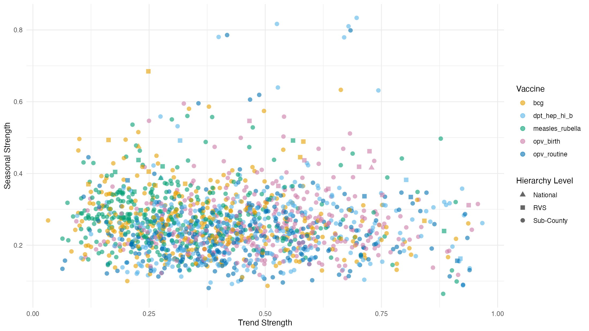
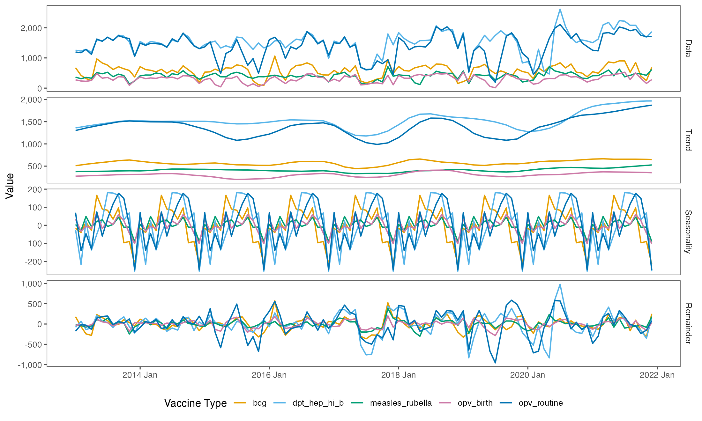
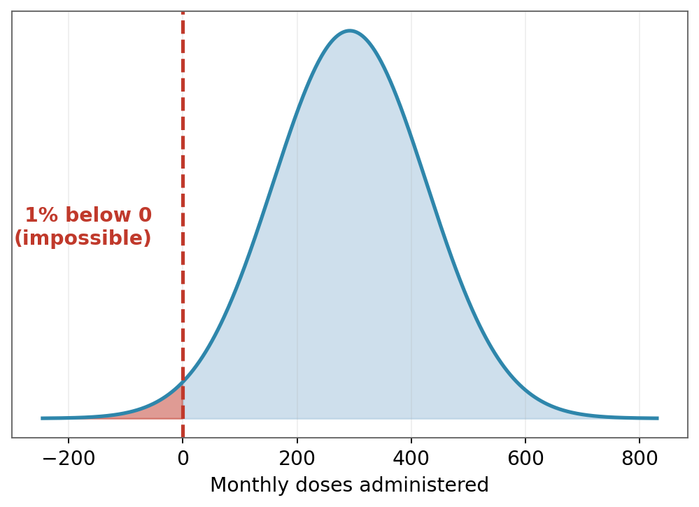
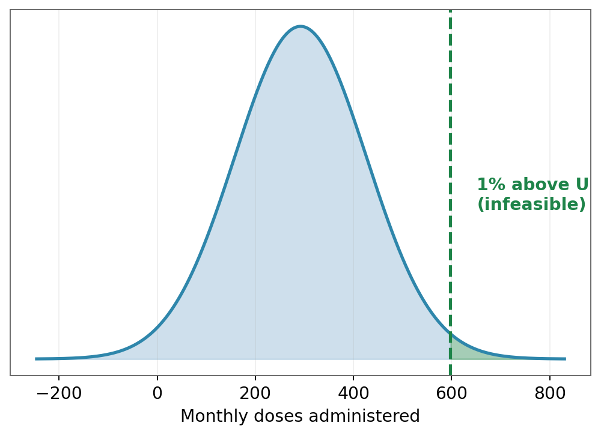
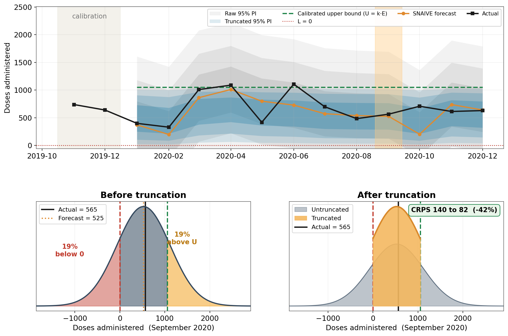
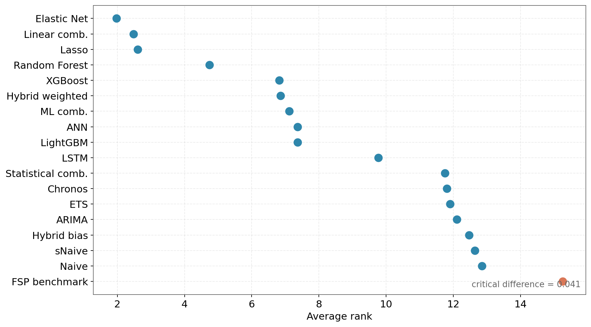
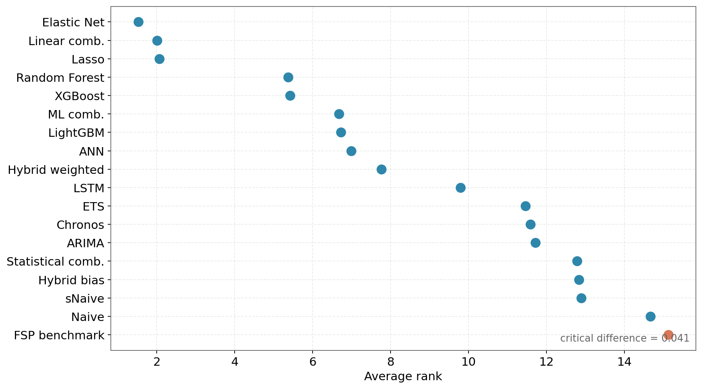
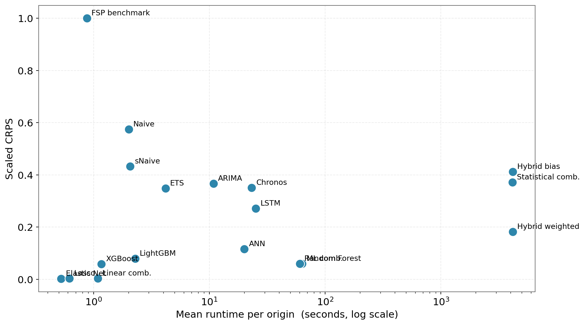
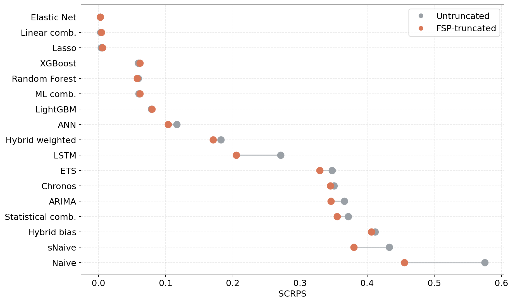
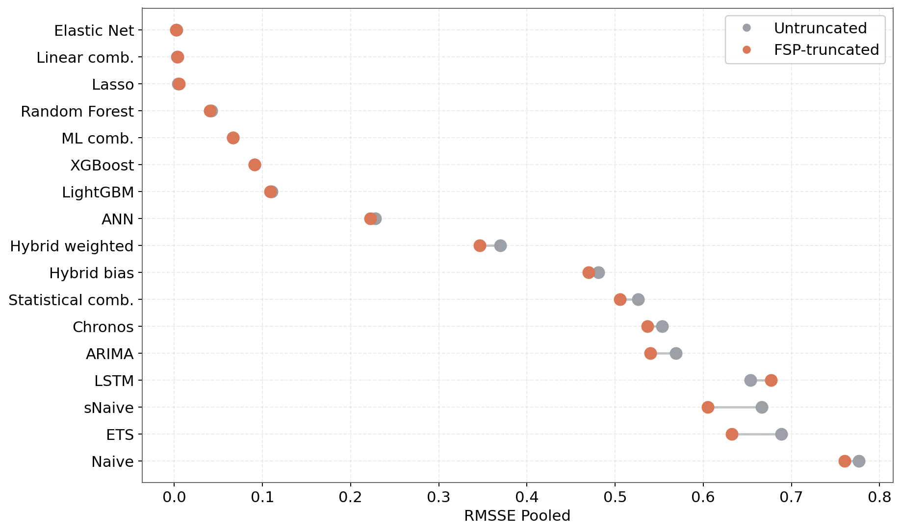

---
format:
  revealjs:
    css: style.css
    width: 1920
    height: 1080
    footer: "[ISF Montreal, Canada 2026](https://udeshisalgado.github.io/talks.html)"
    slide-number: c/t
    pdf-separate-fragments: false
    preview-links: auto
    # chalkboard: true
    html-math-method: mathjax
    # margin: 0.1
    # min-scale: 0.2
    # max-scale: 2.0
---



##

<br>
<br>

[Outline]{.mimic-h2}


- [**Background and motivation**]{style="font-size: 1.2em; color: #A04B2F;"}
- [**Current practice: the FSP tool**]{style="font-size: 1.2em; color: #A04B2F;"}
- [**Data and Methodology**]{style="font-size: 1.2em; color: #A04B2F;"}
- [**Results**]{style="font-size: 1.2em; color: #A04B2F;"}

---

##

<br>
<br>

[Outline]{.mimic-h2}

::: {.agenda}
- [**Background and motivation**]{.ol-on}
- [Current practice: the FSP tool]{.ol-off}
- [Data and Methodology]{.ol-off}
- [Results]{.ol-off}
:::

## Background

::: {.columns}
::: {.column width="40%"}
{width=72%}
:::
::: {.column width="60%" style="font-size: 1.4em;"}
- [1 in 5 children]{style="color:#D97757; font-weight:bold;"} worldwide still lack access to essential vaccines.
- A key operational driver is [inefficiency in vaccine supply chains]{style="color:#D97757; font-weight:bold;"}.
- In low and middle-income countries this shows up as:
  - inaccurate demand forecasts
  - inventory decisions made with no measure of uncertainty
  - wastage and stockouts
:::
:::

## Vaccines {.vaccines}

[A vial holds several doses; each dose is what reaches a child. We forecast the doses actually *administered*.]{.fsp-lead style="display:block; text-align:center;"}

::: {.columns}
::: {.column width="33%"}
{width=100%}
[**Vial**]{style="display:block; text-align:center; font-size:1.3em; color:#A04B2F;"}
:::
::: {.column width="33%" .fragment}
{width=100%}
[**Dose**]{style="display:block; text-align:center; font-size:1.3em; color:#A04B2F;"}
:::
::: {.column width="33%" .fragment}
{width=100%}
[**Administered**]{style="display:block; text-align:center; font-size:1.3em; color:#A04B2F;"}
:::
:::

## The immunisation supply chain

{width=88% fig-align="center"}

## Demand across administrative levels

{width=86% fig-align="center"}


##

<br>
<br>

[Outline]{.mimic-h2}

::: {.agenda}
- [Background and motivation]{.ol-off}
- [**Current practice: the FSP tool**]{.ol-on}
- [Data and Methodology]{.ol-off}
- [Results]{.ol-off}
:::

## One question, three answers

[How many doses to procure next year? FSP4All forecasts *consumption* (administered doses plus wastage) three ways, then blends them.]{.fsp-lead}

::::: {.fsp-main}
:::: {.fsp-stack}

::: {.fsp-box .fsp-dem .fragment}
 **Demographic**

- Counts the eligible child population
- Coverage target × dose schedule
- $Q_{\mathrm{dem}} = P \cdot \frac{c}{100} \cdot d$
:::

::: {.fsp-box .fsp-orange .fragment}
 **Consumption**

- Averages the last 12 months of issues into one flat mean
- Projects it forward by assumed growth, even when the data are years old
- $Q_{\mathrm{cons}} = \bar{C} \cdot 12 \cdot (1+g)^{t} \cdot \frac{100-w_{\mathrm{old}}}{100-w_{\mathrm{new}}} \cdot (1+r)$
:::

::: {.fsp-box .fsp-sess .fragment}
 **Session**

- Built bottom-up from the session plan
- Sessions × average attendance × doses
- $Q_{\mathrm{sess}} = \sum_{s} n_{s} \cdot \bar{a}_{s} \cdot d$
:::

::: {.fsp-combine .fragment}
 **Then combine**

- $Q_{\mathrm{FSP}} = \sum_{m} \omega_{m}\, Q_{m}$
- Weights are decided by the experts in the immunisation supply chain. Default weights are equal
:::

::::
:::: {.fsp-notation}
[Notation]{.fsp-note-title}
$P$: target population<br>
$c$: coverage (%)<br>
$d$: doses per child<br>
$\bar{C}$: avg. monthly consumption<br>
$g$: population growth<br>
$t$: years from data to plan year<br>
$r$: planner's manual % adjustment, e.g. for a campaign<br>
$w$: wastage (%)<br>
$n_s$: sessions<br>
$\bar{a}_s$: attendance<br>
$\omega_m$: method weights
::::
:::::

## The data is there, but the method isn't

[Two methods have no inputs; the third ignores the history sitting right beside it.]{.fsp-lead}

:::: {.fsp-row3}

::: {.fsp-box .fsp-muted .fragment}
 **Session** &nbsp; [No data]{.fsp-pill-gray}

- No session plans kept
- No attendance records
- The method cannot run
:::

::: {.fsp-box .fsp-muted .fragment}
 **Consumption** &nbsp; [No data]{.fsp-pill-gray}

- Only administered doses recorded
- No wastage or reporting rates
- Consumption cannot be computed
:::

::: {.fsp-box .fsp-dem .fragment}
 **Demographic** &nbsp; [Data, but…]{.fsp-pill-blue}

- A fixed estimate, not a forecast
- Needs a rarely-measured wastage rate
- Uncertainty stays hidden
:::

::::

::: {.fsp-info .fsp-missed .fragment}
**The missed opportunity.** FSP4All already holds both the demographic estimate and years of doses-administered history. Yet it only averages them, using simple or expert-assigned weights. No forecasting model is ever fitted to the historical data.
:::

##

<br>
<br>

[Outline]{.mimic-h2}

::: {.agenda}
- [Background and motivation]{.ol-off}
- [Current practice: the FSP tool]{.ol-off}
- [**Data and Methodology**]{.ol-on}
- [Results]{.ol-off}
:::

## Data

::: {.stat-grid}

::: {.stat-card}
[]{.si}
[5 vaccines]{.st}
[BCG · Pentavalent · Measles-Rubella · OPV birth · OPV routine]{.ss}
:::

::: {.stat-card}
[]{.si}
[306 sub-counties]{.st}
[the most granular operational level]{.ss}
:::

::: {.stat-card}
[]{.si}
[1,530 series]{.st}
[one per vaccine and sub-county]{.ss}
:::

::: {.stat-card}
[]{.si}
[Monthly, 2013 to 2021]{.st}
[doses administered, calendar-normalised]{.ss}
:::

::: {.stat-card}
[]{.si}
[Demographic and coverage]{.st}
[FSP target population · WHO coverage targets]{.ss}
:::

::: {.stat-card}
[]{.si}
[External drivers]{.st}
[floods · drought · epidemics · CPI · holidays]{.ss}
:::

:::

## Weak trend and seasonality

[Across the 1,530 series, most show low trend strength and weak, inconsistent seasonality. Sub-county series (circles) are the noisiest and least predictable, so historical patterns alone explain only part of demand.]{.fsp-lead}

{width=58% fig-align="center"}

## Trend, seasonality and noise

[Decomposing the administered series: a smooth local trend and a modest seasonal cycle sit beneath a large, irregular remainder. At the operational level the noise component dominates.]{.fsp-lead}

{width=66% fig-align="center"}

## Forecast the history, bound with the plan

[We hold administered doses, not consumption. So we forecast administered demand *with uncertainty* and bound it with the administered demographic, without guessing wastage.]{.fsp-lead}

:::: {.fsp-two}

::: {.fsp-step-orange .fragment}
**1 · Forecast with uncertainty**

- Administered demand, modelled directly
- Statistical · ML · DL · foundational methods
- $\rightarrow \mathcal{N}(\mu, \sigma)$, a full predictive distribution
:::

::: {.fsp-step-blue .fragment}
**2 · Bound, no wastage assumed**

- The *administered* FSP demographic sets the ceiling
- $U = k\cdot E$, calibrated from history
- $\rightarrow \mathrm{TN}(\mu, \sigma, 0, U)$, truncated to feasible demand
:::

::::

<br>

[Data-driven uncertainty **and** domain feasibility: the combination FSP4All never makes.]{.fsp-lead .fragment}

::: {.fsp-rq .fragment}
[Research Question]{.fsp-rq-label}
Can data-driven probabilistic forecasting, combined with FSP-informed distributional truncation, improve routine childhood vaccine administrative demand forecasting at the sub-county operational level, relative to the FSP approach used in practice?
:::

## Methodology

::::::::: {.fw-wrap}

[Data sources]{.flow-label}

:::::: {.flow-steps}
::: {.fw-box .fw-data}
[Administered doses]{.fw-t}
[African country, sub-county · 2013 to 2021 · monthly · BCG, DPT-HepB-Hib, Measles-Rubella, OPV birth, OPV routine]{.fw-s}
:::
::: {.fw-box .fw-data}
[Demographic and external]{.fw-t}
[FSP target population (sub-county level), WHO coverage · floods, drought, epidemics · Consumer Price Index (CPI) · working days, holidays, lags]{.fw-s}
:::
::::::

[▼]{.fw-arrow}

[Forecasting setup]{.flow-label}

:::::: {.flow-steps}
::: {.fw-box .fw-fsp}
[FSP benchmark]{.fw-t}
[demographic]{.fw-s}
:::
::: {.fw-box .fw-stat}
[Statistical]{.fw-t}
[ARIMA · ETS · Naive · sNaive]{.fw-s}
:::
::: {.fw-box .fw-ml}
[Machine learning]{.fw-t}
[Lasso · Elastic Net · RF · XGBoost · LightGBM]{.fw-s}
:::
::: {.fw-box .fw-dl}
[Deep learning and foundation]{.fw-t}
[ANN · LSTM · Chronos]{.fw-s}
:::
::::::

::: {.fw-bar}
Rolling-origin cross-validation · 6-month horizon (h = 1 to 6) · raw output $\mathcal{N}(\mu, \sigma)$
:::

[▼]{.fw-arrow}

[Distributional post-processing]{.flow-label}

:::::: {.flow-steps}
::: {.fw-box .fw-dl}
[1 · Calibration]{.fw-t}
[2018 to 2019 hold-out · per vaccine and sub-county · $k = Q_{0.975}(y / E)$]{.fw-s}
:::
::: {.fw-box .fw-stat}
[2 · Define bounds]{.fw-t}
[$L = 0$  (non-negativity) · $U = k\,E$  (FSP-informed ceiling)]{.fw-s}
:::
::: {.fw-box .fw-ml}
[3 · Truncated distribution]{.fw-t}
[recast $\mathcal{N}(\mu,\sigma)$ as $\mathrm{TN}(\mu, \sigma, 0, U)$ · scored with exact TN CRPS]{.fw-s}
:::
::::::

[▼]{.fw-arrow}

::: {.fw-final}
Feasibility-aware probabilistic forecast: bounded support, calibrated tails, decision-relevant CRPS
:::

:::::::::

## Distributional post-processing: defining bounds {.eqn-slide}

:::: {.columns}
::: {.column width="50%"}
[**Lower bound**]{style="display:block; text-align:center; font-size:1.4em; color:#A04B2F;"}

{width=82% fig-align="center"}

$$L = 0$$

[A structural constraint. Monthly doses administered cannot be negative.]{.fsp-lead}
:::
::: {.column width="50%"}
[**Upper bound**]{style="display:block; text-align:center; font-size:1.4em; color:#A04B2F;"}

{width=82% fig-align="center"}

$$U_{i,v,t} = k_{i,v}\,E_{i,v,t}, \quad E_{i,v,t} = \tfrac{P_{i,v,y}\,\tau_{v,y}\,d_v}{12}$$

[FSP expected monthly doses $E$ ($P$ = target population, $\tau$ = WHO coverage, $d$ = doses per child), scaled by $k_{i,v} = Q_{0.975}\!\left(\tfrac{y}{E}\,\big|\,\mathcal{C}\right)$ calibrated on 2018 to 2019.]{.fsp-lead}
:::
::::

## From bounds to truncated distribution {.eqn-slide}

[Once $[L, U]$ is set, the raw Gaussian forecast is re-cast as a truncated Normal on that interval.]{.fsp-lead}

$$Y_{i,v,t+h} \sim \mathcal{N}(\mu, \sigma)
\;\Longrightarrow\;
Y_{i,v,t+h} \sim \mathrm{TN}(\mu, \sigma, L, U)$$

Standardised bounds and normaliser ($\Phi$, $\phi$: standard Normal CDF and PDF):

$$\alpha = \frac{L-\mu}{\sigma},\qquad \beta = \frac{U-\mu}{\sigma},\qquad Z = \Phi(\beta) - \Phi(\alpha)$$

Truncated mean and variance:

$$\mu^{\mathrm{tr}} = \mu + \sigma\,\frac{\phi(\alpha) - \phi(\beta)}{Z}, \qquad
(\sigma^{\mathrm{tr}})^2 = \sigma^2\!\left[1 + \frac{\alpha\,\phi(\alpha) - \beta\,\phi(\beta)}{Z} - \left(\frac{\phi(\alpha)-\phi(\beta)}{Z}\right)^{2}\right]$$

[The truncated distribution is scored with the exact closed-form truncated Normal CRPS.]{.fsp-lead}

## Truncation in practice

{width=60% fig-align="center"}

[The untruncated raw Gaussian wastes mass below 0 and above $U$. Truncation concentrates it into the feasible range, improving the CRPS.]{.fsp-lead}


## Evaluation metrics {.eqn-slide}

[Errors are scaled by the FSP benchmark, so a value below 1 beats current practice.]{.fsp-lead}

:::: {.columns}
::: {.column width="50%"}
[**Point accuracy**]{style="display:block; text-align:center; font-size:1.2em; color:#A04B2F;"}

$$\mathrm{MSE} = \tfrac{1}{n}\sum_t (y_t-\hat{y}_t)^2 \qquad \mathrm{MAE} = \tfrac{1}{n}\sum_t |y_t-\hat{y}_t|$$

$$\mathrm{RMSSE} = \sqrt{\tfrac{\mathrm{MSE}}{\mathrm{MSE}_{\mathrm{FSP}}}} \qquad \mathrm{MASE} = \tfrac{\mathrm{MAE}}{\mathrm{MAE}_{\mathrm{FSP}}}$$

[Pooled across series: $\;\mathrm{RMSSE}_{\text{pooled}} = \sqrt{\tfrac{1}{N}\textstyle\sum_i \mathrm{RMSSE}_i^{2}}$]{.metric-hl}
:::
::: {.column width="50%"}
[**Distributional accuracy**]{style="display:block; text-align:center; font-size:1.2em; color:#A04B2F;"}

$$\mathrm{CRPS}(F,y) = \int_{-\infty}^{\infty}\big(F(x)-\mathbf{1}\{x\ge y\}\big)^2\,dx$$

$$\text{scaled CRPS} = \tfrac{\mathrm{CRPS}}{\mathrm{CRPS}_{\mathrm{FSP}}}$$

[Truncated forecasts are scored with the closed-form CRPS of $\mathrm{TN}(\mu,\sigma,0,U)$, not the raw Gaussian.]{.metric-hl}
:::
::::

::: {.fsp-rq}
[How to read the scale]{.fsp-rq-label}
Below 1 beats the FSP tool, 1 ties, above 1 is worse. Ranking via the Nemenyi test, $\mathrm{CD} = q_\alpha\sqrt{k(k+1)/6N}$; methods whose bars overlap are not significantly different.
:::

---

##

<br>
<br>

[Outline]{.mimic-h2}

::: {.agenda}
- [Background and motivation]{.ol-off}
- [Current practice: the FSP tool]{.ol-off}
- [Data and Methodology]{.ol-off}
- [**Results**]{.ol-on}
:::

## Results: before truncation

```{r}
#| echo: false
#| warning: false
#| message: false
library(readr); library(dplyr); library(knitr); library(kableExtra)
labs <- c(ml_elasticnet="Elastic Net", ml_lasso="Lasso", linear_combined="Linear comb.",
  ml_randomforest="Random Forest", ml_xgboost="XGBoost", ml_lightgbm="LightGBM",
  ml_combined="ML comb.", dl_ann="ANN", dl_lstm="LSTM", fm_chronos="Chronos",
  arima="ARIMA", ets="ETS", naive="Naive", snaive="sNaive",
  statistical_combined="Statistical comb.", hybrid_weighted="Hybrid weighted",
  hybrid_bias_adjustment="Hybrid bias", fsp_benchmark="FSP benchmark")
read_csv("global_metrics.csv", show_col_types = FALSE) |>
  filter(truncation_method == "0_Untruncated") |>
  arrange(SCRPS) |>
  mutate(Method = ifelse(model_id %in% names(labs), labs[model_id], model_id)) |>
  transmute(Method,
            MASE = round(MASE, 3),
            RMSSE = round(RMSSE_Pooled, 3),
            `Scaled CRPS` = round(SCRPS, 3),
            `Runtime (s)` = round(Mean_Runtime, 2)) |>
  kable(align = c("l", "r", "r", "r", "r")) |>
  kable_styling(font_size = 28, full_width = FALSE,
                bootstrap_options = c("striped", "condensed"))
```

## Who wins before truncation

:::: {.columns}
::: {.column width="50%"}
[**RMSSE** (point accuracy)]{style="display:block; text-align:center; font-size:1.25em; color:#A04B2F;"}
{width=100%}
:::
::: {.column width="50%"}
[**Scaled CRPS** (distribution)]{style="display:block; text-align:center; font-size:1.25em; color:#A04B2F;"}
{width=100%}
:::
::::

## Accuracy vs computational cost

{width=64% fig-align="center"}

## After truncation: scaled CRPS

{width=66% fig-align="center"}

[Truncation moves every method to the left (better). Gains are largest for the most diffuse forecasters, such as LSTM, sNaive and ETS.]{.fsp-lead}

## After truncation: RMSSE

{width=66% fig-align="center"}

## The road ahead

[Where this work goes next.]{.fsp-lead}

:::: {.fsp-stack}

::: {.fsp-box .fsp-orange .fragment}
 **Add the wastage component**

- Extend administered forecasts to total consumption
- Supports end-to-end procurement quantification
:::

::: {.fsp-box .fsp-dem .fragment}
 **Link to inventory simulation**

- Translate forecast distributions into stockouts, wastage, and service levels
:::

::: {.fsp-box .fsp-sess .fragment}
 **Hierarchical reconciliation**

- Keep forecasts coherent across national → sub-county levels
:::

::::

# Any questions or thoughts? 💬

{fig-align="center"}

::: {.qr-corner}
{width="150"}

[Visit my website for slides]{.qr-cap}
:::