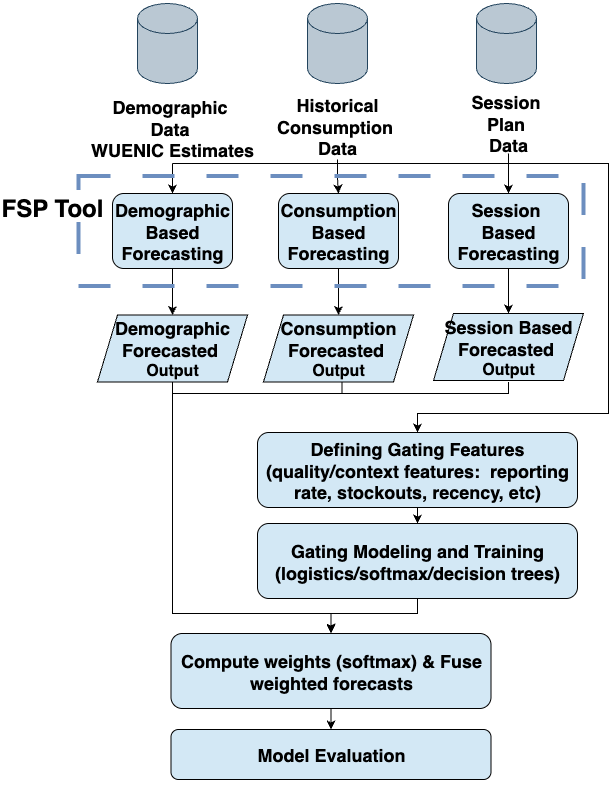
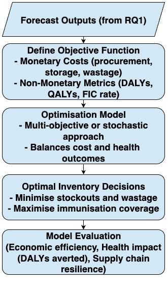
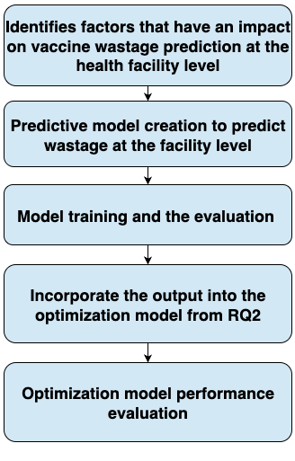

---
format: 
    revealjs:
        toc: false
        slideNumber: "c/t"
        width: 1280
        height: 720
        controls: true
        progress: true
        transition: slide
        plugins: [notes, print-pdf]
        title-slide-attributes:
            data-background-image: none
            data-background-size: cover
        theme: [default, custom.scss]
        logo: images/cardiff_dl4sg_logo.png
        footer: "© 2025 Udeshi Salgado – SWORD Network Event, Cardiff"
---

:::{.slide .title-slide data-background-image="images/background.png" data-background-size="cover"}

## Enhancing Global Immunisation Supply Chain: 
### Integrating Hybrid Intelligence Models into Inventory Optimisation Considering Non-Monetary Welfare Metrics
  

**Udeshi Salgado**  
_Data Lab for Social Good Research Group_  
_Cardiff Business School, Cardiff University, UK_  

<strong>Lead Supervisor:</strong> Professor Bahman Rostami-Tabar 
<strong>Co-supervisors:</strong> Dr Thanos E Goltsos, Dr Geraint Palmer, Dr Xun Wang

 

2025-10-09

:::

## The Problem

::: {.incremental}

- 1 in 5 children  worldwide lack access to lifesaving vaccines. *(source: [WHO](https://www.who.int/news-room/fact-sheets/detail/immunization-coverage))*
- Potential Cause: Supply chain inefficiencies
- Vaccine supply chains in low- and middle-income countries (LMICs) often face:

    - Inaccurate forecasts of vaccine demand
    - Inefficient inventory decisions driven mainly by cost minimisation
    - Wastage and stockouts

:::

## Our Goal

   

Make vaccine supply chains **smarter, fairer, and more resilient**: so that no child misses a vaccine because of logistics

{width=50% fig-align="center"}

## Our Collaborators

::: {.columns}

::: {.column width="40%"}
### Main Collaborator

 
{width=100% fig-align="center"}

<strong>John Snow Inc.</strong>

 

:::

::: {.column width="60%"}

{height=100% fig-align="center"}

:::

:::

## Methodology

::: {.columns}

::: {.column width="33%"}

 RQ1: Hybrid Intelligence for Vaccine Forecasting

{height=70% fig-align="center"}

:::

::: {.column width="33%" .fragment}

 RQ2:  Integrating Welfare Metrics into Inventory Optimisation

{height=70% fig-align="center"}

:::

::: {.column width="33%" .fragment}

 RQ3:  ML Driven Prediction of Open Vial Wastage

{height=70% fig-align="center"}

:::

:::

---

::: {.columns}

::: {.column width="50%"}
### About me

 

Udeshi Salgado

2nd year PhD Student

DL4SG, Cardiff University, UK

 

LinkedIn: [udeshi-salgado](https://www.linkedin.com/in/udeshi-salgado/)  

Slides: [udeshisalgado.github.io/talks](https://udeshisalgado.github.io/talks.html)

:::

::: {.column width="50%"}

### Outline of my talk
 

1. The problem 
2. Our Goal
3. Our Collaborators  
4. Methodology 

:::

:::

