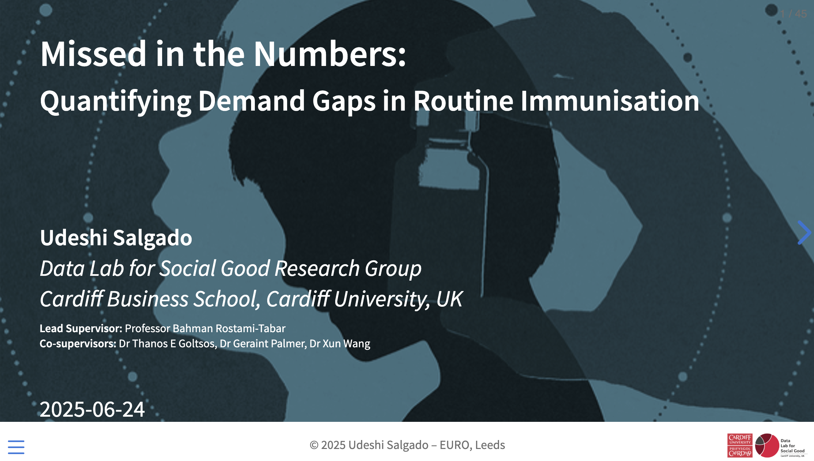

## Pursuing a Fully Funded PhD in the UK: Q A Roadmap to Academic Success
*Higher Studies Webinar, USJ*  

📅 **Date:** July 30, 2025   
⏰ **Time:** 01:30 PM – 03:30 PM  
📍 **Location:** Online 

  <a href="slides/higher_studies_webinar/higher_studies_webinar.html" target="_blank">
    <button style="background-color:#003366; color:white; padding:6px 12px; font-size:13px; margin:4px; border:none; border-radius:4px;">View Slides</button>
  </a>

## Missed in Numbers: Quantifying Demand Gaps in Vaccine Supply Chains
*EURO Conference, Leeds*  

📅 **Date:** June 24, 2025   
⏰ **Time:** 08:30 AM – 10:00 AM  
📍 **Location:** Leeds, UK  

  <a href="slides/euro_presentation/euro_slides.html" target="_blank">
    <button style="background-color:#003366; color:white; padding:6px 12px; font-size:13px; margin:4px; border:none; border-radius:4px;">View Slides</button>
  </a>

## Stochastic Modelling: CTMC and Queuing Theory 
*DL4SG Research Seminar, Cardiff University*  

📅 **Date:** May 22, 2025  
⏰ **Time:** 11:00 AM – 1:00 PM  
📍 **Location:** Cardiff, UK  

  <a href="slides/stocastic_modelling/dl4sg_slides.html" target="_blank">
    <button style="background-color:#003366; color:white; padding:6px 12px; font-size:13px; margin:4px; border:none; border-radius:4px;">View Slides</button>
  </a>
  <a href="https://github.com/udeshisalgado/DL4SG_trainings/tree/main/stocastic_modelling" target="_blank">
    <button style="background-color:#003366; color:white; padding:6px 12px; font-size:13px; margin:4px; border:none; border-radius:4px;">GitHub Repo</button>
  </a>
  <a href="https://github.com/udeshisalgado/DL4SG_trainings/tree/main/stocastic_modelling/lab_r" target="_blank">
    <button style="background-color:#003366; color:white; padding:6px 12px; font-size:13px; margin:4px; border:none; border-radius:4px;">Lab Activity</button>
  </a>

